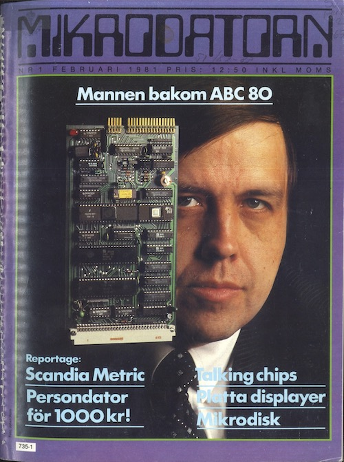

# A TALE FROM THE PAST

Once, my friend Ola Gunnars and I visited NK (Nordiska Kompaniet) late in the evening. Maybe we had been to the cinema before and seen a Bond movie that we often did. At that time, the department store was open until late and one of the few places that computers were available. They had an ABC80 that was on sale among radios, stereos and other home electronics. It was probably the most successful home computer Sweden had. It had a built-in BASIC interpreter in ROM that made it possible to write programs yourself. A Zilog processor Z80 of 3Mhz, 16k byte RAM that could be expanded to 32k. RAM was write and readable memory while ROM was only readable memory that could not be changed. Well it had almost everything needed at that time. We sat down and started keying in some program. One man stopped by, presented himself as Lars Karlsson and said he had designed the computer. Ah, we were very amazed and did not know what we would ask now that we had the original designer in front of us, imagine Lars Karlsson. Hm, I think I said something like that it was a shame that you couldn’t expand the BASIC interpreter and the commands that existed. Well you can easily, he replied. It’s just to do it yourself.

We marveled at home. It took a while but then we learned how to do it. We wrote in handwritten machine code when assembler existed but took the address space we wanted to put the program in. Once we understood how to do it, it was easy. The keyboard generated a break for each key that went to the processor, which directed what would happen next. If one inserted another interrupt address at the keystrokes then one could control what came via the keyboard and thus add the commands for the system itself. But since the interpreter and commands were all fixed in ROM and what we wrote were all in RAM, all code disappeared at a restart. A few years later, a very skilled technician Christer Ekman from the same high school came to build small PROM modules that were put directly on the computer’s data bus. It was then possible to jump between different ROM bases and quickly expanded the possibilities of using the computer. When Lars Karlsson was later asked about what he found to be the most interesting in the developments of the computers, he did not put the microprocessor first but precisely the construction of PROM.

When Bill Gates was looking for an operating system for IBM’s first PC that he had already promised IBM he had, he also made a call to Lars Karlsson. The story is also that Gary Kildall supposedly wasn’t available on the phone when IBM first called, so that he would miss the opportunity to sell them CP/M or some new version of it. Then IBM turned to Microsoft instead for a system. Bill Gates wondered if Lars Karlsson had a system for Intel’s processor 8088/8086, but he didn’t. He only had systems for Zilog’s Z80. Bill Gates eventually managed to find one called 86-DOS/QDOS and bought rights to licenses.

On top of this OS, Bill Gates eventually built an empire of Microsoft’s licenses for the MSDOS operating system and thus its fortune.

The rest is, as you say, history.

## References

* https://en.wikipedia.org/wiki/ABC_80
* https://www.abc80.org
* https://www.idg.se/2.10186/1.339871/legenden-bakom-abc-80
* https://www.idg.se/2.10186/1.29486/datorn-som-forandrade-sverige
* https://www.abc80.net/archive/luxor/ABC80/Owoco-super-smartaid.pdf (Christer Ekman’s expansion card made and sold by OWOCO)
* https://www.abc80.net/archive/luxor/ABC80/ABC80-64k-bygg-själv-MD9-1983-small.pdf (Expansion to 64k RAM used for expanded BASIC and other ideas on ABC80 by Christer Ekman)
* https://en.wikipedia.org/wiki/86-DOS
* https://en.wikipedia.org/wiki/Home_computer
* https://en.wikipedia.org/wiki/Personal_computer
* http://www.old-computers.com/history/timeline.asp
* http://www.pc-museum.com
* [ABC80 historik](./assets/pdf/ABC80-historik.pdf)
* https://computerhistory.org/blog/microsoft-ms-dos-early-source-code/

