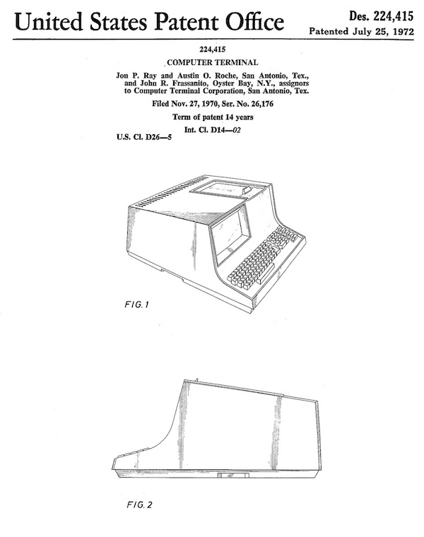
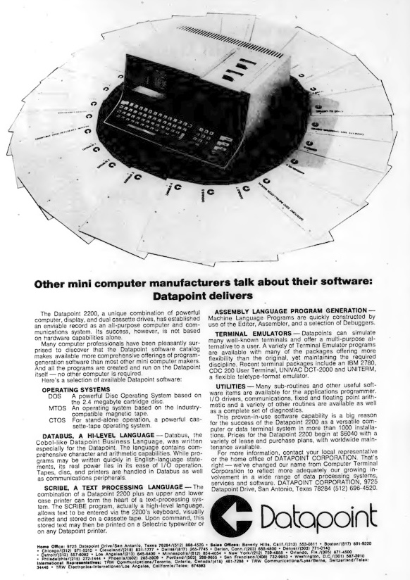

# BEFORE ABC80

## A note on historical contexts

History can be written in many ways. This includes the history of technology
and computer science. One way of looking at things relates to often the context
in which something appeared. Let's take the "western" type of keyboard layout
which many of us are used to: the *qwerty* keyboard.[^qwerty]

An argument of *why* we have this might not be as interesting as the question
of why it became som *popular and wide spread*. The question of why can be
construed in hindsight (even contrafactual), and might not be the actual
reason (or in case: reasons) for why it became to be so popular. The reason,
it could be argued, the keyboard layout was due to technical reasons, as the
(maybe overlapping) typebars should not collide to often (as the often used
keys are spread out). Those of us who have typed on an ordinary typewriter
may agree to this, and draw the immediate conclusion that this must have
*caused* the layout to be the still dominant way of manufacturing keyboards today.
This historical "hunt" for such causal relationships may or may not be the
actual case, naturally. But, perhaps, rather than internal arguments, we
could look for emergence of *streams of technological innovation* where
some find their way through the changing landscape and derive larger and
larger streams, but where others stops and go no futher.
To keep with the analogy, success (or failure) might *not* have to do with the
strength of the stream itself from the start, but may very well have to do
with the form of the landscape, hills and valleys, soft and hard ground, and
add to this the constant change through time (which deviates from the impervious
landscape).

We can thus speculate in the historical success of "qwerty" as the result
of a lot of 'things' influencing its path. One of these influences can be
the technological reason (overlapping typebars) mentioned above.
But it not even might be *the* cause, if such a thing actually exists.
Other concerns might have been sale prices, availability of sources or
ready made items, unfortunate or fortunate events, unforseen events,
etc. etc. But context may clarify circumstance.

[^qwerty]: https://en.wikipedia.org/wiki/QWERTY

Image from patent: https://patents.google.com/patent/USD224415S/en.
[^patent]

[^patent]: Seems to show Datapoint 1100 which had one cassette interface,
rather than two as in Datapoint 2200, as only one lid on the top is visible.

## Datapoint 2200

In 1970 Computer Terminal Corporation (CTC) annonced the terminal/computer
*Datapoint 2200*.[^datapoint] Later, in 1971, the company shipped the
product to customers. The rather recent video terminals[^terminal] had some
inheritance from the old teletype.[^teletype] But as many video terminals
relied on *replacing* the interface to the computer from teletype, papertape
and the like, the new Datapoint 2200 introduced more of a proper *computer*
inside the case, besides being a terminal emulating Model 33. This was
innovation. Therefore there are some claims as it was the start of the
computer that was personal, or private to the operator, i.e. a "PC".[^disc]

There was several periferals that could be connected such as removable
cartridge hard disk drive, modems, priters, serial and parallel interface,
but also, later on, it was first with an 8" disk drive. But also there was
software which could independently run, not only emulate different terminal
protocols. It had its own processor, its own CPU. The idea from start was
that a CPU could be designed such that it would be possible to have the
main functions in one chip (to reduce problems with heat). CTC designed
this chip called 1201, and went to Intel[^intel] for planning ultimately
in production. Also Texas Instrument was asked to compete. However, after
some time, CTC went ahead and made the CPU by TTL-logic in hardware instead.
They were not satified with what was delivered to them. TTL-logic was thus
the hardware base when Datapoint 2200 first went into production.
At the time CTC dropped the idea of a CPU on a chip, and transferred
the design to Intel.[^datap] This happend almost concurrently with the
design of Intel 4004 for Busicom and their calculator, released in 1971.[^intelf]
At this time *memory* was the really expensive part in machines, and
therefore decisions on design and production had a different focus
than a decade later on. A CPU (or part of a CPU) on a chip would however
reduce costs as well as the heat issues, even though it were some issues
with speed in the first of designs.

The Datapoint 2200 was very popular, and had a relatively long life. It also
changed its internals over time, improving e.g. memory from serial shift
register to RAM, or adding a hard drive. On the other hand it could only
reach a limited set of customers, as it was leased and not sold at the start,
exactly as IBM's products were at the time from which the marketing model was
copied.

A renewed interest in the 1201 design came up as Seiko found interest for a
scientific calculator. An improved design turned into Intel 8008, a
microprocessor that could claim to have started the microprocessor/
microcomputer revolution. But also the lineage to its processors for ordinary
PCs of today in 'x86'.[^xintel] *This is one of the strains from the stream.*
The fact that the core of instruction set, or the use of little endian kept
making progress for decades to come, was the demarkation of a strong hold.
A physical habit, one might call it. Hard to overturn.

Advertisment from Datapoint (recently renamed from CTC)
in *Computerworld*, December 1972, p.12.

[^datapoint]: https://en.wikipedia.org/wiki/Datapoint_2200
and https://en.wikipedia.org/wiki/Datapoint
[^teletype]: https://en.wikipedia.org/wiki/Teleprinter
[^disc]: There is often, to my mind, a futile debate on who came first
(of anything). Depending on what criteria you use, different computers
come to mind. One compeditor here should probably be Kenbak-1:
https://en.wikipedia.org/wiki/Kenbak-1 sold in 1971. The French have
their Micral: https://en.wikipedia.org/wiki/Micral in 1973.
The Swedes (of course) also claimed to be first:
https://dflund.se/~triad/diab/archive/Tidningsartiklar/1986%20Datornytt%2010%20om%20Transdata.jpg.
For our story here, the interesting part is that Lars Karlsson (together
with others) used the Intel 8008 in a computer intended for education
in e.g. programming: Transdata 7261. It thus had a *microprocessor* and
could mark the start of the *microcomputer*. It was introduced at a
computer fair, one kilometer from where I grew up, Älvsjömässan in 1972.
Besides the Transdata in 1972, there was a Univac 1972 and a Q1.
All of them had the 8008. All of them were born in 1972, including the
processor. The Q1 can be seen in the video: https://www.youtube.com/watch?v=dB3V_Q9wQ-M&t=6s.
The Univac 1982 can be seen at: https://www.youtube.com/watch?v=9KojS1ezQIY.
And the Transdata have no video, but some presentation at:
https://sv.wikipedia.org/wiki/Dataindustrier_AB (in Swedish), and
e.g. https://dflund.se/~triad/diab/archive/Transdata/Transintro%20Transdata%207260.jpg
(also in Swedish).
[^terminal]: https://en.wikipedia.org/wiki/Computer_terminal
[^intel]: https://en.wikipedia.org/wiki/Intel
[^datap]: https://en.wikipedia.org/wiki/Datapoint
[^intelf]: https://en.wikipedia.org/wiki/Intel_4004
[^xintel]: https://en.wikipedia.org/wiki/X86

Seven-S. Image from Peter Häll - https://digitaltmuseum.se/021026362412/dator,
CC BY 4.0, https://commons.wikimedia.org/w/index.php?curid=80713670

## Seven-S

The man behind the technical part of ABC80, Lars Karlsson, started in 1971 his
company Dataindustrier AB (approximately translated as "Computer Industries
ltd.").[^diab] The core products was for a long time based on the bus "Data Board
4680". The numbers in the name came from the intended support of Intel 4004,
Motorola 6800 (later also MOS 6502) and Intel 8080 (later also Zilog Z80).
Besides a versatile board computer driving this bus (4/8 bit processors), cards
could be added in the style of the S-100 bus to build custom computers
suitable for the intended audience of industrial applications.

In 1974 a memorandum describes ideas for a new computer, the "Seven-S". At the 
end of the memorandum, the main competition is mentioned:[^triad]

> The main competitor is Datapoint 2200 made by Computer Terminal
Corporation, USA. This unit has been on the market for about four
years and some 6000 units have been sold, of which 300 in Sweden.

> Datapoint 2200 has been a success and has open a market for a new
generation of decentralized computers. Many new brands will follow
but Seven-S will take an economical and technological lead, and
based on aggressive marketing, will reach most of the potential
markets inside and outside of Sweden.

> Seven-S will be the new weapon to fight the computer giants
like IBM, Honeywell-Bull, CDC etc.

Maybe a bit ironic is the cirumstance that DIAB Data AB (as the company later was
called), was bought in 1991 by Bull, later in 1994 denationalized in France.[^bull]

The functions of the computer is described such as it could be used for word
processing, data collection, as a terminal, remote batching, stock-keeping,
inventory, personnel, salaries, etc. suitable for then current office needs.
A remark is also that smaller companies could use this computer, as well a
larger (through the terminal function). Also other applications are possible,
programmable calculator systems, process control, and industrial programmable
controller system are mentioned. In total this made up the seven bullet points,
the seven application areas, to which Seven-S was intended, hence its name.

In 1975 eventually Dataindustrier AB together with Innovation Tomas Nilsson AB,
formed a new company, a joint-venture, Data Future AB for the sole purpose of
selling Seven-S. It was promising at first, they acquired some needed investment
capital from the state, they won a reputable prize for innovation, and also a
larger customer (Kommundata) was ready for 500 terminals, or even more in the future.

Hardware isn't mentioned much from what can be found in sources, but was build around
the Z80, with 16k byte of dynamic RAM, initially at least from the outset according
to an article.[^di] From the picture displayed above, the caption says that the
configuration here is a Zilog Z80 processor, it has a 15" screen (25x18 characters),
and 64k of RAM. The Seven-S was manufactured by Stansaab starting 1977, which later
fusioned with Datasaab. Production was relatively slow.

Then something happend. The control of the sole customer and the product was transferred
to Datasaab.[^datasaab] Datasaab cancelled the project in 1978/1979, and that was the
end of that. A total of hundred Seven-S were produced.

Ignoring interesting futher politics here involving larger companies and competition,
the ideas and solutions from Seven-S was brought in to the project of ABC80. The pace
in which the project of ABC80 proceeded could only come through the previous experience
of its predecessor Seven-S. *A small strain survived.*

[^diab]: https://en.wikipedia.org/wiki/Dataindustrier_AB
[^diabsv]: https://sv.wikipedia.org/wiki/Dataindustrier_AB
[^triad]: See https://www.df.lth.se/~triad/diab/archive/Seven%20S/1974%20SevenS%20konceptstudie.pdf (archived by Linus Walleij).
[^bull]: https://en.wikipedia.org/wiki/Groupe_Bull
[^di]: *Dagens Industri*, 14 Feb. 1978 (?)
[^datasaab]: https://en.wikipedia.org/wiki/Datasaab

## References

* A short history on Datapoint 2200: https://www.old-computers.com/museum/computer.asp?c=596
* More on Datapoint 2200: https://web.archive.org/web/20080819031221/http://www.computerworld.com/action/article.do?command=printArticleBasic&articleId=9111341
* An archive about Seven-S: https://www.df.lth.se/~triad/diab/archive/Seven%20S/, or
https://dflund.se/~triad/diab/archive/Seven%20S/
