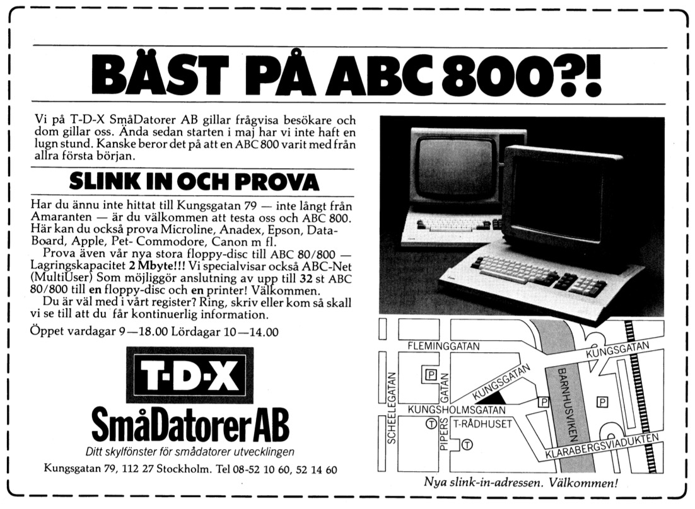

#### Advertisement translated from Swedish:

*The best at ABC800!?*

*We at TDX SmåDatorer AB like inquisitive visitors and they like us. Since the start of May, we haven't had a quiet moment. Maybe it's because an ABC800 was included from the very beginning.*

*If you have not yet found Kungsgatan 79 - not far from Amaranten - you are welcome to try us and ABC800. Here you can also try Microline, Anadex, Epson, Data-Board, Apple, Pet-Commodore, Canon etc.*

*Also try our new large floppy disc for ABC 80/ 800 – Storage capacity 2 Mbyte!!! We also separately demonstrate ABC-Net (Multiuser) Which enables the connection of up to 32 pcs to __a__ floppy disc and __a__ printer. Welcome!*

*Are you on our register? Call, write or come to us and we will ensure that you receive continuous information.*

*Open weekdays 9-18.00. Saturdays 10-14.00*

# ANOTHER TALE FROM THE PAST

One day in the early 80’s I and a friend of mine, Ola Gunnars, visited a rather extraordinary computer retailer in Stockholm: *T-D-X Smådatorer AB*. We made several visits to this particular store, because they both accepted us as young as we were for what we were, but also respected our deep interest in computers. They were early, importing brand new computers. This was a time of instant change, i.e. the era before IBM came to dominate. The pace of innovation was somewhat impressive.

So, one of the employed at T-D-X (or if he was one of the owners), Allan Larsson, were often occupied in front of a computer when we visited, not really having time to chat with us. But he was still very polite and kind to us, so when I asked him what he was doing obviously hacking hard at a Commodore PET (exactly which model it was I don't recall), he answered shortly: ”I’m building a database”. Ok, so I was halfway impressed. It must be quite a large program, was my first thought, even if I couldn’t grasp really what was implied.

In some later reincarnation of the database it was adopted to the ABC800-series called 'NetBAS'.

Many years later Allan, together with Mikael Widenius and David Axmark, started MySQL AB in 1995. Even though not any of code should have survived from the early days during the years, changing programming languages and computers, experience of how to build databases must have been valuable ending up in strands of MySQL.

MySQL is probably one of the most well known small databases, well spread and is one part in ’LAMP’, where Linux, PHP and Apache are the other components.

## References

* https://en.wikipedia.org/wiki/MySQL_AB#History
* https://www.idg.se/2.10186/1.29486/datorn-som-forandrade-sverige
