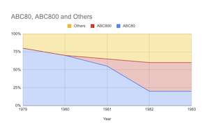
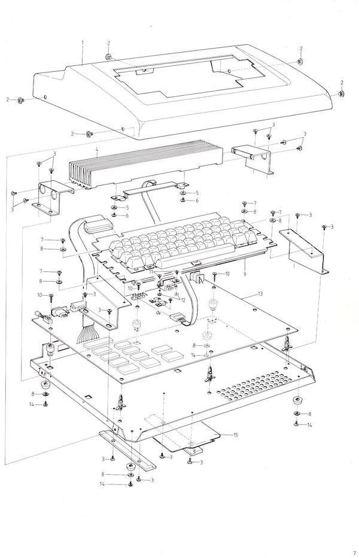
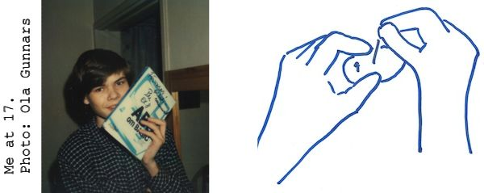
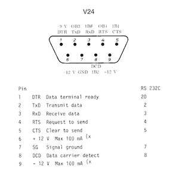

# ABC80 AIR-FIGHT 1981
A recreated program/code from paper trail. Originally the program was
coded for the Swedish home computer
[ABC80](https://en.wikipedia.org/wiki/ABC_80)[^1],
abbreviation for "Advanced Basic Computer for the 80s", (approx. transl.) 
in 1981. Inspired by the contemporary game console
[Atari VCS/2600](https://en.wikipedia.org/wiki/Atari_2600)
game [Combat #24](https://en.wikipedia.org/wiki/Combat_(Atari_2600)).

[^1]: More info in Swedish: https://www.idg.se/allt-om/abc+80.
Service manual: https://www.abc80.org/docs/abc80_servicemanual.pdf

But we will return to this program later. The computer, ABC80,
was a Swedish computer quite new at the time which came to market in 1978.
It was bought by the school for classroom education in circa early 1979.
Thus must have been one of the earliest schools in Sweden to have computers.

Modern captured photo of a ABC80 computer.[^2]

[^2]: Photo: liftarn, CC BY-SA 2.0 <https://creativecommons.org/licenses/by-sa/2.0>,
 via Wikimedia Commons.

## Some historical context

Let's have a look at a timeline of some contemporary microcomputers introduced
during the years 1975-1984, with year of introduction and computer respectively:

- 1975
  - MITS Altair 8800
  - IMSAI 8080
- 1976
  - MOS KIM-1
  - Sol-20
  - Apple I
  - Rockwell AIM 65
- 1977
  - RCA COSMAC VIP
  - Apple II (in Sweden 1978)
  - Commodore PET
  - Radio Shack TRS-80
  - Atari VCS (2600)
- 1978
  - **ABC80**
- 1979
  - Atari 400
  - Atari 800
  - TI-99/4
- 1980
  - TRS-80 Pocket Computer
  - Sinclair ZX80
- 1981
  - *ABC800*
  - Commodore VIC-20
  - Sinclair ZX81
  - Osborne 1
  - TI-99/4A
  - IBM PC (in Sweden 1983)
  - Acorn BBC Micro
- 1982
  - Victor 9000
  - Sinclair ZX-Spectrum
  - Commodore 64
- 1983
  - Jupiter Ace
  - Apple Lisa
- 1984
  - Apple Macintosh
  - IBM PCjr
...

A year after the three amigos (triad): Commodore PET, Apple II and TRS-80 were
released, ABC80 had some kind of the same flavour to it. These were machines that
took the step to a compact all-in-one computer for the expanding hobby/home computer
market.
Previously there were mainly boards sold, kit computers, you could solder on the
components yourself, add cards, peripherals, tape recorders, printers, disc drive units,
screens etc. that required much more skill than plugging in a power cable. The new
generation of machines had burnt in BASIC in ROM. When started there would respond
instantly with a prompt, ready for programming. Quite a difference from just a few
years earlier.

Another observation is that the field of both innovation and diversity is widespread
during these "early" years. Each system had its own dependencies, its own configuration,
its own programming language. Yes, there were standards and de facto standards
such as Centronics parallel port, some wiring of RS-232, the IBM 8" floppy disc,
CP/M or even some tracking the older S-100 bus. But they did not kill the other systems.
Rather, they cooperated. But poorly. Maybe too poor were the connections.
But that was about to change. With such climbing staggering diversity,
the equilibrium of standards were needed even more.

IBM PC was introduced in 1983 in Sweden, two years after the introduction in the USA.
But the nationally homebrew computer ABC80 and its successor
[ABC800](https://en.wikipedia.org/wiki/ABC_800), had strong sales in the
late 70s until the mid-80s inside of Sweden, when it was gradually replaced by
foremost IBM PC and its clones. But even if there was success of the PC,
it was not immediate. The IBM PC XT, later AT, as well as Microsoft DOS
made it harder to keep the competition at a profitable level for other competing
computers. The constant increased flow of new hardware as well as software
(translated software), internal fighting over contracts of who had the right
to sell what and when among retailers of ABC-computers, made sales even harder.

In the late 70s CP/M was the system to keep track of. Also in Sweden.
But it was starting to get old. It was uncertain if this was the right choice.
There were cards and software for ABC80 that could run CP/M, not unusual at this
time to expand contemporary systems for CP/M with the intention of generalising
the computer. If you already had a computer why not expanding it to a system
with well supplied software. Even IBM PC had from the start three systems to
choose from: UCSD Pascal (p-code), CP/M-86, and IBM/Microsoft DOS.
In the start of the 80s the prognosis was that UNIX and C was the
standard to be. Many bet on Unix, a few bet on the PC because it was IBM behind.
Even Microsoft wasn't sure about its DOS project. They also went with Xenix,
a Unix variant. Some were more sure on their opinions, they said Unix was here
to stay, but as we learned: it wasn't. Hardware and software for these often
larger systems were expensive. Truely, too expensive. They were however multiuser,
endorsed by many authorities, better systems overall, but the old way of sharing
was not really suitable for these times.
*The terminal faded and the personal computer became the established configuration.*
This however wasn't clear at the time. Eventually in the late 80s and start of
the 90s the fog dissipated and direction was set.

In the chart below[^3] you can see how the sales were internally and proportionally
of ABC80, successor ABC800 and the rest of computers was during late 70'ties
until circa 1983. The national products were dominant.

In total, from 1978-1985, the sales of ABC80 were 33,000 units. But then Apple II were
at 4.8 million, and Commodore 64 somewhere around 12-17 million. They were obviously
not playing on the same field.

[^3]: Diagram reproduced from: Sjöström, Roland, Positionering under strategisk osäkerhet:
Vol. 2 Luxor datorer och persondatorbranschen, Unitryck, Linköping, 1996, p. 212.

The cost of computers was quite high at this time, but also shrinking rapidly.
* 1977 Commodore PET sold for $595 which is in 2022 today ca $2,850 USD.
* 1978 ABC80 (no VAT) sold for approx. 6,900 SEK, which is in 2022 today ca $2,900 USD,
 thus not far from the PET.
* 1983 Commodore 64 sold for $595 which is in 2022 today ca $1,700 USD.

The ABC80 was a collaboration between
[DIAB Industrier](https://en.wikipedia.org/wiki/Dataindustrier_AB)
(DIAB Industries) behind the technology,
[Scandia Metric AB](https://sv.wikipedia.org/wiki/Scandia_Metric)
with its roots in industry, and
[Luxor AB](https://en.wikipedia.org/wiki/Luxor_AB)
which made radios and television sets. There were retailers that
was also behind the large, but restricted to national and local, success.

Specifications of the ABC80:
* Zilog Z80, 3 MHz (2.9952 MHz)
* 16K RAM installed (could be expanded to 32K)
* 16K ROM with BASIC semi compiler/interpreter and e.g. driver for a tape recorder
* Monitor B/W included (modified TV set from Luxor)
* Graphics 78 x 72 dots (near the "standards" of Teletext
 /[Videotex](https://en.wikipedia.org/wiki/Videotex) /Prestel Plus ... )
* 24 rows x 40 columns character screen
* Swedish keyboard (sold in some other countries also, Hungary e.g. with presumably
 Hungarian keyboard)
* Sound (actually a decent chip SN76477, but not fully used by the computer)
* Expansion slot (the DIAB favored 4680 bus, used often for miscellaneous instruments,
 measurements, ...)

I don't remember, but maybe the tape recorder was included at times.
Disc drives were sold both from 3rd party, and from the manufacturer DIAB.
Later on the ABC80 could be extended with other 3rd party additions such as
contemporary popular 80 column cards, CP/M, and local network, which
expanded its lifetime in the start of the 80s. But the support wasn't
coming from the source itself that time, and adding possibly conflicting
hardware didn't make its life easier.

DIAB had moved on, betting on Unix, focusing its own crafted
[DNIX](https://en.wikipedia.org/wiki/DNIX), and had other machines
at this time, with little time for something they really wasn't that
interested in.

## My conclusions

*ABC80 had industrial strength, was very solid with software in ROM,
fast and reliable (one or two bugs maybe, later corrected). Expansion was key to
the construction and essential, as it was basically designed for industry and primarily
not for e.g. games or business. The later generalisation with ABC800 made it easier
for expansion in those latter fields. It had colour, better graphics, better BASIC
and came with more variations in configurations.*

*On the other hand segments which could also have gained from the success
of ABC80, such as schools, those dependent on the graphic, gaming or sound
technology etc. were left behind. Instead schools were completely misled by
investing in failed projects such as "[COMPIS](https://en.wikipedia.org/wiki/Compis)".
But that is quite another story...*

In general the horizontal field of innovation and diversity came to be replaced by 
vertical strata. The highly incompatible plethora of machines in spirit of the 70s,
was replaced by a single item hardware during the 80s where new competition was in speed,
speed, and more speed, but also internal memory expansion, external storage and programs
that copied and cloned each others ideas.

Data, though, was still hard to convert between programs. There were new flaws such
as incompatibility between programs and data, sometimes intentionally to keep customers
addicted to one branch of program development e.g. word processing. Not only were there
these vendor lock-ins, but also the ideas of what word processing could be. If Ted Nelson,[^4]
the guy behind hypertext, had his chance of changing electronic writing
([Xanadu](https://en.wikipedia.org/wiki/Project_Xanadu)), or Jef Raskin,[^5]
the guy behind Macintosh, with his ideas of speed up typing
(eventually the [Canon Cat](https://en.wikipedia.org/wiki/Canon_Cat)), the ideas
evaporated soon in this narrow environment. What we now still have in implemented ideas
is not far from what we already had 40-50 years ago.

[^4]: See https://en.wikipedia.org/wiki/Ted_Nelson.

[^5]: See https://en.wikipedia.org/wiki/Jef_Raskin.

Or look at the inevitable history and legacy that still influences our modern computers,
such as architectures and processors that can still run old code almost dating back to
the origin in Intel 8088, or rather: the 8086 instructions. This somewhat stifled hardware
development for many many years, or rather: it took it in a special direction of just getting
faster with historical constraints. But nonetheless it benefitted software development,
as software can rely on older code, systems, libraries etc. You do not necessarily have
to invent the wheel every other year.

Well, back to the code …

## The code and additional hardware

*U. Kristian Lidberg* did the main code for the ABC80 in [BASIC](https://en.wikipedia.org/wiki/BASIC)
and I (to a very small degree) contributed. We were at the time in
the gymnasium ([Brännkyrka gymnasium](https://sv.wikipedia.org/wiki/Br%C3%A4nnkyrka_gymnasium),
Stockholm, Sweden), in 1981. As you might recognize, it is not very consistent program
and flawed. We were alternating by the keyboard under some pressure to complete
this (including nights), so there are naturally a lot of those flaws as consequence.
I guess at maximum we might have done this in a week, or more probably in some days.
(I also did a poster, which was an illustration of two fighting aeroplanes.)

*It was really only once ever used, during an afternoon when parents visited the school.*
It also depends on two "joysticks" which were connected to the V24-port
[RS232](https://en.wikipedia.org/wiki/RS-232) at the back, were tailor-made by us.
So it did not have much of an afterlife.

We built the joysticks out of small hotel soap containers, where the inside had cables,
switches and diodes. (No pull up or pull down resistors, from which I can remember.)
The joysticks were in the same spirit as Atari made them: simple switches, and for each a
"fire button". Our fire button may have had a problem with "bouncing".
The keyboard was really no alternative, to my recollection, because the keyboard
roll-over was too limiting (even if it has "N-key roll-over" 2,5 ms scanning, i.e. 30 hits per
second, somehow interruption routine might have impacted this?) or was it that joysticks were
much too fun?

AIR-FIGHT has never been published, **until now**, partly because we were probably afraid
of possible copyright infringement at the time. That's why it's also called "AIR-FIGHT"
rather than "Combat (#24)" or something to that effect.

__There might be *spelling mistakes*, as I have not tried to run this code at all.__

It has finally been put here as a remembrance of *Kristian*, as he disappeared without
trace in the mid 80s, never to return.

### So what about the code?

* First there is an introduction on how to play. As a user you might also have to answer
some questions
  1. Have you played before? If you have, we could skip some more info and choises.
  2. Please enter your name and the name of your oppent.
  3. Choose your joysticks.
  4. Choose if you want the game to terminate when time is out, or when the highest
score has been reached.
* The main of the game then runs, and ends with a musical score and the winner is annonced!
* Play again? No? Please turn over to (premuably) the next player in line!

#### So what happends in the game itself?

1. As there are two players, an index of the two are kept in a game loop:
first we chose one, and then the other player. Each in turn. And all the calculations
are done each round for each player. The variables are stored and fetched for each
player during its turn.

2. Assume a player has been chosen, so we increase the direction in which the
plane is flying (if we start then the variable has already been set) by a single move.
As in an animated movie, one move is made one step for each frame. The motor is always
running. The plane can move in 8 directions, let's use some geographical terms:
N, NW, W, SW, S, SE, E, NE. So we can e.g. move one step in the N, north direction. 
If we hit a boundary of the screen, up, down, left or right, then we roll over so that
we can appear on the right if the plane took a turn outside screen limits to the left,
and so on.

3. So now we have the coordinates to paint the plane on the screen. But first
we erase the previous painting, which have temporarily been stored from earlier
passing in the loop (or if we start a fresh, some initialization which doesn't effect
the game or painting). If we constantly paint like this frame by frame it would seem
that the plane is moving across the screen.

4. We poll the input of the current joystick we are interested in, and check for a
desired left or right turn. As we really can't "turn on a dime" (rotate around an "axis"),
we delay the rotation by increasing a temporary variable that slows the turn, as we
have to wait some game cycles to the increment is adequate, then we adjust the variables
for the actual turning, reset the temporary variable and start over.

5. If there is a shot, then a subroutine is called. The shot has to go strait and not
turn, so it has its own variables to keep track of. The routine is very much the
same as for the plane when it comes to limits of the screen, and moving the shots.
But we can also check for a opponent hit here. If the coordinates coincides, then
the hit registers, the plane blows up, and we count up a score. For speed we used
characters rather than putting out dots on the screen. Also collision detection
was naturally done through the position of characters.

6. Eventually the game ends, but may start over depending of answered questions.

#### About the ABC80 BASIC

As noted by [Wikipedia](https://en.wikipedia.org/wiki/ABC_80), the 
semi-compiled BASIC interpreter in ABC80 was quite fast for integer based
programs, for the time. Games have the property of always required more of
the computer that it can handle. But for our goals in this case, the BASIC
was enough without having to resort to assembly.

In general was in fact one of the main advantages of ABC80.
That it was fast and reliable. And that was often enough for setting up
e.g. [measurement of temperatures](assets/pdf/temp.pdf) relatively easy
through a computer (which we also did back in the day).

In this BASIC integers are denoted by a percent character '%' after the
variable name. Thus almost all the varible names have this sign after them.
I don't remember if assigning a numeral constant, a number, to a variable 
with the sign after it had any impact on speed. But the program as you can
see is littered with them.

There are some special deviations, as there were at the time, in this BASIC,
compared to other contemporary variants. All had there own solutions.
A semicolon ';' is used as a shorthand for 'PRINT'.
The position of the cursor for characters can be done by 'CUR(X, Y)'.
Printing the character 12 clears the screen, and positions the cursor
at x=0, y=0, top left corner with '; CHR¤(12)'.
There are some poking going on such as 'POKE 32357,208,175,212' -- forgot
all there was about that address.

Often computers based on MOS 6502 processor, did memory mapping for I/O.
But Z80 had its own separate ports for I/O which was used here, and in
the case for generating sound in ABC80 you could send out e.g.
'OUT 6,9' to a port, wait a while and close with 'OUT 6,0'.
That would generate some sound. You could also
poll the V24 port for input of the joysticks and fire buttons, by first
setting the right output at port 58 and then reading from it,
depending on how the wiring was done. You could do some PEEK and POKE
commands to lookup clocks and do some timing. Etc.

Also can be noted that almost half of the code is actually sound,
grahics, presentation, ending, tunes, interactivity with questions/answers
etc. That is, most of the code is not about the actual game logic. This is
important from the standpoint of what makes a game in this early era of video
games is *not only the time playing*. It is about *the whole experience*, 
as they say.

## Some observations

Programs are often considered as being synonymous with code. Or coding as
synonymous with programming. Algorithms are also considered sometimes as programs.
Seldom though are algorithms identified as code, but it happens. So maybe there
are some intuitive abstractions here, even if the concepts are fussy and floating.

One distinction I've found to be useful is between "coding" and "programming".
*Coding can be seen as when only focus is on the code itself.* Refactoring
often can be looked at in this way. You look at the code, see as it could be
written in other ways, but not really consider exactly all of the connections
for what the code is doing to other parts. E.g. refactor from a recursive
function to an iterative. But as soon as you are considering any ideas outside
of the immediate code into the mental abstraction and conception of *programs*,
you are into *programming*. This is no absolute distinction, but more of a
guideline navigating the concepts in development. As a coder/programmer
you oscillate betweeen "*programming*" and "*coding*".

In the example of early development in software for the 
[Atari VCS](https://en.wikipedia.org/wiki/Atari_2600), video computer
system, later called Atari 2600, programming was more of a *time based experience*.
You have to keep track of scanlines, and when clocks made their ticks, the
CPU clock, counting how time was left at the edge where the ray turned to
start at another line, vertical and horizontal blanking, etc.
Then 128 byte of RAM was the space to navigate within. But not even that,
some bytes were already spoken for by the system for some I/O,
buttons pressed, joysticks moved, etc. The finalised code would at the
introduction of the machine started with 4K of memory in a cartridge.
Later games had more memory.

This is what I would label as a highly coupled *coding experience*. Debugging
was sometimes done with oscilloscope (if they could afford it) or other
analog equipment, rather than some debugging software. If something was wrong,
you could see that is was wrong by looking at the flickering screen, but you
could not tell what went wrong for most of the time. Of course programming
was done in assembly/machine code. There was too little space and too many
oddities to the hardware to even consider compiling code.

A good introduction on the difficulties and obscurities of programming the
Atari VCS/2600 can be seen in the Youtube video: https://www.youtube.com/watch?v=sJFnWZH5FXc.

Historical reflections on "Combat" can be found in Montfort & Bogost,
*Racing the beam* see below in references. An article (excerpt) can be
found at at: http://gamestudies.org/0601/articles/montfort which explains
*Combat* in detail.

### contrib/JAVASCRIPT
A simple reimagination of the game in JavaScript. It illustrates a kind of "prototyping"
in programming. I. e. testing your ideas as "code".

### contrib/ATARI 2600/VCS
A partially implemented AIR-FIGHT, i.e. just the movement of the aeroplane in code for
[MOS 6502](https://en.wikipedia.org/wiki/MOS_Technology_6502) (6507) Atari VCS/2600.
It might be that it has to be heavily reimplemented and changed due to the
particularities of this machine, if fully implemented. But it also easily
extended as you push each value for each player (2), and switch every other
loop iteration. It also illustrates my interpretation of the meaning of "code" and "coding".
It has only been tested at the site https://8bitworkshop.com (by Steven Hugg)
on the emulator for Atari VCS/2600.

# ABC80 MUSIC 1981
Most simple sample we could come up with that made it to the presentation.

## References

- Andersson, Anders (red.), *ABC om BASIC*, (1979) 2. uppl., Didact, Linköping, 1980
- Finnved, Johan, *Programvaran i persondatorn i ABC80*, manuskript, Inst. för tillämpad elektronik, Kungl. Tekniska Högskolan, 1979.
- Hugg, Steven, *Making Games for the Atari 2600: An 8bitworkshop Book*, CreateSpace Independent Publishing Platform, 2016
- Isaksson, Anders & Kärrsgård, Örjan, *Avancerad programmering på ABC80*, Studentlitt., Lund, 1980
- Markesjö, Gunnar, *Mikrodatorns ABC: elektroniken i ett mikrodatorsystem*, 1. uppl., Esselte studium, Stockholm, 1978
- Montfort, Nick & Bogost, Ian, *Racing the beam: the Atari Video computer system*, MIT Press, Cambridge, Mass., 2009
- Wolf, Mark J. P. (red.), *The video game explosion: a history from Pong to Playstation and beyond*, Greenwood Press, Westport, Conn., 2008
