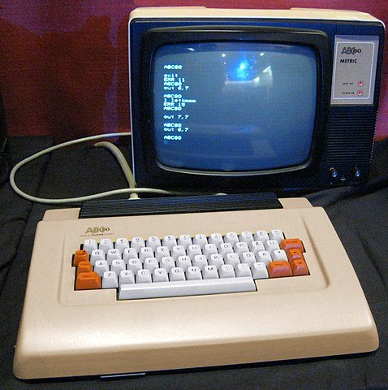

# ABC80 AIR-FIGHT 1981
A recreated program/code from paper trail.
Originally the program was coded for the Swedish home computer
[ABC80](https://en.wikipedia.org/wiki/ABC_80)[^1],
abbreviation for "Advanced Basic Computer for the 80s", (approx.) in 1981.
Inspired by the contemporary game console
[Atari VCS/2600](https://en.wikipedia.org/wiki/Atari_2600)
game [Combat #24](https://en.wikipedia.org/wiki/Combat_(Atari_2600)).

[^1]: More info in Swedish: https://www.idg.se/allt-om/abc+80.

But we will return to this program later. The computer, ABC80,
was a Swedish computer quite new at the time which came to market in 1978.
It was bought by the school for classroom education in circa early 1979.
Thus must have been one of the earliest schools in Sweden to have computers.

(Picture: liftarn, CC BY-SA 2.0 <https://creativecommons.org/licenses/by-sa/2.0>, via Wikimedia Commons.)

## Some historical context

Let's have a look at a timeline of some contemporary microcomputers introduced
during the years 1975-1984, with year of introduction and computer respectively:

- 1975
  - MITS Altair 8800
  - IMSAI 8080
- 1976
  - MOS KIM-1
  - Sol-20
  - Apple I
  - Rockwell AIM 65
- 1977
  - RCA COSMAC VIP
  - Apple II (in Sweden 1978)
  - Commodore PET
  - Radio Shack TRS-80
  - Atari VCS (2600)
- 1978
  - **ABC80**
- 1979
  - Atari 400
  - Atari 800
- 1980
  - TRS-80 Pocket Computer
  - Sinclair ZX80
- 1981
  - *ABC800*
  - Commodore VIC-20
  - Sinclair ZX81
  - Osborne 1
  - TI-99/4A
  - IBM PC (in Sweden 1983)
  - Acorn BBC Micro
- 1982
  - Victor 9000
  - Sinclair ZX-Spectrum
  - Commodore 64
- 1983
  - Jupiter Ace
  - Apple Lisa
- 1984
  - Apple Macintosh
  - IBM PCjr
...

A year after the three amigos (triad): Commodore PET, Apple II and TRS-80 were
released, ABC80 had some kind of the same flavour to it. These were machines that took
the step to a compact all-in-one computer for the expanding hobby/home computer market.
Previously there were mainly boards sold you could solder on the components yourself,
add cards, peripherals, tape recorders, printers, disc drive units, screens etc. that
required much more skill than plugging in a power cable. The machines had BASIC in ROM.
When started there would respond instantly with a prompt, ready for programming.
Quite a difference from just a few years earlier.

Another observation is that the field of both innovation and diversity is widespread
during these years. Each system had its own dependencies, its own configuration,
its own programming language. Yes, there were standards and de facto standards
such as Centronics parallel port, some wiring of RS-232, the IBM 8" floppy disc,
CP/M or even the older S-100 bus. But they did not kill the other systems.
Rather, they cooperated. But poorly. Maybe too poor were the connections.
But that was about to change. With such climbing staggering diversity,
the equilibrium of standards were needed even more.

IBM PC was introduced in 1983 in Sweden, two years after the introduction in the USA.
But the nationally homebrew computer ABC80 and its successor
[ABC800](https://en.wikipedia.org/wiki/ABC_800), had strong sales in the
late 70s until the mid-80s inside of Sweden, when it was gradually replaced by
foremost IBM PC and its clones. But even the success of the PC was not immediate.
The IBM PC XT, later AT, as well as Microsoft DOS made it harder to keep the
competition at a profitable level. The constant increased flow of new hardware
as well as software (translated software), internal fighting over contracts
of who had the right to sell what and when among retailers of ABC-computers,
made sales even harder.

In the late 70s CP/M was the system to keep track of. Also in Sweden.
But it was starting to get old. There were cards and software for ABC80
that could run CP/M, not unusual at this time to expand contemporary systems
for CP/M with the intention of generalising the computer. Even IBM PC had from the
start three systems to choose from: UCSD Pascal (p-code), CP/M-86, and
IBM/Microsoft DOS. In the start of the 80s the prognosis was that UNIX and C was the
standard to be. Many bet on Unix, a few bet on the PC. They said Unix was here to stay,
but it wasn't. Hardware and software for these systems were expensive.
Truely, too expensive. They were multiuser, endorsed by many authorities,
but the old time for sharing was not really suitable for the time.
*The terminal faded and the personal computer became the established configuration.*
This however wasn't clear at the time. Eventually in the late 80s and start of
the 90s the fog dissipated and direction was set.

In the chart below[^2] you can see how the sales were internally and proportionally
of ABC80, successor ABC800 and the rest of computers was during late 70'ties
until circa 1983. The national products were dominant.

In total, from 1978-1985, the sales of ABC80 were 33,000 units. But then Apple II were
at 4.8 million, and Commodore 64 somewhere around 12-17 million. They were obviously
not playing on the same field.

[^2]: Diagram reproduced from: Sjöström, Roland, Positionering under strategisk osäkerhet:
Vol. 2 Luxor datorer och persondatorbranschen, Unitryck, Linköping, 1996, p. 212.

The cost of computers was quite high at this time, but also shrinking rapidly.
* 1977 Commodore PET sold for $595 which is in 2022 ca $2,850 USD.
* 1978 ABC80 (no VAT) sold for approx. 6,900 SEK, which is today ca $2,900 USD, thus not far from the PET.
* 1983 Commodore 64 sold for $595 which is today ca $1,700 USD.

The ABC80 was a collaboration between [DIAB Industrier](https://en.wikipedia.org/wiki/Dataindustrier_AB)
(DIAB Industries) behind the technology, [Scandia Metric AB](https://sv.wikipedia.org/wiki/Scandia_Metric)
with its roots in industry, and [Luxor AB](https://en.wikipedia.org/wiki/Luxor_AB)
which made radios and television sets. There were retailers that
was also behind the large, but restricted to national and local, success.

Specifications of the ABC80:
* Zilog Z80, 3 MHz
* 16K RAM installed (could be expanded to 32K)
* 16K ROM with BASIC semi compiler/interpreter and e.g. driver for a tape recorder
* Monitor B/W included (modified TV set from Luxor)
* Graphics 78 x 72 dots (near the "standards" of Teletext /[Videotex](https://en.wikipedia.org/wiki/Videotex) /Prestel Plus ... )
* 24 rows x 40 columns character screen
* Swedish keyboard (sold in some other countries also, Hungary e.g. with presumably Hungarian keyboard)
* Sound (actually a decent chip, but not fully used by the computer)
* Expansion slot (the DIAB favoured 4680 bus, used often for miscellanous instruments, measurements, ...)

I don't remember, but maybe the tape recorder was included at times.
Disc drives were bith from 3rd party and from the manufacturer.
Later on the ABC80 could be extended with 3rd party additions such as
contemporary popular 80 column cards, CP/M, and local network, which
expanded its lifetime in the start of the 80s. But the support wasn't
coming from the source itself, and adding possibly conflicting hardware
didn't make its life easier.

DIAB had moved on, betting on Unix, focusing its own crafted
[DNIX](https://en.wikipedia.org/wiki/DNIX), and had other machines
at this time, with little time for something they really wasn't that
interested in.

## My conclusions

*ABC80 had industrial strength, was very solid with software in ROM,
fast and reliable (one or two bugs maybe, later corrected). Expansion was key to
the construction and essential, as it was basically designed for industry and primarily
not for e.g. games or business. The later generalisation with ABC800 made it easier
for expansion in those latter fields. It had colour, better graphics, better BASIC and came
with more variations.*

*On the other hand segments which could also have gained from the success
of ABC80, such as schools, those dependent on the graphic, gaming or sound
technology etc. were left behind. Instead schools were completely misled by investing in
failed projects such as "[COMPIS](https://en.wikipedia.org/wiki/Compis)".
But that is quite another story...*

In general the horizontal field of innovation and diversity came to be replaced by a
vertical strata. The highly incompatible plethora of machines in spirit of the 70s,
was replaced by a single item hardware during the 80s where new competition was in speed,
speed, and more speed, but also internal memory expansion, external storage and programs
that copied and cloned each others ideas.

Data, though, was still hard to convert between programs. There were new flaws such
as incompatibility between programs and data, sometimes intentionally to keep customers
addicted to one branch of program development (e.g. word processing). Not only were there
these vendor lock-ins, but also the ideas of what word processing could be. If Ted Nelson,[^3]
the guy behind hypertext, had his chance of changing electronic writing (Xanadu),
or Jef Raskin,[^4] the guy behind Macintosh, with his ideas of speed up typing (eventually the Canon
Cat), the ideas evaporated soon in this narrow environment.

[^3]: See https://en.wikipedia.org/wiki/Ted_Nelson.

[^4]: See https://en.wikipedia.org/wiki/Jef_Raskin.

Or look at the inevitable history and legacy that still influences our modern computers, such
as architectures and processors that can still run old code almost dating back to the origin in
Intel 8088, or rather the 8086 instructions. This somewhat stifled hardware development for
many many years, or rather: it took it in a special direction of just getting faster
with historical constraints. But nonetheless it benefitted software development,
as software can rely on older code, systems, libraries etc. You do not necessarily have to invent
the wheel everyother year.

Well, back to the code …

## The code and additional hardware

*U. Kristian Lidberg* did the main code for the ABC80 in [BASIC](https://en.wikipedia.org/wiki/BASIC)
and I (to a very small degree) contributed. We were at the time in
the gymnasium ([Brännkyrka gymnasium](https://sv.wikipedia.org/wiki/Br%C3%A4nnkyrka_gymnasium),
Stockholm, Sweden), in 1981. As you might recognize, it is not very consistent program
and flawed. We were alternating by the keyboard under some pressure to complete
this (including nights), so there are naturally a lot of those flaws as consequence.
I guess at maximum we might have done this in a week, or more probably in some days.
(I also did a poster, which was an illustration of two fighting aeroplanes.)

*It was really only once ever used, during an afternoon when parents visited the school.*
It also depends on two "joysticks" which were connected to the V24-port
[RS232](https://en.wikipedia.org/wiki/RS-232) at the back, were tailor-made by us.
So it did not have much of an afterlife.

We built the yousticks out of small hotel soap containers, where the inside had cables,
switches and diodes. (No pull up or pull down resistors, from which I can remember.)
The joysticks were in the same spirit as Atari made them: simple switches, and for each a "fire button".
The keyboard was really no alternative, to my recollection, because the keyboard roll-over was too
limiting (even if it has "N-key roll-over" 2,5 ms scanning, i.e. 30 hits per second, somehow
interruption routine might have impacted this?) or was it that joysticks were much too fun?

Historical reflections over Combat can be found in:
Montfort, Nick & Bogost, Ian, *Racing the beam: the Atari Video computer system*, MIT Press,
Cambridge, Mass., 2009. An article (excerpt) can be found at at: http://gamestudies.org/0601/articles/montfort
which explains *Combat* in detail.

AIR-FIGHT has never been published, **until now**, partly because we were probably afraid of possible
copyright infringement at the time. That's why it's also called "AIR-FIGHT" rather than "Combat (#24)"
or something to that effect.

__There might be *spelling mistakes*, as I have not tried to run this code at all.__

It has finally been put here as a remembrance of *Kristian*, as he disappeared without trace in the
mid 80s, never to return.

### contrib/JAVASCRIPT
A simple reimagination of the game in JavaScript. It illustrates a kind of "prototyping" in programming.
I. e. testing your ideas as "code".

### contrib/ATARI 2600/VCS
A partially implemented AIR-FIGHT, i.e. just the movement of the aeroplane in code for
[MOS 6502](https://en.wikipedia.org/wiki/MOS_Technology_6502) (6507) Atari 2600/VCS.
It might be that it has to be heavily reimplemented and changed due to the
particularities of this machine, if fully implemented. But it also easily extended as you
push each value for each player (2), and switch every other loop iteration.
It also illustrates my interpretation of the meaning of "code" and "coding".
It has only been tested at the site https://8bitworkshop.com (by Steven Hugg) on the emulator
for Atari 2600.

# ABC80 MUSIC 1981
Most simple sample we could come up with that made it to the presentation.

## References

- Andersson, Anders (red.), *ABC om BASIC*, (1979) 2. uppl., Didact, Linköping, 1980
- Hugg, Steven, *Making Games for the Atari 2600: An 8bitworkshop Book*, CreateSpace Independent Publishing Platform, 2016
- Isaksson, Anders & Kärrsgård, Örjan, *Avancerad programmering på ABC80*, Studentlitt., Lund, 1980
- Markesjö, Gunnar, *Mikrodatorns ABC: elektroniken i ett mikrodatorsystem*, 1. uppl., Esselte studium, Stockholm, 1978
- Montfort, Nick & Bogost, Ian, *Racing the beam: the Atari Video computer system*, MIT Press, Cambridge, Mass., 2009
- Wolf, Mark J. P. (red.), *The video game explosion: a history from Pong to Playstation and beyond*, Greenwood Press, Westport, Conn., 2008
