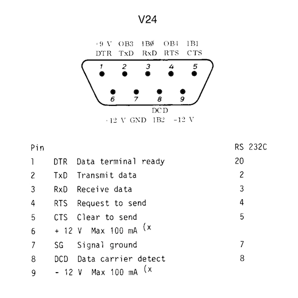

# ABC80 AIR-FIGHT 1981
A recreated program/code from paper trail.
Originally coded for the [ABC80](https://en.wikipedia.org/wiki/ABC_80) (Advanced Basic Computer for the 80-ties, approx.) in 1981,
inspired by [Atari VCS/2600](https://en.wikipedia.org/wiki/Atari_2600) [Combat #24](https://en.wikipedia.org/wiki/Combat_(Atari_2600)).

**U. Kristian Lidberg** did the main code in [BASIC](https://en.wikipedia.org/wiki/BASIC)
and I (to a very small degree) contributed. We were at the time in
the gymnasium ([Brännkyrka gymnasium](https://sv.wikipedia.org/wiki/Br%C3%A4nnkyrka_gymnasium),
Stockholm, Sweden), in 1981. As you might recognize, it is not very
consistent and flawed. We were alternating by the keyboard under some pressure to complete this
(including nights), so there are naturally a lot of those flaws. I guess at maximum we might have
done this in a few weeks, or more probably in some days. I also did a poster, which was an illustration
of two fighting aeroplanes.

It was really only once ever used, during an afternoon when parents visited the school.
It also depends on two "joysticks" which were connected to the V24-port
[RS232](https://en.wikipedia.org/wiki/RS-232)
at the back, were tailormade by us.
We built them from small hotel soap containers, where the inside had cables, switches and diodes.
They were in the same spirit as Atari made them: simple switches, and for each a "fire button".
The keyboard was no alternative because the keyboard roll-over was too limited.

Historical reflections over Combat can be found in:
Montfort, Nick & Bogost, Ian, *Racing the beam: the Atari Video computer system*, MIT Press, Cambridge, Mass., 2009.
Hugg, Steven, *Making Games for the Atari 2600: An 8bitworkshop Book*, (2016), CreateSpace Independent Publishing Platform, 2018. 
An article can be found at at: http://gamestudies.org/0601/articles/montfort which considers it in detail.

It has never been published, until now, partly because we were probably afraid of possible
copyright infringment at the time. That's why it's also called "AIR-FIGHT" rather than "Combat (#24)".

There might be spelling mistakes, as I have not tried to run this code at all.

It has finally been put here as a remeberance of Kristian, as he disappeared without trace in the mid 80'ties, never to return.

### JAVASCRIPT
A simple reimagination of the game in JavaScript. It illustrates a kind of "prototyping" in programming.
I. e. testing your ideas as "code".

### ATARI 2600/VCS
A partially implemented AIR-FIGHT, i.e. just the movement of the aeroplane in code for
[MOS 6502](https://en.wikipedia.org/wiki/MOS_Technology_6502) (6507) Atari 2600/VCS.
It might be that it has to be heavily reimplemented and changed due to the
particularities of this machine, if fully implemented.
It also illustrates my interpretation of the meaning of "code" and "coding".
It has only been tested at the site https://8bitworkshop.com (by Steven Hugg) on the emulator
for Atari 2600.

# ABC80 MUSIC 1981
Most simple sample we could come up with that made it to the presentation.
