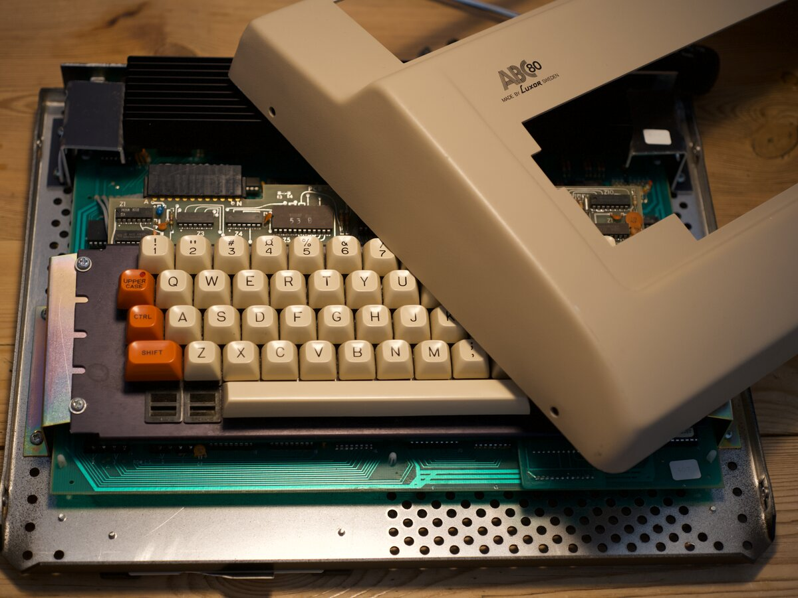

# ABC80

Material om den svenska hemdatorn ABC80 (Luxor, 1978): spelet
AIR-FIGHT från 1981, emulatorer, verktyg och texter, och materialet
till boken *ABC80 inifrån*.

Material on the Swedish home computer ABC80 (Luxor, 1978): the game
AIR-FIGHT from 1981, emulators, tools and essays, and the companion
material to the book *ABC80 inifrån* ("ABC80 from the inside").

| Mapp / Folder | Innehåll | Contents |
|---|---|---|
| [`inifran/`](inifran/) | boken *ABC80 inifrån*: exempel, Forth, disassembleringar, assembler och emulator (i terminalen och i webbläsaren) | the book: examples, Forth, disassemblies, assembler and emulator (terminal and browser) |
| [`airfight/`](airfight/) | AIR-FIGHT 1981, MUSIC och KOL av Kristian Lidberg, uppsatsen om dem och portar till andra maskiner | AIR-FIGHT 1981, MUSIC and KOL by Kristian Lidberg, the essay about them, and ports to other machines |
| [`emulatorer/`](emulatorer/) | en enkel emulator i C och *ABC80 for Ants* för Raspberry Pi Pico 2 | a simple emulator in C and *ABC80 for Ants* for Raspberry Pi Pico 2 |
| [`kassett/`](kassett/) | verktyg mellan ABC80-band (WAV) och BASIC-text | tools between ABC80 tapes (WAV) and BASIC text |
| [`texter/`](texter/) | historik, minnen och en debattartikel från 1984 | history, memories and an opinion article from 1984 |
| [`abc802/`](abc802/) | benchmarks för ABC802 och BASIC II | benchmarks for ABC802 and BASIC II |
| [`abclisp/`](abclisp/) | *What if*: en Lisp för Z80 | *What if*: a Lisp for the Z80 |
| [`assets/`](assets/) | bilder och PDF:er som texterna visar | images and PDFs used by the texts |

Börja gärna med [uppsatsen om AIR-FIGHT](airfight/README.md) eller med
emulatorn i [`inifran/emulator/`](inifran/emulator/), som går att köra
direkt i webbläsaren.

A good place to start is [the essay on AIR-FIGHT](airfight/README.md),
or the emulator in [`inifran/emulator/`](inifran/emulator/), which runs
directly in the browser.
