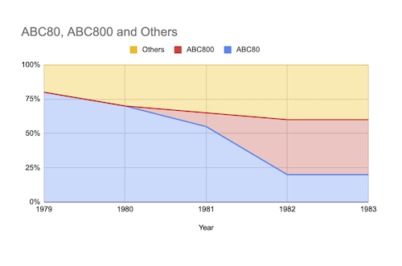

# ABC80 AIR-FIGHT 1981
A recreated program/code from paper trail.
Originally coded for the [ABC80](https://en.wikipedia.org/wiki/ABC_80)[^1]
(Advanced Basic Computer for the 80-ties, approx.) in 1981,
inspired by [Atari VCS/2600](https://en.wikipedia.org/wiki/Atari_2600)
[Combat #24](https://en.wikipedia.org/wiki/Combat_(Atari_2600)).

[^1]: More info in Swedish: https://www.idg.se/allt-om/abc+80.

## Some historical context

Timeline of some microcomputers during the years 1975-1984, year of
introduction and computer:

- 1975
  - MITS Altair 8800
  - IMSAI 8080
- 1976
  - MOS KIM-1
  - Sol-20
  - Apple I
  - Rockwell AIM 65
- 1977
  - RCA COSMAC VIP
  - Apple II (in Sweden 1978)
  - Commodore PET
  - Radio Shack TRS-80
  - Atari VCS (2600)
- 1978
  - **ABC80**
- 1979
  - Atari 400
  - Atari 800
- 1980
  - TRS-80 Pocket Computer
  - Sinclair ZX80
- 1981
  - Commodore VIC-20
  - Sinclair ZX81
  - Osborne 1
  - TI-99/4A
  - IBM PC (in Sweden 1983)
  - Acorn BBC Micro
- 1982
  - Victor 9000
  - Sinclair ZX-Spectrum
  - Commodore 64
- 1983
  - Jupiter Ace
  - Apple Lisa
- 1984
  - Apple Macintosh
  - IBM PCjr
...

IBM PC was introduced in 1983 in Sweden, two years after the introduction in USA.
But the homebrew computer ABC80 and its successor ABC800, had strong sales in the
late 70-ties until the mid-80'ties in Sweden, when it was gradually replaced by
foremost IBM PC and clones. But the success of the PC was not immediate.
The IBM PC XT, later AT as well as Microsoft DOS made it harder to keep the
competition at a profitable level. The constant increased flow of new hardware
as well as software didn't make it easy to keep up. Internal fighting over contracts
of who had the right to sell what and when among retailers, made sales even harder.

In the late 70'ties CP/M was the system to keep track of. Also in Sweden.
But it was getting old. Even IBM PC had from the start three systems to chose from:
UCSD Pascal, CP/M, and IBM/Microsoft DOS. In the 80'ties came UNIX and C as the
standard to be. They said. But it wasn't. Hardware and software for these systems
were expensive. Too expensive. They were multiuser, but the old time for sharing was
not really suitable for the time. The terminal faded and the personal computer
became the established configuration. 

In the chart below you can see how the sales were internally and proportinally
of ABC80, successor ABC800 and the rest was during late 70'ties until circa 1983.

[^2]: Diagram reproduced from: Sjöström, Roland, Positionering under strategisk osäkerhet:
Vol. 2 Luxor datorer och persondatorbranschen, Unitryck, Linköping, 1996, p. 212.

The cost of computers were quite high at this time, but also shrinking heavily.
* 1977 Commodore PET sold for $595 which is today ca $2,850 USD.
* 1978 ABC80 sold for approx. 6,000 SEK, which is today ca $2,500 USD, not far from the PET.
* 1983 Commodore 64 sold for $595 which is today ca $1,700 USD.

## The code

*U. Kristian Lidberg* did the main code in [BASIC](https://en.wikipedia.org/wiki/BASIC)
and I (to a very small degree) contributed. We were at the time in
the gymnasium ([Brännkyrka gymnasium](https://sv.wikipedia.org/wiki/Br%C3%A4nnkyrka_gymnasium),
Stockholm, Sweden), in 1981. As you might recognize, it is not very
consistent and flawed. We were alternating by the keyboard under some pressure to complete
this (including nights), so there are naturally a lot of those flaws. I guess at maximum we
might have done this in a week, or more probably in some days. (I also did a poster, which
was an illustration of two fighting aeroplanes.)

It was really only once ever used, during an afternoon when parents visited the school.
It also depends on two "joysticks" which were connected to the V24-port
[RS232](https://en.wikipedia.org/wiki/RS-232)
at the back, were tailor-made by us.
We built them from small hotel soap containers, where the inside had cables, switches and diodes.
They were in the same spirit as Atari made them: simple switches, and for each a "fire button".
The keyboard was really no alternative to my recollection because the keyboard roll-over was too
limiting (even if it has "N-key roll-over" 2,5 ms scanning, i.e. 30 hits per second, somehow
interrupt routine might have impacted this?) or was it that joysticks were much too fun?

Historical reflections over Combat can be found in:
Montfort, Nick & Bogost, Ian, *Racing the beam: the Atari Video computer system*, MIT Press,
Cambridge, Mass., 2009. An article (excerpt) can be found at at: http://gamestudies.org/0601/articles/montfort
which explains *Combat* in detail.

AIR-FIGHT has never been published, **until now**, partly because we were probably afraid of possible
copyright infringement at the time. That's why it's also called "AIR-FIGHT" rather than "Combat (#24)"
or something to that effect.

__There might be *spelling mistakes*, as I have not tried to run this code at all.__

It has finally been put here as a remembrance of *Kristian*, as he disappeared without trace in the
mid 80'ties, never to return.

### contrib/JAVASCRIPT
A simple reimagination of the game in JavaScript. It illustrates a kind of "prototyping" in programming.
I. e. testing your ideas as "code".

### contrib/ATARI 2600/VCS
A partially implemented AIR-FIGHT, i.e. just the movement of the aeroplane in code for
[MOS 6502](https://en.wikipedia.org/wiki/MOS_Technology_6502) (6507) Atari 2600/VCS.
It might be that it has to be heavily reimplemented and changed due to the
particularities of this machine, if fully implemented. But it also easily extended as you
push each value for each player (2), and switch every other loop iteration.
It also illustrates my interpretation of the meaning of "code" and "coding".
It has only been tested at the site https://8bitworkshop.com (by Steven Hugg) on the emulator
for Atari 2600.

A good reference is: Hugg, Steven, *Making Games for the Atari 2600: An 8bitworkshop Book* (2016),
CreateSpace Independent Publishing Platform, 2018.

# ABC80 MUSIC 1981
Most simple sample we could come up with that made it to the presentation.

## Reference

- Andersson, Anders (red.), *ABC om BASIC*, (1979) 2. uppl., Didact, Linköping, 1980
- Hugg, Steven, *Making Games for the Atari 2600: An 8bitworkshop Book*, CreateSpace Independent Publishing Platform, 2016
- Isaksson, Anders & Kärrsgård, Örjan, *Avancerad programmering på ABC80*, Studentlitt., Lund, 1980
- Markesjö, Gunnar, *Mikrodatorns ABC: elektroniken i ett mikrodatorsystem*, 1. uppl., Esselte studium, Stockholm, 1978
- Montfort, Nick & Bogost, Ian, *Racing the beam: the Atari Video computer system*, MIT Press, Cambridge, Mass., 2009
- Wolf, Mark J. P. (red.), *The video game explosion: a history from Pong to Playstation and beyond*, Greenwood Press, Westport, Conn., 2008
