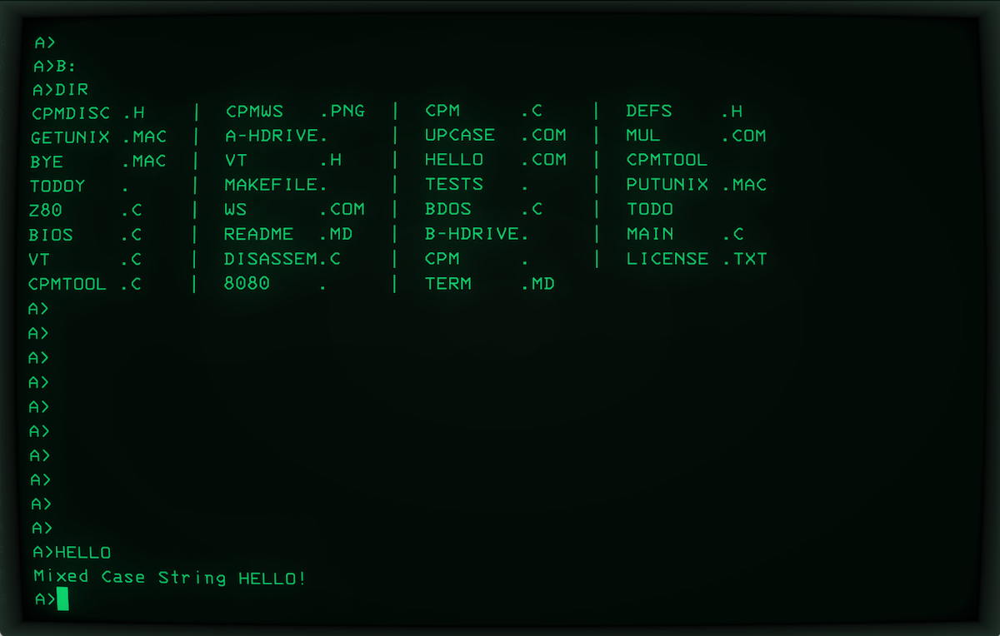
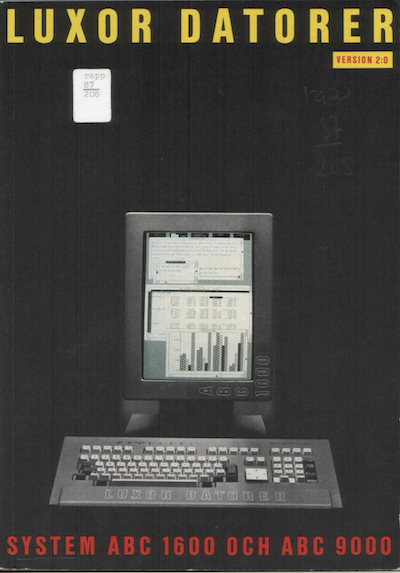
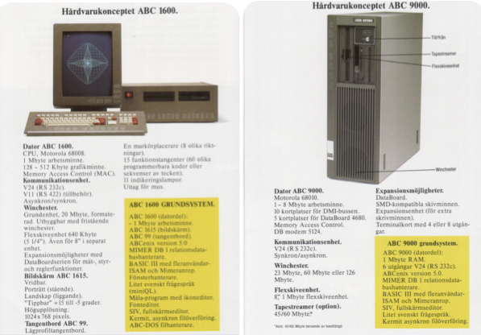

#### A note on context

The following primarily focuses on technological developments in
microcomputer operating systems from the late 70s to the mid-80s,
excluding larger systems like workstations and contemporary
minicomputers. In retrospect, PC-DOS / MS-DOS emerged
victorious, with the IBM PC becoming the new de facto standard 
in this market. The well-documented story of how and why this
happened is widely known. However, in the periphery, intriguing
developments were stifled, potentially escaping broader historical
narratives. Some examples here will shed light on traces of that
overlooked story.

# CP/M

In the late 1970s and early 1980s, many contemporary computer manufacturers
expanded their proprietary solutions by incorporating CP/M[^cpmwiki]
capabilities, either through add-on cards or by redesigning their machines.
This trend emerged as CP/M gained market traction. For instance, the Apple II
could run CP/M software using third-party Z80 processor cards, such as the
Microsoft SoftCard.[^softcard] Similarly, the Commodore 128 included a Z80
processor, enabling it to run CP/M alongside its native operating
systems.[^commodore128]

Additionally, some systems came with CP/M pre-installed from the start.
Notable examples include the Osborne 1[^osborne], an early portable computer
that bundled software like WordStar[^wordstar] and SuperCalc[^supercalc],
and the Kaypro II[^kaypro]. These integrations highlighted CP/M's versatility
and widespread adoption during that era.

*Not to be unfashionable, the ABC802 did also came prepared for a possible
extension of running CP/M.*[^cpmabc800]

[^cpmwiki]: Elementary on CP/M: https://en.wikipedia.org/wiki/CP/M.
[^softcard]: Z80 SoftCard: https://en.wikipedia.org/wiki/Z-80_SoftCard.
[^commodore128]: Commodore 128: https://en.wikipedia.org/wiki/Commodore_128.
[^osborne]: Osborne 1: https://en.wikipedia.org/wiki/Osborne_1.
[^wordstar]: WordStar: https://en.wikipedia.org/wiki/WordStar.
[^supercalc]: SuperCalc: https://en.wikipedia.org/wiki/SuperCalc.
[^kaypro]: Kaypro: https://en.wikipedia.org/wiki/Kaypro
[^cpmabc800]: Almost the same computer, CP/M for ABC800:
https://www.abc80.net/archive/luxor/sw/CPM/MYAB-Bruksanvisning-for-cpm-pa-ABC800.pdf.
Although here it was an addition, instead of pre-built harware.

### De facto standardisation

Developed by Gary Kildall[^kildall] (Digital Research Inc.)[^dri], CP/M
(Control Program for Microcomputers, Control Program / Monitor) is one
of the seminal operating systems in the history of personal computing.
CP/M began in 1973 when Gary Kildall wrote the initial version to run
on Intel 8080/85-based microcomputers. Officially released in 1974,
CP/M quickly became one of the first widely used de facto operating
systems for personal computers.

In the pre-CP/M era, early microcomputers lacked standardised operating
systems. Probably it could not be fitted in them, often low on memory.
Sometimes they had though "monitors," early basic communications
with the system for debugging, status etc. Users often had to write
their own software to interact more directly with the hardware,
which was naturally a significant barrier to wider adoption and usability.
By providing a de facto standardised operating system that could run
on various hardware platforms, CP/M played a pivotal role in the growth
of the personal computer market during the late 1970s and early 1980s.
It enabled software developers to write programs that could be distributed
widely and run on a variety of machines, paving the way for a burgeoning
software industry.

CP/M featured a simple, yet effective file system and command-line interface,
which was user-friendly for its time. One significant strength was its design,
which made it easily adaptable to various hardware platforms. This *portability*
was a crucial factor in its widespread use. CP/M utilised a BIOS[^bios]
(Basic Input/Output System) to handle hardware-specific operations.
This abstraction layer enabled the operating system to run on different
machines with minimal modifications, enhancing its portability and flexibility.
The BIOS is also one of the features that translated well to the future MS-DOS
era.

CP/M fostered a rich ecosystem of software applications and development tools.
Popular software like WordStar was first developed for CP/M, and a successful
database management dBASE II[^dbase] became very popular software
ported to CP/M. Microsoft's MS-DOS, later on became the standard operating
system for IBM PCs, was heavily influenced by CP/M. The initial version of
MS-DOS (also known as 86-DOS or QDOS) was even designed to be 'compatible'
with (legacy) CP/M-86 software, facilitating an easier transition for users
and developers. Its interactive command-line featured many familiar commands.
Portability was easier when APIs were close enough for a smoother transition.
This included compatibility with CP/M’s BIOS and BDOS (Basic Disk Operating
System) calls, which were mapped to equivalent functions in MS-DOS.

On the hardware side, there was also a similar standardisation development.
The S-100 bus,[^s100] originally known as the Altair bus, was introduced
in 1974 with the MITS Altair 8800,[^altair] one of the first commercially
successful personal computers. Initially designed for the Intel 8080
microprocessor, it was later adapted for other processors, including
the Zilog Z80 and the Intel 8085. The bus consisted of a 100-pin edge
connector, providing a standardised interface for attaching CPU, memory,
and peripheral cards. Users could easily add or replace components to
upgrade their systems, which promoted a thriving third-party hardware
market. The standardisation of the bus allowed components from different
manufacturers to work together.

*It is important to note that CP/M and the S-100 bus were __not__
dependent on each other. They were distinct standards, each contributing
independently to the diverse and evolving personal computer market. These
unifications highlighted the significance of a common ground. However,
identifying where that intersection lay and how to achieve it remained
an unresolved challenge.*

[^kildall]: https://en.wikipedia.org/wiki/Gary_Kildall
[^bios]: https://en.wikipedia.org/wiki/BIOS
[^dbase]: https://en.wikipedia.org/wiki/DBase
[^dri]: https://en.wikipedia.org/wiki/Digital_Research
[^s100]: https://en.wikipedia.org/wiki/S-100_bus
[^altair]: https://en.wikipedia.org/wiki/Altair_8800

### Decline

The rise of CP/M and the S-100 bus standard occurred roughly in the same
time span, creating a synergistic environment where microcomputer users
could benefit from a standardised software platform *CP/M* and a standardised
hardware interface *S-100*. This combination contributed to the growth of
the personal computer industry by making it somewhat easier for users to
expand and customise their systems and for developers to create compatible
hardware and software.

But eventually these standards had their drawbacks, as time progressed.
The S-100 bus large and complex backplanes and cards made systems bulky
and costly to design and maintain. The parallel bus architecture was prone
to electrical noise and signal integrity issues, leading to potential data
corruption and system instability, as more cards were added. High power
consumption due to its wide range of supported voltages required robust power
supplies and cooling solutions, further increasing costs. Despite being a
standard, variations in implementation among manufacturers caused compatibility
issues. The bus also suffered from relatively slow data transfer speeds, becoming
a performance bottleneck. Additionally, the connectors were not robust, leading
to mechanical issues and the need for frequent maintenance. As newer, more
efficient bus standards like the ISA (internal 16-bit of IBM PC/AT) emerged,
the S-100 bus quickly became outdated, struggling to keep
up with evolving hardware capabilities.

CP/M, originally designed for 8-bit microprocessors, had several drawbacks
that limited its effectiveness as computing technology advanced. Its memory
management capabilities were restricted, allowing it to address only up to
64KB of memory. The absence of built-in networking capabilities hindered its
usefulness in networked environments, becoming a significant limitation as
businesses and individuals began connecting computers in local area networks
(LANs) and using modems for remote communication -- although there were
applications running e.g. terminal emulations. CP/M's command-line interface,
though functional, was basic and started to feel outdated as graphical user interfaces
like those in e.g. the Apple Macintosh and later Microsoft Windows emerged, offering
more intuitive and visually appealing experiences. Additionally, CP/M struggled to support
emerging hardware technologies such as high-resolution graphics, advanced sound systems,
and sophisticated input devices, making it less appealing for multimedia applications.
Its single-tasking nature, which allowed only *one program to run at a time*, became a
significant drawback as multitasking grew in importance for productivity and user
convenience. Furthermore, the existence of many variations of CP/M created by different
hardware manufacturers led to compatibility issues, with software written for one version
often not running correctly on another. These limitations collectively contributed to
CP/M's decline as a previous dominant operating system.

#### Summary

*IBM’s decision to use MS-DOS for its PCs was a major blow to CP/M.*
IBM PCs quickly became the industry standard, and MS-DOS emerged
as the dominant operating system. It is important to note that IBM also
offered CP/M and UCSD Pascal as alternatives to MS-DOS, but the pricing
for CP/M was significantly higher. The saying 'You couldn't go wrong with buying an IBM,'
originally used when considering mainframes, underscored the reliability
and growing popularity of the IBM PC. Even though PC-DOS / MS-DOS
was built on a 'clone' of CP/M, it evolved and laid the foundation for a large
developer market.

*This shift fostered a competitive software market for PCs, which established
a standard in both hardware and software. Previously, proprietary computer
brands with unique solutions had competed for dominance. While early de facto
standards here provided some cohesion, their future impact was limited.*

### DataBoard 4680

In 1974, i.e. the same year of birth as the S-100, the Data Board 4680 system
was designed by Dataindustrier AB[^diab] with support for three microprocessors:
Intel 4004, Motorola 6800, and Intel 8080. Other additional processors
were initially considered for use, and also cards were built, but ultimately,
the Z80 became the predominant choice. This original system consisted of a
CPU card, and separate cards for RAM and EPROM for software.
The 4680 bus featured a 16-bit address bus and an 8-bit data bus,
allowing it to directly address 64 KB of memory.

The modular system was used in various applications such as a diagnostic machine
for brain tumors at a prominent hospital, the printing process at a major newspaper,
or a control system for an industrial manufacturer in collaboration with an automation
company.

In 1977, the 7S (Seven S) debuted as a combined monochrome terminal
and computer utilizing the Data Board 4680 bus and powered by the Z80
processor. Following this, in 1978, the ABC 80 was introduced as a Z80-based
monochrome home computer, also with a variation as the "ABC-bus", which
could connect to Data Board 4680.

By 1981, the ABC 800 emerged as an enhanced model for both office
and home use, equipped with 32 KB of RAM and featuring color graphics.
And as we know, in 1983 the ABC 802 was launched as a variant of the
ABC 800, offering 64 KB of RAM, with 32 KB designated for use as a RAM disk.
Or the alternative use: as a 64 KB CP/M machine.
Further enhancing the lineup was the ABC 806, which featured
160 KB of RAM, with 128 KB allocated as a RAM disk. Also
with enhanced graphics. All of these computers were in fact based on the
Data Board 4680 bus.

But Data board 4680 represented more of a niche approach to microcomputer
design, focusing on specific industrial and computing needs rather than
aiming for broad consumer appeal. Its influence was felt in specialized
applications but obviously did not have the same widespread impact as
the S-100.

Data Board 4680 was employed in embedded control applications.
This could include industrial automation, where precise timing and
control were necessary, leveraging the capabilities of primarily the Z80 processor.
In educational and experimental settings, the Data Board 4680 provided
a platform for early computing enthusiasts and hobbyists to explore different
microprocessor architectures. Certain specialized computing tasks,
such as data acquisition systems or specific instrument control applications,
benefited from the versatility. Engineers and scientists could customize systems
based on their specific requirements.

The designer of the basis for the ABC-line of computers and the Data Board 4680,
was in the main Lars Karlsson, together with a group of engineers.
A self-taught engineer, Karlsson early on realise the importance of the "bus"[^bus]
but also the abstraction or generalisations of the "bus". But as technology progressed,
the bus also had to change. When 16-bit  processors came along, and Unix
became a topic of interest, the bus also had to adapt.
Dataindustrier AB, alternatively called DIAB AB later, started by Karlsson in 1971,
became one of Swedens primary designer for microcomputers. No other company
nationally made such a success in this market with their own design. Lars Karlsson
left Sweden for USA in 1983, to focus on Data Board 4680 and the future,
but also then sold shares of the company he once started.

[^diab]: https://sv.wikipedia.org/wiki/Dataindustrier_AB
[^bus]: https://en.wikipedia.org/wiki/Bus_(computing)

### Alternative routes

Computer manufacturers in the beginning of 1980s faced critical decisions
about their future direction. The importance of the 1981 IBM PC was evident,
but the extent of its impact and the direction of the market were uncertain.
Key questions included: Where was the technology heading? How crucial
was legacy support? How could the company stay relevant in the changing
technological landscape?

*Business as Usual*: Some manufacturers adopted a "business as usual" approach,
assuming that their customers would remain satisfied with whatever they produced
and innovated. This group often targeted the low-end market, where affordability
and entertainment, such as gaming, were key factors. They produced cheaper
computers that fit well within this (rather large) niche.

*Partial Compatibility*: Another group chose to create "clones" of the IBM PC with
a twist. These manufacturers, including local and national companies like Nokia
and Ericsson, made PCs that were not fully compatible with the original IBM PC.
They aimed to offer a superior product by adding unique features or improvements,
hoping for customer loyalty. However, they often miscalculated the market risks
and faced high costs, which led to their decline within a few years.

*Full Compatibility*: The third group understood the critical importance of full
compatibility with the IBM PC. They focused on reverse engineering, including
replicating the BIOS, to ensure that their PCs were entirely compatible with
IBM PCs. This approach allowed them to capitalize on the existing software
ecosystem and meet the demands of users who required seamless compatibility.
Companies like Compaq successfully adopted this strategy, becoming significant
players in the market by offering reliable IBM PC clones.

But there was at least one group more: they bet on *UNIX* as the future.[^Xenix]
[^Xenix]: Among them were in fact Microsoft with *Xenix*.

### UNIX

Unix was developed in the late 1960s and early 1970s at AT&T's Bell Labs by
Ken Thompson, Dennis Ritchie, and some others. That is years before CP/M.
Initially, it was a small, flexible operating system for the prevalent and
current *minicomputers* (most famously the PDP/11). Thus it was aimed at
significantly different computers than CP/M. But Unix quickly gained popularity
in academic and research institutions due to its portability, powerful
features, and the availability of its source code for educational purposes.

In the late 1970s, AT&T began licensing Unix to commercial vendors, which
led to a proliferation of Unix versions. Different vendors developed their
own variants, leading to extreme fragmentation.

One significant variant was the Berkeley Software Distribution (BSD),
developed at the University of California, Berkeley. BSD introduced many
enhancements and became a foundation for later Unix systems. But they also
had license fees to be paid to AT&T for some Unix software. A significant
difference at the start was that important networking such as TCP/IP was
supported on BSD, but only later added to the AT&T versions.

In the years to come, overcoming *fragmentation* was a significant issue,
perhaps the largest of them all. Besides technological challenges, licensing
restrictions and the use of the Unix brand also hindered companies, development,
and market expansion.

### The proliferation of standards, ABCenix or D-NIX, among them

The rise of multiple standards, derivations of Unix in a lot of *NIX,
exemplifies a trend towards diverse platforms as well as fragmentation.

In 1983, same year as Luxor introduced ABC802, DIAB developed its first
UNIX-compatible machine, the DIAB DS90, using the Motorola 68000 CPU.
They initially used a UNIX System V license from AT&T, but being an
industrial automation company, DIAB required a real-time operating system.
To meet this need, they replaced the AT&T-supplied UNIX kernel with their
own real-time variant. Over time, DIAB also developed their own versions
of UNIX standard tools, eventually eliminating any code derived from UNIX.
This allowed DIAB to deploy their machines independently, without needing
an AT&T UNIX license. But not being able to use the UNIX brand,
of course,

Two years later, DIAB continued enhancing the DS90 computer series,
incorporating newer Motorola CPUs such as the 68010,
68020, 68030, and the 68040. Luxor was offered to sell a DS90
as they rebranded "ABC9000", and the operating *NIX called D-NIX,
was instead rebranded as "ABCenix".[^ABC9000] Also a smaller model called
ABC1600 run the same OS.[^ABC1600] This latter system D-NIX was even
licensed or possibly only rebranded as *Cromix* for Cromenco.[^D_NIX]
D-NIX and the computers from DIAB continued to live under a
new ownership of Bull in the 1990s.

Here somewhere in the mid 1980s was the beginning of what to become
the "Unix wars."[^war]. It was a period of competition and fragmentation
continuing from the mid 80s into the 1990s. This era was characterized
by disputes among various Unix vendors and standards bodies,
leading to the proliferation of different Unix variants and standards.

But there were some achievements in standardization efforts such as
POSIX and somewhat of the Single UNIX Specification (SUS). However,
rivalry among vendors, intense competition, legal disputes over licensing,
and ongoing compatibility issues continued to pose significant challenges.
Competition often led to proprietary extensions, which further contributed
to fragmentation.

That history, however, extends far beyond the lifespan of the ideas
surrounding the ABC802 and its relatives.

[^D_NIX]: https://sv.wikipedia.org/wiki/D-NIX
[^ABC1600]: https://sv.wikipedia.org/wiki/ABC_1600
[^ABC9000]: https://sv.wikipedia.org/wiki/DIAB_Serie_90
[^bro]: Image above taken from: https://www.abc80.net/archive/luxor/ABC1600/1986-System-ABC-1600-och-ABC-9000.pdf
[^war]: https://en.wikipedia.org/wiki/Unix_wars

#### A note on context

This time there is not so much context added beside comments
on how the technology in some cases had their ups and downs.

## Appendix: CP/M, Unix, MS-DOS/PC-DOS[^chatgpt]

#### Target audience

__CP/M__: Designed for microcomputers using Intel 8080 or Zilog Z80 processors,
aimed at hobbyists, small businesses, and early personal computer users.

__Unix__: Initially designed for minicomputers and mainframes used by researchers,
academics, and enterprise environments. Early Unix required more powerful
hardware compared to CP/M.

__MS-DOS/PC-DOS__: Designed for IBM PCs and compatible microcomputers using
Intel x86 processors, aimed at personal and business users.

#### Architecture and Design

__*CP/M*__: Simple, single-tasking operating system with a command-line interface.
* __File System__: Utilised a flat file system with an 8.3 filename convention (eight
characters for the name, three for the extension).
* __Memory Management__: Limited to 64 KB of RAM, reflecting the hardware constraints
of early microcomputers.
* __Modularity__: Relied on a system BIOS to handle hardware-specific functions,
requiring customization for different hardware.

__*Unix*__: Multiuser, multitasking operating system with a hierarchical file system.
* __File System__: Supported long filenames and a complex directory structure.
Utilised a hierarchical file system with nested directories.
* __Memory Management__: More advanced memory management, supporting larger amounts
of RAM and virtual memory.
* __Modularity__: Designed to be highly portable across different hardware platforms.
Unix was written in C, which facilitated easier adaptation to various systems.

__*MS-DOS/PC-DOS*__: Single-tasking operating system with a command-line interface.
* __File System__: Initially used the FAT12 file system, which also had an 8.3 filename
convention. Later versions supported FAT16 and FAT32.
* __Memory Management__: Initially limited to 640 KB of conventional memory, with later
enhancements for extended and expanded memory.
* __Modularity__: Less modular compared to Unix but more standardised than CP/M, as
MS-DOS was designed to run on IBM PCs and compatible with a standard BIOS interface.

#### User Interface and Usability

__*CP/M*__: Command-line interface (CLI) with a simple set of commands.
* __Usability__: Geared towards users with some technical knowledge, but less complex
than Unix. Limited user interface features compared to Unix.

__*Unix*__: Command-line interface with powerful shell scripting capabilities. Early
Unix systems used shells like the Bourne shell (sh).
* __Usability__: More complex commands and utilities, providing greater power and
flexibility but requiring more technical expertise. Unix systems often included a
rich set of command-line tools and utilities.
* __GUI__: Some systems had some (proprietary) graphical interfaces, like D-NIX.
Later on not uncommon with X-Windows.

__*MS-DOS/PC-DOS*__: Command-line interface (CLI) with a straightforward set of commands.
* __Usability__: Designed to be user-friendly for business and personal use, simpler
than Unix but more advanced than CP/M in terms of user interface and available commands.
* __GUI__: MS-DOS/PC-DOS itself did not include a GUI, but it could run graphical
environments like Microsoft Windows, which started out as an add-on (graphical shell) to
MS-DOS.

#### Software and Ecosystem

__*CP/M*__
* __Software__: Had a significant library of early business and productivity software,
including word processors, spreadsheets, and database programs.
* __Ecosystem__: Dominated the early microcomputer market before being overtaken by MS-DOS.
Limited networking and multiuser capabilities.

__*Unix*__
* __Software__: Known for its rich set of development tools, including compilers,
text processing utilities, and networking tools. Early Unix also supported
multiuser environments and networked operations.
* __Ecosystem__: Widely used in academic, research, and enterprise environments.
Unix systems contributed to the development of the Internet and networking protocols.

__*MS-DOS/PC-DOS*__
* __Software__: Initially focused on providing a command-line interface and basic
system utilities. Over time, MS-DOS amassed a significant library of applications
including early versions of Microsoft Word and Excel, as well as various business
and gaming software.
* __Ecosystem__: Became dominant in the IBM PC-compatible market, eventually overtaking
CP/M. MS-DOS lacked built-in networking and multiuser capabilities in its early
versions, focusing primarily on single-user desktop computing.

#### Networking and Multiuser Capabilities

__*CP/M*__
* __Networking__: Very limited networking capabilities. Primarily designed for standalone
systems.
* __Multiuser__: Not designed for multiuser operation. Single-tasking environment.

__*Unix*__
* __Networking__: Strong networking capabilities, supporting early development of TCP/IP and
networked computing.
* __Multiuser__: Designed from the ground up to support multiple users simultaneously.
Included features like file permissions and process management to handle multiple users
and tasks.

__*MS-DOS/PC-DOS*__
* __Networking__: Limited native networking capabilities in early versions. Networking
support evolved over time with add-on software and later versions of DOS.
* __Multiuser__: Designed as a single-user operating system, lacking inherent multiuser
capabilities. Later versions of DOS (like MS-DOS 5.0 and later) included features for
multitasking and enhanced memory management, but true multiuser support was __not__ a
native feature.

#### Portability and Adaptability

__*CP/M*__
* __Portability__: Required a custom BIOS for each hardware platform, which limited its
adaptability to new systems.
* __Adaptability__: Less portable compared to Unix. Each new hardware platform necessitated
significant modifications.

__*Unix*__
* __Portability__: Highly portable due to being written in the C programming language.
Unix could be adapted to run on a wide variety of hardware platforms.
* __Adaptability__: Designed to be easily modified and extended. Unix’s modular
architecture and use of C made it easier to port and adapt to different environments.

__*MS-DOS/PC-DOS*__
* __Portability__: Relied heavily on hardware-specific drivers and configurations,
tied closely to the IBM PC architecture. Compatibility across different hardware
platforms was limited without significant modifications.
* __Adaptability__: Adapted primarily through OEM versions tailored for specific
hardware configurations. Microsoft allowed OEMs to customize MS-DOS for their hardware,
contributing to its widespread adoption on various PC clones. (Not unlike their experience
with adaptability of MSBASIC.)

[^chatgpt]: This chapter has been derived from chatting with ChatGPT and other current LLMs.
We chatted and came to this reasonable conclusion and summary of facts.

## References

- *Bit för bit med ABC 800*, Luxor datorer, Motala, 1984.
- Lundgren, Jan & Thornell, Sören, *BASIC II boken*, 1. uppl., Emmdata, Umeå, 1982.
- Lundgren, Jan & Thornell, Sören, *BASIC II boken för ABC 802*, 1. uppl., Emmdata, Umeå, 1983.
