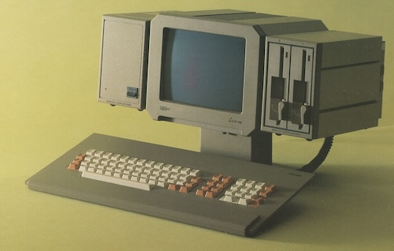

# BENCHMARKS

I'm not really a fan of benchmarks. I find them too restrictive in the way they only measure what they measure.
That is, they only could give you an estimate of something (that they measure), not an evaluation of what the
machine can do in general. It doesn't indicate the possibilities, they only convey a test of something.
Mostly is has been for speed .. of that something.

Today when almost all interests on 'retro computers' are in the spotlight of how and if they are able to play
(graphical) games, and in this area the ABC802 can not compete, benchmarks shows other aspects. Regrettably,
the presence of anti-historical perspectives undermines significant milestones in computer advancements and
skews factual information, potentially transforming them into narratives that lack historical validity.

Besides that reality distortion of today, benchmarks can be fun to look at. The following are benchmarks
that have been done through the early years of personal computing, when programming in BASIC was the
primary choice. It was the time when the BASIC came in ROMs, and basically was the computer
software/operating system. But also there are some new retro community contributions of benchmarks, which
are fun, also.

The ABC802, which is the focus here, was a follow-up to the ancestor ABC80. It was almost the same computer,
but, among other things, had an improved BASIC, the BASIC II. The BASIC II was used in the similar machines
ABC800 and ABC806, but also there was a version made for PC-DOS/MS-DOS, intended for easier transitioning
to the future PC-line of computers. Or was it suppose to conquer?

Well, even if the first IBM PC was launched with a Microsoft *BASIC in ROM*, the ABC802 also marked the
end of an era started with SOL-20, Apple II, Commodore PET, TRS-80, and the like. The instant BASIC at startup
had passed its prime time. This was true for the *business market* where ABC802 belonged, when you either
made your own program or bought from it on the market from small developers, small firms. That was about
to change. On the other hand there was a compleatly different *home computer* domain in which BASIC in ROM
right at this time rised and thrived, where it stayed for some time longer and much stronger, almost into
the next decade. Hand in hand with the rise and fall of *BASIC in ROM* was the *cassette tape recoder/player*
used as data/program storage. If you think about it .. not that surprising. The diskette, and eventually
the hard drive, changed the personal computer to using a *disc operating system* (yeah, DOS) as a focus point,
instead. This is far from declaring the language as dead. No, it still thrives even today and may develop
futher. Who knows. However, the large base it once supported is no longer there.

But as can be witnessed below, BASIC II in __ABC802__ was quite fast for its time. Often very near (below or
above) the highly prasied BBC BASIC of the __BBC Micro__. It also had the possible choice between different
number types in trade-off between speed and precision. Thus making it versatile in many applications.

### ABC802

Some relevant specs, ABC802 was introduced in Feb. 1983:
* Z80 3 Mhz
* 24k ROM BASIC II (made by DIAB AB)
* 32k RAM (+ additional 32k RAM-disc, or combined let you have 64k CP/M)

__The following programs have all been tested on an original machine, Luxor ABC802.__


## Samples of BASIC II

Some different samples in BASIC II for ABC802 to show how it can work.

* [SNAKE1.BAS](SNAKE1.BAS) - more or less regular BASIC of the time, selecting and jumping by using `GOSUB` och `GOTO`.
  First attempt of making separate routines. Sample of 'spagetti code'.
* [SNAKE2.BAS](SNAKE2.BAS) - an attempt of using `DEF FN` to replace some previous jumping. All essential variables are
  *globals*, thus no real gain of the structure were performed.
* [SNAKE3.BAS](SNAKE3.BAS) - some more shakeing at the code strucure, but parameters to functions `FN` only allows for
  single values when called (from variables) to be passed, thus limiting the usefulness as procedures or functions as
  we know them from (contemporary) other languages such as C or Pascal. Even though this may count as 'structured BASIC'
  the language still has too weak constructs, or in itself is not sufficient.


### Representation of numbers[^numbers]

Integer, Float, Double, ASCII ..
Something noticeable about the built-in number types in BASIC II is that
there is a clear trade-off between precision and speed, which is probably
one of the best reasons for the different types offered.

But there was also care taken for the number of bytes each and every number
took. Memory was scarce, and number of bytes had serious significance. 

#### Integers

The value of an integer is stored in 2 bytes in two's complement form. With
two bytes, a binary number can be written in the number range 0 to 65535. In
two's complement form, the number range becomes -32768 to +32767. The
two's complement form uses the most significant bit (bit 15) to
indicate whether the number is negative or positive. If the number is negative,
the bit is 1, else 0.

In the symbol table, a simple integer variable takes up 6 bytes.

#### Floating point

A floating point number has the form:
  * +/- Mantissa * 10 ** Exponent

In the computer, a simple floating point number is stored in 4 bytes
as SINGLE and 8 as DOUBLE. Unlike ABC80, which used BCD arithmetic,
ABC802 uses binary arithmetic. Thus, the computer sees a floating point
number as:
  * byte 1 The exponent
  * byte 2-4/8 The mantissa

Calculation of the correct exponent value from exponent changes is
done with:
  * Exponent value = Exponent bytes - 128

Byte 2 differs from the others in the mantissa in that the most
significant bit indicates whether the mantissa is negative or not.
Is the bit set to one the mantissa is negative, otherwise positive.
To save space, the highest bit is *not* stored in the mantissa
since it is always "one" due to normalization (that bit is used in
instead of showing the sign of the mantissa as above). One
exception to this is when the floating point is zero (O),
which is indicated in that the exponent byte is zero.

In the symbol table, a floating point number occupies 8 bytes as
SINGLE and 12 bytes as DOUBLE.

#### ASCII-arithmetic

With BASIC II, some new features was added to the ASCII arithmetic:
  * The number of digits was increased to 125.
  * Exponent was allowed in input data.

[^numbers]: More or less a translation from
*Bit för bit med ABC 800*, Luxor datorer, Motala, 1984, pp.44-6


## Timing in BASIC II with ABC802

Simple timing with approx. seconds:
```BASIC
10 POKE 65524%,0%,0%
...
1000 PRINT "Time: ”;PEEK(65524%)+(PEEK(65525%)/100)
```

Timing for programs that takes a longer time, result in seconds:
```BASIC
10 T1$=RIGHT$(TIME$,12)
...
1000 T2$=RIGHT(TIME$,12)
1010 T=(VAL(LEFT$(T2$,2))-VAL(LEFT$(T1$,2)))*3600+VAL(RIGHT$(T2$,7))-VAL(RIGHT$(T1$,7))
1020 PRINT "Time: ";T+(VAL(MID$(T2$,4,2))-VAL(MID$(T1$,4,2)))*60;
```

### Kilobaud 1977, Personal Computer World 1978, Mikrodatorn 1982, Hobbydata 1984[^rugg]

One of the earliest comprehensive benchmarks for primarily home computing (but also occationally
larger machines) came in 1977 with Rugg-Feldman samples in 1977 *Kilobaud* magazine. Later *Personal
Computer World* added a benchmark in 1978, below 'B8.BAS'.

* [B1.BAS](B1.BAS) Kilobaud, 1977
* [B2.BAS](B2.BAS) "-
* [B3.BAS](B3.BAS) "-
* [B4.BAS](B4.BAS) "-
* [B5.BAS](B5.BAS) "-
* [B6.BAS](B6.BAS) "-
* [B7.BAS](B7.BAS) "-
* [B8.BAS](B8.BAS) PCW Feb. 1978

The samples built most on each other progressively towards more advanced. They are intended
to reflect floating point results. Later two Swedish magazines extended the list with other
computers, unsurprisingly most from the ABC-line. Below I've added lacking results from ABC802.

[^rugg]: https://en.wikipedia.org/wiki/Rugg/Feldman_benchmarks


### Creative Computing 1984 Ahl's Simple Benchmark[^ahl]

* [AHLS.BAS](AHLS.BAS) This is the only benchmark among the selected ones here,
  that also gives a hint about *accuracy* in number crunching, beside 'quality'
  of *random* numbers.
* [AHLS1.BAS](AHLS1.BAS) Another version of the same benchmark.
* [AHLS2.BAS](AHLS2.BAS) Version adopted to ABC802.

[^ahl]: David H. Ahl, "Benchmark Comparison Test", Creative Computing, Nov. 1983. pp. 259–260,
        David H. Ahl, "Creative Computing Benchmark", Creative Computing 1984. p.6.
        https://en.wikipedia.org/wiki/Creative_Computing_Benchmark


### Interface Age 1980 Prime Numbers[^inter]

At page 131 the author writes: *'Use any tricks you know to speed up the program execution
(multiple statement lines, integer variables, etc.), but don't "improve" on the basic algorithm
itself.'*

* [INTER.BAS](INTER.BAS) Original.
* [INTER1.BAS](INTER1.BAS) Timing included.
* [INTER2.BAS](INTER2.BAS) SINGLE.
* [INTER3.BAS](INTER3.BAS) DOUBLE.
* [INTER4.BAS](INTER4.BAS) Tricks used.

[^inter]: Interface Age, 1980, pp.130-1


### BYTE 1981 Erathostenes Sieve[^byte]

* [SIEVE.BAS](SIEVE.BAS) In contrast to the other benchmarks, this intend to compare different
  *programming languages*, and their outcome in speed. Here it is of course a sample in BASIC.
* [SIEVE10.BAS](SIEVE10.BAS) From *Byte* Jan. 1983. Now updated with 10 iterations in BASIC.

[^byte]: https://en.wikipedia.org/wiki/Byte_Sieve


### FizzBuzz[^fizzbuzz]

Perhaps a bit odd to introduce FizzBuzz as a benchmark. But why not? It is easy
to change and adopt to different flavours of BASIC.

* [FIZZBUZZ.BAS](FIZZBUZZ.BAS) Original program. Increased to 1000 instead of 100,
  shows smaller diviations more explicit.
* [FIZZBUZ1.BAS](FIZZBUZ1.BAS) Introduce % everywhere.
* [FIZZBUZ2.BAS](FIZZBUZ2.BAS) SINGLE.
* [FIZZBUZ3.BAS](FIZZBUZ3.BAS) DOUBLE.

[^fizzbuzz]: https://en.wikipedia.org/wiki/Fizz_buzz


### Noel[^noel]

* [NOEL.BAS](NOEL.BAS) Original test.
* [NOEL1.BAS](NOEL1.BAS) Introduce % all over.
* [NOEL2.BAS](NOEL2.BAS) SINGLE.
* [NOEL3.BAS](NOEL3.BAS) DOUBLE.

[^noel]: https://www.youtube.com/@NoelsRetroLab


### Scruss[^scruss]

I have kept to the original program as close as possible. The only thing that was changed was
the timing, as necessary. However, the restriction to a syntactical alignment is troublesome
as no one, even then in the 80's, would make a program without adopting internal speedups
in available BASIC, such as using integer where possible instead of the always slower floating
point. At least if it was known to the programmer. 

* [SCRUSS.BAS](SCRUSS.BAS) Original program. Can not be used as is.
* [SCRUSS2.BAS](SCRUSS2.BAS) Changed for timing in ABC802.

I do agree with *not* using any special `POKE` e.g. turning off interrupts, using machine code
or any assembly routines. *It's not BASIC*. It doesn't measure the BASIC.

[^scruss]: https://scruss.com/blog/2020/12/17/bench64-a-new-basic-benchmark-index-for-8-bit-computers/


### Mandelbrot Set[^mandel]

A traditional benchmark for programming languages have been the Mandelbrot set. Especially when colours are
present, it shows speed in zooming and the spread of colours in the palette.

* [MANDEL1.BAS](MANDEL1.BAS) Plotted with `TX POINT`. Adopted from ZX81 sample.
* [MANDEL2.BAS](MANDEL2.BAS) Printed with characters. This seems to have been written for an emulator (e.g. some
  oddities in represented chars).[^mandel2]
* [MANDEL3.BAS](MANDEL3.BAS) Printed with characters, and somewhat optimized slightly better than the above.

[^mandel]: https://en.wikipedia.org/wiki/Mandelbrot_set
[^mandel2]: http://forum.6502.org/viewtopic.php?p=87398,
and https://gitlab.com/retroabandon/bascode/-/blob/master/abc800/mandel-abc800.bas?ref_type=heads.


## Summary benchmark results

The precision of seconds given in fractions may or may not be the true or actual case,
as the timing in many cases was not that precise. Therefore most numbers are given as
rounded up today, unless they are from computers tested a long time ago and already published
as in fractions.

| Program       | Mods    | Seconds                           |
| ------------- | ------- | --------------------------------- |
| B1.BAS        | none    | 1<sup>1</sup>                     |
| B2.BAS        | none    | 2<sup>2</sup>                     |
| B3.BAS        | none    | 6<sup>3</sup>                     |
| B4.BAS        | none    | 6<sup>4</sup>                     |
| B5.BAS        | none    | 7<sup>5</sup>                     |
| B6.BAS        | none    | 11<sup>6</sup>                    |
| B7.BAS        | none    | 20<sup>7</sup>                    |
| B8.BAS        | none    | 3<sup>8</sup>                     |
| AHLS2.BAS     | % some  | 24 (.247559, 10.7994)<sup>9</sup> |
| INTER1.BAS    | none    | ?               |
| INTER2.BAS    | SINGLE  | ?               |
| INTER3.BAS    | DOUBLE  | ?               |
| INTER4.BAS    | % & al. | ?               |
| SIEVE.BAS     | %       | ?               |
| SIEVE10.BAS   | %       | ?               |
| FIZZBUZZ.BAS  | none    | ?               |
| FIZZBUZ1.BAS  | %       | ?               |
| FIZZBUZ2.BAS  | SINGLE  | ?               |
| FIZZBUZ3.BAS  | DOUBLE  | ?               |
| NOEL.BAS      | none    | 19<sup>a</sup>  |
| NOEL1.BAS     | %       | 8<sup>b</sup>   |
| NOEL2.BAS     | SINGLE  | 26              |
| NOEL3.BAS     | DOUBLE  | 26              |
| SCRUSS2.BAS   | none    | 246<sup>c</sup> |
| MANDEL1.BAS   | % some  | 3317            |
| MANDEL2.BAS   | none    | 93              |
| MANDEL3.BAS   | % some  | 88              |

__Notes__

<sup>1</sup> BBC Micro: 1.0

<sup>2</sup> BBC Micro: 3.1

<sup>3</sup> BBC Micro: 8.2

<sup>4</sup> BBC Micro: 8.7

<sup>5</sup> BBC Micro: 9.1

<sup>6</sup> BBC Micro: 13.9

<sup>7</sup> BBC Micro: 21.4

<sup>8</sup> BBC Micro: 5.1

<sup>9</sup> IBM PC: 24 sec., acc. 0.1159668, rnd. 6.3;
    ABC802: using DOUBLE but the rest of program with no change: 38 sec.,
    acc. 6.02824457018869<sup>-11</sup>, rnd. 10.79915231955238.
* "The measure of randomness should also be as close to zero as possible.
   Anything under 10 is quite good. Values between 10 and 20 are acceptable.", p.260.
* "The measure of accuracy should be as close to zero as possible. [...]
   A value of 0.001 is about the norm. Anything larger than that (0.18, for example)
   is poor, while smaller values (0.00000021, for example) is very good.", p.260

<sup>a</sup> Same result as BBC Micro.

<sup>b</sup> Slightly better than BBC Micro using integers (here BBC Micro at 9 sec).

<sup>c</sup> In this case a higher number the better.
Cf. *BBC BASIC* at 202, *Commodore 64 BASIC* at 100.
And alas *ABC802 BASIC II* at 246.


## References

- Andersson, Anders (red.), *ABC om BASIC*, (1979) 2. uppl., Didact, Linköping, 1980.
- *Bit för bit med ABC 800*, Luxor datorer, Motala, 1984.
- Isaksson, Anders & Kärrsgård, Örjan, *Avancerad programmering på ABC80*, Studentlitt., Lund, 1980.
- Lundgren, Jan & Thornell, Sören, *BASIC II boken*, 1. uppl., Emmdata, Umeå, 1982.
- Lundgren, Jan & Thornell, Sören, *BASIC II boken för ABC 802*, 1. uppl., Emmdata, Umeå, 1983.
- Markesjö, Gunnar, *Mikrodatorns ABC: elektroniken i ett mikrodatorsystem*, 1. uppl., Esselte studium, Stockholm, 1978 [URL](https://www.abc80.org/docs/Mikrodatorns_ABC.pdf).
