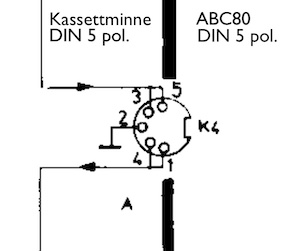

# Cassette routines for transferring files to/from ABC80

*Software for transferring BASIC programs between a modern computer
and ABC80 using the tape recorder connection.*

In the early days of home computing, cassette tapes were used
very much for storage. Mainly due to the affordability of tapes
and machines, but also their wide spread use and the general
understanding of their mechanics: *play*, *record*, *pause*, *fast*
*forward* and *backward* winding.

When you bought a brand new ABC80 as a package, there was a special
monitor including the power supply for the computer, and a
special tape recorder. As a company that usually manufactured
receivers, stereo equipment, TVs etc.
[Luxor AB](https://en.wikipedia.org/wiki/Luxor_AB) could naturally also
provide the tape recorder: __ABC820__.


## The principles in hardware

*But what happends when your tape recorder doesn't work,
or you do not have a recorder? Well, here a new solution
might be at hand: transfer files to and from your modern
computer. What counts as a "modern computer" is however a 
moving target, where jacks and hardware connections might
change over time.*


### Old hardware

__*At this moment when writing, I do not have yet tested this. But
from what I understand by reading and viewing similar experiments,
this should be able to work. I'll return later to review and
explain more when I have the physical experience.*__



The original hardware has a cable connection of three wires, one for
input, one for output and one for ground. At each end it has a 5 pol.
DIN male connector.


It also have a motor control cable that acts as control from the
computer for stopping the motor and starting when the tape is played.


### New hardware

The new hardware setup is roughly as follows:

```
ABC80 <-> 5 pin DIN connector [cord] 3.5 mm audio plug <-> modern computer
```

Or, other suitable connection to your computer. The important
thing is obviously how the wires are connected.

Unfourtunately the 3.5 audio jack/plug have not had any formal
standard connected to its various pins, but de facto standards that has
developed during time. Different manufacturers: different solutions.
But sometimes some of them do agree, and others then follows.
One such almost standard is CITA/AHJ[^cita] where Apple really
didn't follow.


[^cita]: E.g. https://support.headsetbuddy.com/hc/en-us/articles/207970396-Smartphone-Headset-Standards-Apple-iPhone-AHJ-CTIA-OMTP


## Conversion

With a program such as e.g. [Audacity](https://www.audacityteam.org/)
installed on your modern computer, you can record and play
sound, just as with a cassette recorder.

You can think of it as __the  modern computer thus replaces
the tape recorder__.

In this case the handling of sound files will be through the
IBM/Microsoft [Wave](https://en.wikipedia.org/wiki/WAV) format.

Requirements for these programs below is to install Python
(any 3-version) and to compile the C-program.
You can start compiling through the tool `make` which
produces an object-file (.o) and a library linked executable.

The decision to do this into two separate steps are mostly due to
following the previous programs in C for BASIC to WAVE, and then
later on adding a Python-script. I also started with the other
way around 'from WAVE to BASIC' in C, then added Python.
Python is much more concise and powerful for these types of tasks,
and you might consider to rewrite everything into Python.


### From BASIC to WAVE

So if you have a program in BASIC as text for the ABC80, you can
transfer the file by first run the program through a Python program
'[uni2abc.py](towave/uni2abc.py)' to adopt it for ABC80. It will
translate from Unicode to 7 bit ASCII, but as a Swedish character
set there are some character substitutions to allow for e.g. umlauts.

Next step is to translate the newly adopted text into a Wave-file.
This time I used the experience from two previous developers Robert
Juhasz for the [original code](towave/alt/abccas/abccas.c),
and Stefano Bodrato for some [updates](towave/alt/abc80.c),
to make my version in C. Through '[abc2wav.c](towave/abc2wav.c)'
the sound file can be used for the final transfer to the target:
*ABC80*.

```
sample.bas (unicode) -> [uni2abc.py] -> sample.abc -> [abc2wav.c] -> sample.wav 
```

Now you should have some software to be able to play the sound.
Connect the machines with some cable, the modern and the old computer.
At the old ABC80 start loading a program with typing `LOAD CAS:`
and then hit return. At almost the same time (very few seconds),
start playing the sound in wave-format through the cable from your
modern computer to the ABC80. It should in best case start loading
the program ..


#### Converting files

Prerequisites: install or make sure you have `Python3` and `gcc`
(or equivalent) and optional `make`. Compile '[abc2wav.c](towave/abc2wav.c)'
to an executable. Run the Python3 interpreter with
'[uni2abc.py](towave/uni2abc.py)'.

```
> Python3 uni2abc.py -i sample.bas -o sample.abc
> make abc2wav
> ./abc2wav -i sample.abc -o sample.wav
```


### From WAVE to BASIC

For going the other way around, from the produced wave file to
BASIC, there is a bit of "parsing" once the binary encoding has
been decoded. First start with a cable connected so that the modern
computer can listen to what ABC80 sends out. Start some audio
program to capture sound, and start with recording. At the
ABC80 you have the program to send, type `SAVE CAS:` and hit return.
Audio should now be broadcast through the cable.
Save the new file in the Wave-format and 
[PCM](https://en.wikipedia.org/wiki/Pulse-code_modulation).

First translate the Wave-file to a (decimal) binary file with
'[wav2bin.c](tobasic/wav2bin.c)'. Then from the "binary" file translate
to BASIC with '[bin2basic.py](tobasic/bin2basic.py)'.

```
sample.wav -> [wav2bin.c] -> sample.bin -> [bin2basic.py] -> sample.bas (unicode)
```

PENDING TEXT

#### Converting files

Prerequisites: install or make sure you have `Python3` and `gcc`
(or equivalent) and optional `make`. Compile 'wav2bin.c' to an
executable.

```
> make wav2bin
> ./wav2bin -i sample.wav -o sample.bin
> Python3 bin2basic.py -i sample.bin -o sample.bas
```

## The principles in software

Much of the programs in C are code for satisfying how the
WAVE-format is specified. Headers of different kinds are added.
Here a "raw" ([PCM](https://en.wikipedia.org/wiki/Pulse-code_modulation))
format has been chosen, which __does not__ alter
the content. We are not interested in how it sounds like to the
ear, but that the representation of bits are correct, e.g. not compressed.
The body of the file is actually the "binary" for how the (cassette) file
is stored and retrieved from/to ABC80. Therefore it can be
interesting to look at the storage of the file in principle.[^mikro]

[^mikro]: Images are copied from the book Mikrodatorns ABC by Gunnar Markesjö.


### Files

On the tape (BAND) there can obviously be more than one file (FIL)
stored. A problem is that the files and bits are stored sequentially,
so you simply have to wait. Here the files are stored with a gap of
5 seconds in between. A sample file "SPADER" can be separated into
blocks (BLOCK). The first block consists of the name (Namn), extension
or type and not much else. The body of the program are stored sequentially
by a block number, and the actual data (DATA 0, DATA 1 .. DATA N).


### Blocks

Each *block* have a structure of 256 bits of zero, 3 bytes of SYNC i.e.
16h, 1 byte STX i.e. 2h, 256 bytes of data, 1 byte ETX i.e. 3h and finally
2 bytes checksum. The first control bytes are pretty straightforward to
separate the blocks from each other. They are used in 'bin2basic.py' to
split the string of "binaries". The string represents the binaries in the
form of left to right, rather than the usual way right to left (most
significant to the left). As the bits are added along the way in time,
they are put at the right of previous bits.

```python
sync = '01101000' # 16h in reverse
stx = '01000000' # 2h in reverse
blocks = re.split('0{256}' + sync + sync + sync + stx, content)
```

What remains are the data itself of 256 bytes, 1 byte ETX and checksum
in 2 bytes. As the checksum is derived from all of this as an addition,
it can be used to control if the data was correctly transferred.

There are two variants to the blocks: *name* (Namnblock) and
*data* (Datablock) block.

The name block is simple, a name (namn) of maximum 8 characters
and 3 character extension (or bytes in the case of 8-bit computers).[^name]
It has a small header of 3 FFh.

[^name]: Note: The 'internal' name used by ABC80 has no impact on the names at
the modern computer side in the conversion.

The data block has one byte of zeros, then 2 bytes of binary block number,
and the rest of 253 bytes are user data.


### Signals

As the binaries are represented as frequency of sound tones with respect
to time, the coding and decoding can be done in various ways.
The way it was solved for ABC80 was by frequency modulation. Another
better known standard used at the time was Kansas City
([KC](https://en.wikipedia.org/wiki/Kansas_City_standard)).

Regular pulses through a clock sets the points from where you can
derive if it is a zero (0) or one (1). The hardware solution permits
also implementation of the Kansas City standard, as well as others.

If the signal changes at the edge, start counting the time and
perhaps assume a zero. If it then changes again at the edge after
(at the same time) the pulse comes (expected to come), then
it is most likely a zero. But if a change of edge comes in the middle
of pulses, they you can expect a change at the edge when the next pulse
comes, hence it should be a one.


This is reflected in C-code.

```c
int bit(int count) {
	// zero confirmed
	if (count > threshold) {
		return 0;
	}
	// full one confirmed
	else if (count < threshold && previous == TRUE) {
		previous = FALSE; // .. so reset
		return 1;
	}
	// half of one confirmed
	else if (count < threshold) {
		previous = TRUE; // ok, halfways ..
		return -1;
	}
	else {
		printf("ERROR");
		return -2;
	}
}
```

Converting a signal from continuous-time to discrete-time is known as
*sampling the signal*. The value of the signal is measured at certain
time intervals. Each measurement is referred to as a *sample*.
Higher number of samples, higher precision of its replication.

A threshold somewhere between the likelihood of one and zero,
marks where we should be able to deduce the "binary".
A count functions as a number of samples that hasn't changed
(much) in a while.


## References

- Andersson, Anders (red.), *ABC om BASIC*, (1979) 2. uppl., Didact, Linköping, 1980
- Finnved, Johan, *Programvaran i persondatorn i ABC80*, manuskript, Inst. för tillämpad elektronik, Kungl. Tekniska Högskolan, 1979.
- Isaksson, Anders & Kärrsgård, Örjan, *Avancerad programmering på ABC80*, Studentlitt., Lund, 1980
- Markesjö, Gunnar, *Mikrodatorns ABC: elektroniken i ett mikrodatorsystem*, 1. uppl., Esselte studium, Stockholm, 1978 [URL](https://www.abc80.org/docs/Mikrodatorns_ABC.pdf)
