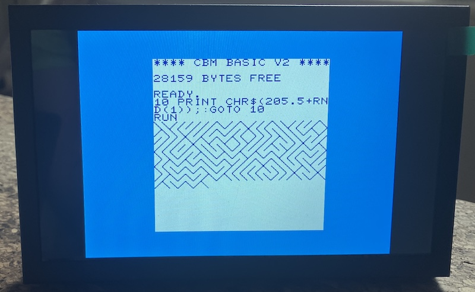

## Commodore VIC20 Emulator on a Raspberry Pi Pico 2W with DVI

During the 1980s, I taught programming courses to a group of young children,
around 10 years old, following the Swedish study association model (studieförbund).
The programming was done on *Commodore VIC-20* computers. In some ways it was
a difficult task, since it was a rather limited computer as an introduction
to computing for children. So it was more a matter of guidance, especially
since the parents were there as well. They had to find their own way forward,
and whenever they got stuck, I helped them work around the problem.

But I never really understood the computer myself; I could only experiment
with the BASIC language within the tiny amount of memory the machine had.
I never had the luxury of owning one myself, so the only time I could actually
use it was while "teaching." It was far from ideal.

Still, that limitation became part of the experience--for me. In a way, we
were all beginners together--the children, the parents, and even I myself.
The computer was less a polished educational tool and more something mysterious
that we explored collectively through trial and error. Much of the learning
came not from mastery, but from curiosity, patience, and the excitement of
discovering that a few lines of code could make the machine respond at all.

So, maybe the AIRFIGHT be implemented on a VIC20?

