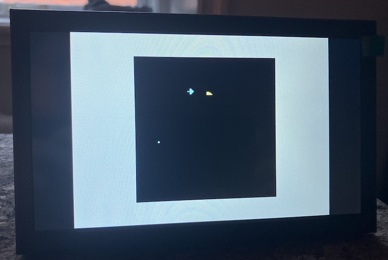

## Commodore VIC-20 Emulator on a Raspberry Pi Pico 2W with DVI


During the 1980s, I taught programming courses to a group of young children,
around 10 years old, following the Swedish study association model (studieförbund).
The programming was done on *Commodore VIC-20* computers. In some ways it was
a difficult task, since it was a rather limited computer as an introduction
to computing for children. So it was more a matter of guidance, especially
since the parents were there as well. They had to find their own way forward,
and whenever they got stuck, I helped them work around the problem.

But I never really understood the computer myself; I could only experiment
with the BASIC language within the tiny amount of memory the machine had.
I never had the luxury of owning one myself, so the only time I could actually
use it was while "teaching." It was far from ideal.

Still, that limitation became part of the experience--for me. In a way, we
were all beginners together--the children, the parents, and even I myself.
The computer was less a polished educational tool and more something mysterious
that we explored collectively through trial and error. Much of the learning
came not from mastery, but from curiosity, patience, and the excitement of
discovering that a few lines of code could make the machine respond at all.

So, maybe can the AIRFIGHT be implemented on a VIC-20?




A cycle-accurate VIC-20 emulator running on a Raspberry Pi Pico 2W, producing
640x480 DVI video and accepting keyboard input over USB serial.

Bundled with a version of *AIRFIGHT*: in this case a one-player-vs-AI
dogfight arcade game written from scratch in 6502 assembly.


### Hardware

| Component | Details                                                                     |
|-----------|-----------------------------------------------------------------------------|
| Board     | Raspberry Pi Pico 2W (RP2350, 520 KB SRAM)                                  |
| Clock     | 252 MHz (overclocked via VREG 1.20 V)                                       |
| Video     | DVI 640x480p 60 Hz via Pico-sock / TMDS encoder (libdvi PIO + DMA)          |
| Audio     | None (VIC audio not implemented)                                            |
| Keyboard  | USB serial terminal at *115200 baud* - the Pico appears as a USB-CDC device |

#### DVI wiring

The project uses the `pico_sock_cfg` pin configuration from libdvi.  Connect a
Pico-sock DVI breakout board, or wire TMDS pairs to a micro-HDMI / DVI-D
adapter according to the libdvi documentation.


#### CPU emulation - fake6502

`fake6502/fake6502.c` now provides a cycle-accurate 6502 interpreter.
`step6502()` returns the number of cycles consumed; the main loop runs exactly
`65 x 261 = 16 965` cycles per 60 Hz frame, spread across 240 DVI scanlines
(70 cycles per line, 165 remainder after the loop).

#### Memory map

| Range         | Contents                                  |
|---------------|-------------------------------------------|
| `$0000-$7FFF` | RAM (zero-page, stack, screen, expansion) |
| `$8000-$8FFF` | Character ROM (read-only overlay)         |
| `$9000-$90FF` | VIC chip registers (mirrored every 16 B)  |
| `$9110-$911F` | VIA #1                                    |
| `$9120-$912F` | VIA #2                                    |
| `$C000-$DFFF` | BASIC ROM                                 |
| `$E000-$FFFF` | Kernal ROM                                |

When `AUTORUN_AIRFIGHT=ON`, the reset vector (`$FFFC-$FFFD`) is patched at
read-time to `$1000` so the CPU jumps directly to the game, bypassing KERNAL
and BASIC entirely.

#### VIC chip - vic_chip.c

Implements the register file (`$9000-$900F`), timing (scanline counter, frame
counter, vblank flag), and the software renderer `vic_render_dvi_line()`.

*Custom charset*: Writing `7` to `$9005` (lower nibble) points the VIC at
RAM block 7 (`$1C00`).  Writing `0` restores the ROM charset at `$8000`.

*Colour RAM* lives at `$9400` in ordinary RAM and is read directly during
rendering.

*Palette*: VICE-derived 16-colour RGB565 table.

#### Keyboard - vic_kbd.c

`vic_kbd_scan()` is called once per frame.  It reads one character from the
USB-CDC port (`getchar_timeout_us(0)`) and:

- Maps VT100/ANSI escape sequences (arrow keys, F-keys) to PETSCII.
- Injects regular keys into the KERNAL ring buffer (`$C6` / `$0277`).
- Routes Ctrl-C / bare ESC to the VIA #2 key matrix as RUN/STOP.

#### Timing

Each `dvi_output_push_row()` call blocks for one DVI scanline period (~63 µs).
Running CPU emulation and back-buffer rendering inside that 63 µs slot paces
the whole loop to exactly 60 Hz without any `sleep` or timer.


### AIRFIGHT

#### Overview

A single-player dogfight against an AI opponent on a 22 x 23 character-cell
screen.  Both planes move continuously, wrap around all four edges, and fire
bullets.

#### Session structure

- A session is *10 rounds*.  One hit ends each round.
- Speed increases after every round (frame delay steps `$A0 --> $90 --> .. --> $20`).
- After round 10: final scores are shown, optional name entry, then the
  *top-5 high score table* is displayed.
- Scores reset between sessions; the high score table persists in RAM until
  power-off.

#### Controls

| Key     | Action                   |
|---------|--------------------------|
| `A`     | Rotate clockwise         |
| `D`     | Rotate counter-clockwise |
| `Space` | Fire bullet              |

During name entry for the high score table:

| Key     | Action                                             |
|---------|----------------------------------------------------|
| `A`     | Previous letter                                    |
| `D`     | Next letter                                        |
| `Space` | Confirm current letter (advances to next position) |

#### Scoring

The player earns one point per AI kill.  High scores are ranked by total kills
over the 10-round session.

#### Display

| Element       | Colour |
|---------------|--------|
| Player plane  | Cyan   |
| AI plane      | Yellow |
| Player bullet | Cyan   |
| AI bullet     | Yellow |
| Explosion     | White  |
| Background    | Black  |

#### Custom charset (AIRFIGHT-specific)

11 bitmaps at `$1C00` (selected via `$9005 = 7`):

| Code | Shape                                                      |
|------|------------------------------------------------------------|
| 0    | Blank                                                      |
| 1-8  | Plane in each of 8 directions (N, NW, W, SW, S, SE, E, NE) |
| 9    | Bullet (small dot)                                         |
| 10   | Explosion (X pattern)                                      |


### Building and flashing

#### Prerequisites

- Raspberry Pi Pico SDK 2.2.0 (path configured in `build_and_flash.sh`)
- ARM embedded toolchain 14.2 (via pico-sdk)
- CMake 3.31 + Ninja (via pico-sdk)
- picotool 2.2.0 (via pico-sdk)
- Python 3 (to regenerate `include/prg_airfight.h`)

All SDK components are expected under `~/.pico-sdk/` as installed by the
official Pico VS Code extension.  Edit the paths at the top of
`build_and_flash.sh` if your layout differs.

#### Assemble the game PRG

```bash
# One-time: make the assembler executable
chmod +x asm6502

./asm6502 airfight.asm build/airfight.prg

python3 - <<'EOF'
data = open('build/airfight.prg','rb').read()
name = 'prg_airfight'
print('#pragma once')
print('#include <stdint.h>')
print(f'static const uint8_t {name}[] = {{')
hex_vals = [f'0x{b:02X}' for b in data]
for i in range(0, len(hex_vals), 16):
    print('    ' + ', '.join(hex_vals[i:i+16]) + ',')
print('};')
print(f'static const unsigned int {name}_len = {len(data)};')
EOF > include/prg_airfight.h
```

#### Build and flash (AIRFIGHT autorun)

```bash
./build_and_flash.sh -DAUTORUN_AIRFIGHT=ON
```

The script configures CMake with Ninja, builds, then uses picotool to force the
Pico into BOOTSEL mode over USB and flash the resulting `build/vic20.uf2`.

#### Build without AIRFIGHT (normal VIC-20 BASIC boot)

```bash
./build_and_flash.sh
```

Connect a serial terminal at 115200 baud to the Pico's USB port to get the
BASIC `READY.` prompt.

#### PAL timing

```bash
./build_and_flash.sh -DVIC_PAL=1 -DAUTORUN_AIRFIGHT=ON
```


### Project layout

```
airfight.asm            6502 source for the AIRFIGHT game
asm6502                 6502 assembler binary (macOS arm64)
build_and_flash.sh      One-step build + flash script
CMakeLists.txt          CMake project definition
src/
  main.c                Pico entry point, dual-core setup, main loop
  memory.c              Memory bus: RAM, ROM overlays, VIC/VIA dispatch
  vic_chip.c            VIC chip emulation and DVI line renderer
  vic_kbd.c             USB-CDC keyboard input --> PETSCII injection
  via.c                 VIA 6522 emulation (timers, key matrix)
  dvi_output.c          libdvi wrapper: init, double-buffer, push-row
include/
  prg_airfight.h        AIRFIGHT PRG embedded as a C byte array (generated)
  rom_basic.h           BASIC ROM (generated)
  rom_kernal.h          Kernal ROM (generated)
  rom_char.h            Character ROM (generated)
fake6502/               6502 CPU emulator library
libdvi/                 Raspberry Pi DVI/HDMI output library (PIO + DMA)
```


### Notes

- The Pico 2W runs at 252 MHz to meet the DVI bit-clock requirement.
  The Pico's core voltage is raised slightly (1.20 V) for stability.
- ROM images (BASIC, Kernal, charset) are not included in this repository
  for copyright reasons.  Obtain them from the VICE emulator distribution
  and generate the header files with the same Python pattern used for the PRG.
- The high score table is stored in RAM at `$0300` and is lost on power-off.
- Audio registers are accepted by the VIC chip emulator but produce no output.
