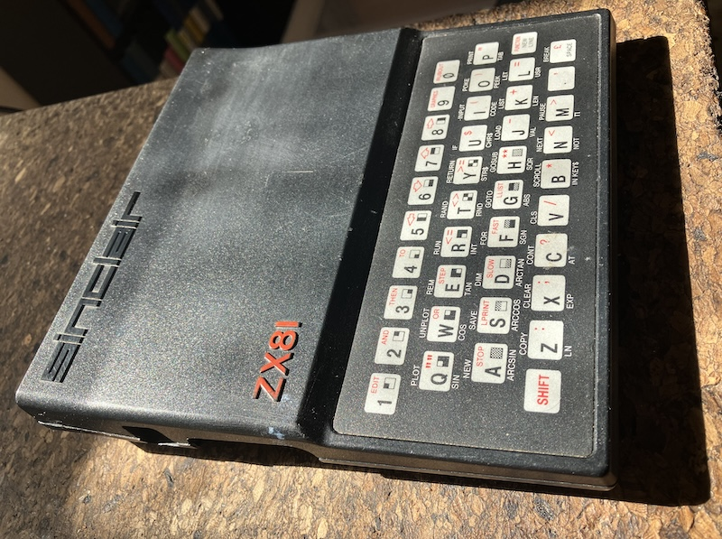
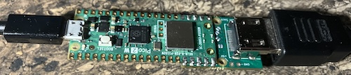
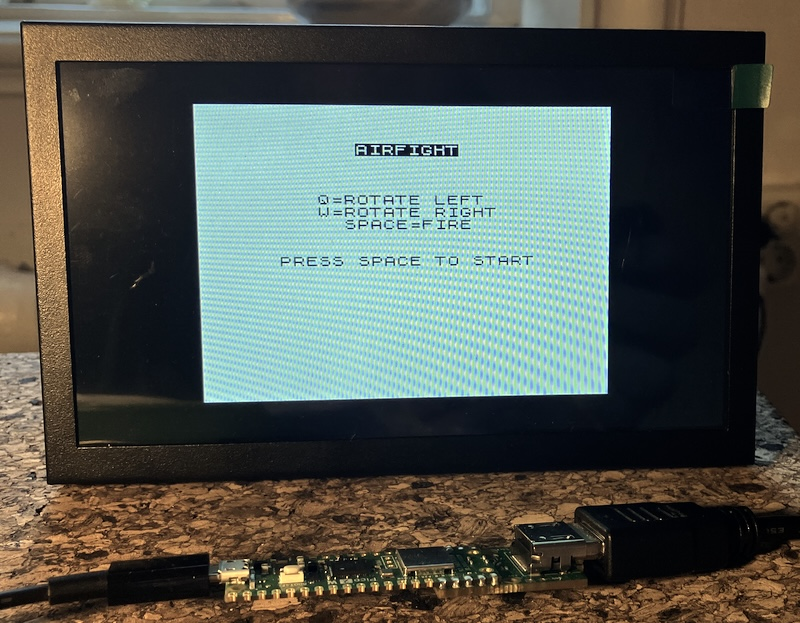
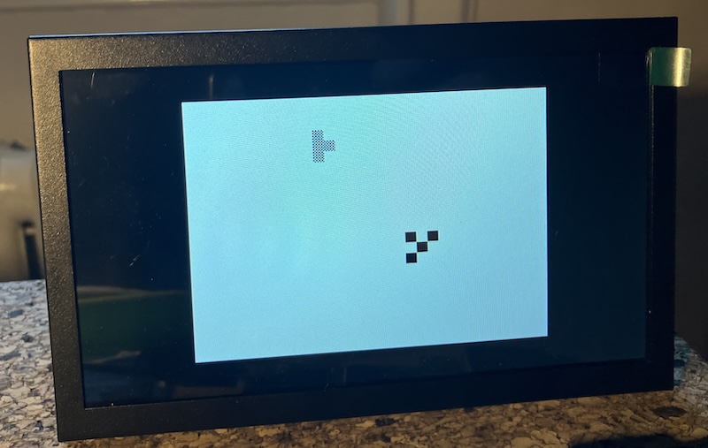

## ZX81 Emulation on a Pico 2

A ZX81 emulator for the *Raspberry Pi Pico 2 (RP2350)* with DVI video output,
USB-CDC keyboard input, and a built-in Z80 assembly dogfight game--AIRFIGHT.


### Real ZX81 Hardware

The real ZX81 was primarily launched in Sweden by the still-existing company
[Beckmann Innovation AB](http://historia.beckman-inno.se). At their office
and small shop, you could try out the ZX80 and ZX81 - which I did.
However, I wasn’t very impressed, since the ABC80 was indeed far superior.
But what can you do when you don’t have enough money? At the end I decided
to go for the Jupiter ACE.

Well, today as a modern asset .. was a different question. Still inferior.




### Hardware for the Emulator

#### Board

- *Raspberry Pi Pico 2* (RP2350, dual-core ARM Cortex-M33, 264 KB SRAM)
- Core 0: Z80 CPU emulation + emulator logic + USB-CDC keyboard
- Core 1: DVI TMDS pixel stream (via PicoDVI / libdvi)
- System clock: 252 MHz (required for 640×480@60 Hz TMDS bit rate)

#### DVI output — Pico DVI Sock

Connect a *Pico DVI Sock* (castellated pads) to the Pico:

| GPIO   | TMDS signal                      |
|--------|----------------------------------|
| 12, 13 | Lane 0 — Blue + H/V sync (D+/D−) |
| 14, 15 | Clock (CK+/CK−)                  |
| 16, 17 | Lane 2 — Red (D+/D−)             |
| 18, 19 | Lane 1 — Green (D+/D−)           |

DVI output: 640×480 60 Hz, ZX81 display (256×192, 32×24 chars) centred with a black border.



#### Keyboard — USB-CDC serial (current)

Type through any USB serial terminal at 115200 baud. ASCII characters are translated
into ZX81 matrix key events.

#### Keyboard — GPIO matrix (planned or project)

The ZX81 has a 40-key 8×5 matrix. GPIO pinout when wired:

| Signal                                    | GPIO            |
|-------------------------------------------|-----------------|
| Row outputs (driven high, one at a time)  | GPIO 0 – 7      |
| Column inputs (pull-down, HIGH = pressed) | GPIO 8 – 11, 20 |

`zx81_kbd.c` already has the port-in structure; GPIO scanning
is not yet implemented.


### Software

#### Architecture

```
src/main.c          — startup, core assignment, main loop
src/z80.c           — Z80 CPU emulator (T-state accurate)
src/zx81.c          — ZX81 machine: ROM mapping, RAM, I/O, NMI/INT
src/zx81_screen.c   — D_FILE → RGB565 framebuffer renderer (OSD included)
src/zx81_kbd.c      — USB-CDC keyboard: ASCII → ZX81 key events
src/zx81_load.c     — .p file loader via USB-CDC serial
src/dvi_out.c       — DVI scanline push to Core 1 / libdvi
src/color.c         — RGB565 colour helpers
asm/z80asm.c/.h     — Embedded Z80 assembler (used by make_airfight)
games/airfight.asm  — AIRFIGHT game source (Z80 assembly)
roms/zx81.rom       — Original Sinclair ZX81 ROM (16 KB)
libdvi/             — PicoDVI TMDS library (Wren6991/PicoDVI)
```

#### ZX81 emulation

- ROM: 16 KB Sinclair ZX81 ROM at 0x0000–0x3FFF
- RAM: 16 KB at 0x4000–0x7FFF (system variables + BASIC + display file)
- Display file (D_FILE): read from sysvar at 0x400C
  each frame; 24 rows × 32 chars + HALT bytes
- NMI disabled at startup (emulator handles timing explicitly)
- ~65 000 Z80 T-states per 60 Hz frame

#### AIRFIGHT game

A single-player dogfight against an AI opponent,
written in Z80 assembly for the ZX81.





*Game flow:*
1. Title screen — press SPACE to start
2. Dogfight — player vs AI; first bullet hit wins the round
3. Score screen — shows win counts, press SPACE for next round
4. Champion screen — first to 9 wins gets the CHAMPION banner;
   scores reset, title screen again

*Controls:*

| Key   | Action                          |
|-------|---------------------------------|
| Q     | Rotate left (counter-clockwise) |
| W     | Rotate right (clockwise)        |
| SPACE | Fire                            |

*Memory layout:*

| Address | Content                                              |
|---------|------------------------------------------------------|
| 0x8000  | Game code (Z80 machine code)                         |
| 0x8800  | Display file (793 bytes: leading HALT + 24×33 bytes) |

The game overrides the D_FILE sysvar at 0x400C to point at 0x8800,
so the ZX81 renderer picks up the game's own display.


### Build

#### Prerequisites

- Raspberry Pi Pico SDK 2.2.0
- ARM GCC toolchain
- CMake 3.31.5, Ninja 1.12.1
- picotool 2.2.0-a4 
- A C compiler (for `tools/make_airfight.c`) — system `cc` is fine
- Python 3 (for `tools/make_rom_header.py`)

Adjust paths at the top of `Makefile` if your SDK lives elsewhere.

#### Makefile targets

```
make              — assemble airfight + build firmware (default)
make airfight     — assemble games/airfight.asm → src/airfight_bin.h only
make firmware     — cmake/ninja firmware build only
make flash        — flash the last-built .uf2 via picotool (no BOOTSEL needed)
make clean        — remove build/ and generated files
make monitor      — open USB CDC serial monitor (screen at 115200)
```

#### Quick start

```bash
make          ## build everything
make flash    ## flash to connected Pico 2
make monitor  ## open serial terminal
```


### Keyboard reference

Connect via USB serial (115200 baud):

```bash
screen /dev/tty.usbmodem* 115200
```

Press *Ctrl+O* to cycle the on-screen keyboard help overlay:
1. Normal ZX81 display
2. K-mode keyword reference (dark blue)
3. Symbol/control map (dark green)

#### Symbol key mappings (Mac --> ZX81) [NOT TESTED/NOT ALL WORKING]

| Mac key   | ZX81 combo | Result           |
|-----------|------------|------------------|
| `"`       | SHIFT+P    | `"` double quote |
| `(`       | SHIFT+9    | `(`              |
| `)`       | SHIFT+0    | `)` / Delete     |
| `-`       | SHIFT+J    | `-` minus        |
| `+`       | SHIFT+K    | `+` plus         |
| `=`       | SHIFT+L    | `=` equals       |
| `;`       | SHIFT+X    | `;` semicolon    |
| `:`       | SHIFT+Z    | `:` colon        |
| `/`       | SHIFT+V    | `/` slash        |
| `<`       | SHIFT+R    | `<` less than    |
| `>`       | SHIFT+T    | `>` greater than |
| `*`       | SHIFT+M    | `*` multiply     |
| `,`       | SHIFT+.    | `,` comma        |
| Backspace | SHIFT+0    | Delete (rub out) |

#### Arrow / cursor keys

| Key      | ZX81 action            |
|----------|------------------------|
| ← or `%` | Cursor left (SHIFT+5)  |
| ↓ or `^` | Cursor down (SHIFT+6)  |
| ↑ or `&` | Cursor up (SHIFT+7)    |
| →        | Cursor right (SHIFT+8) |

#### Control keys

| Key    | Action                                                 |
|--------|--------------------------------------------------------|
| Ctrl+O | Cycle OSD keyboard help                                |
| Ctrl+R | Launch AIRFIGHT game                                   |
| Ctrl+L | Load .p file (then send via `tools/send_p_termios.py`) |
| Ctrl+D | Display dump (print 32×24 screen to terminal)          |


### Loading .p files

```bash
python3 tools/send_p_termios.py /dev/tty.usbmodem* game.p
```

Protocol: press Ctrl+L in the terminal first (or let the script do it),
wait for `LOAD: waiting...`, then send a 2-byte LE length followed by
the raw `.p` file bytes. After loading the emulator jumps to ROM 0x0207
(post-load entry) and runs the program.


### Project structure

```
games/          — game sources (.asm) and built .p files
asm/            — Z80 assembler source (z80asm.c/.h)
roms/           — ZX81 ROM binary
src/            — emulator C source
tools/          — build helpers and PC-side scripts
libdvi/         — PicoDVI TMDS library
token/          — .p file parser tokenizer/detokenzier BASIC utility (can be used independently)
old/            — archived / duplicate files
```


### Known issues / limitations

- *ZX81 keyboard matrix not fully mapped* — only the most common keys are
  wired through the USB-CDC path. K-mode keyword assignments for many
  letters are unverified. GPIO physical keyboard is not yet implemented.
- *.p file loading is fragile* — the serial protocol works for simple
  programs but timing issues can occur with large files or slow terminals.
  The loader does not yet handle re-entrant loads gracefully.
- *No SLOW mode emulation* — the ZX81's SLOW mode (display-halted CPU) is
  not cycle-accurately emulated; the display is rendered from D_FILE once
  per frame regardless.
- *No printer / ZX Printer support.*


### Ideas / future work

- Wi-Fi file upload via Pico 2W web interface
- GPIO keyboard matrix scanning
- SLOW-mode accurate emulation
- Save state (.p file export) over serial
