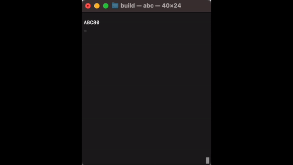

# Barely functional emulator for ABC80

There are naturally several emulators for ABC80. But this one
may be the simplest, although barely functional.
Built upon "tinyz80": https://github.com/kspalaiologos/tinyz80
it illustrates some simple concepts such as:

```basic
10 ; "Hejsan ";
20 GOTO 10
```




## Compile and run

To compile you need `cmake` as we use `ncurses` for display and keyboard.
Create a folder `build` in parallel to (same parent as) `src`. From the
`build` type:

```sh
> cmake ../
> make
> bin/abc
```


## License

As tinyz80 is licensed with a "greedy" version 3 of GNU, every
file that works with it must follow the same license.

The `abcprom.h` file however is data and *not* part of the program.
Dataindustrier AB (DIAB) gave Jonas Yngvesson permission to distribute
the PROM-contents. Jonas Yngvesson also made a proper simluator/emulator
for ABC80.
