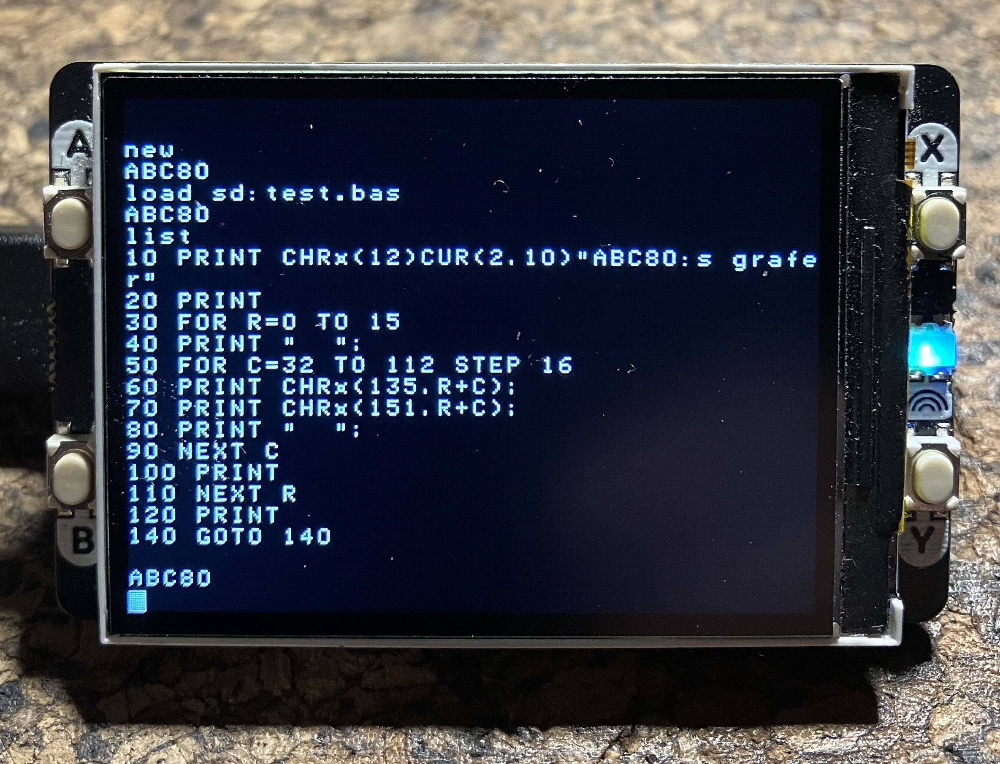
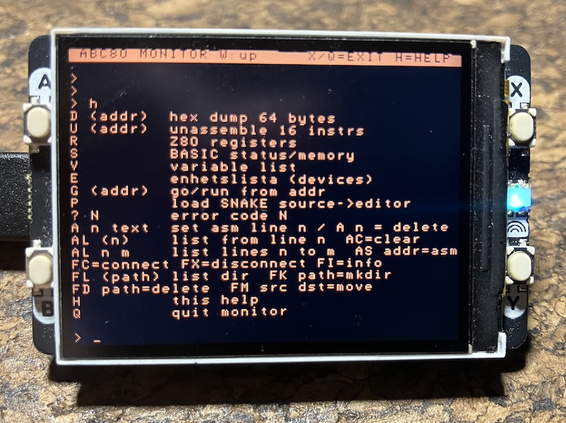
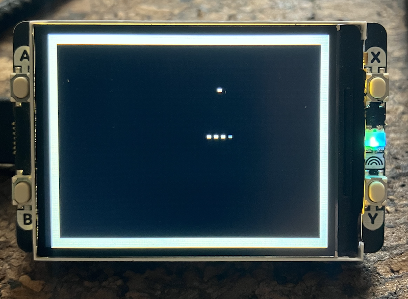

## ABC80 for Ants: Handling Files & Improved Graphics

An ABC80 emulator for the Raspberry Pi Pico 2W, small enough to fit on a
Pimoroni Display Pack 2.0--a 320×240 pixel screen exactly the width of a 40-column
ABC80 computer (essentially a very intelligent terminal).


### Overview

The emulator runs a Z80 core executing the original ABC80 ROM, renders the 40×24
character display (including Swedish characters and graphics mode), and accepts
keyboard input over USB CDC serial. Any terminal emulator connected to the Pico's
USB port works as the keyboard--baud rate is irrelevant for USB CDC.

A 50 Hz hardware timer fires a repeating interrupt that generates the Z80 keyboard
strobe, keeping the BASIC input loop well-behaved and the display scrolling correctly.

As early as 1978, DIAB chose a forward-looking technology for the ABC80’s font and
character set, which included the use of mosaic patterns. They viewed this as an
emerging standard with significant potential, particularly for communication technologies.
In Sweden, this standard was notably adopted--with the addition of colour--for
"[Text-TV](./TEXTTV.md)." While the original ABC80 lacked colour support, later models
like the ABC806 incorporated it. At the time, "national variations" of these standards
became common, as European languages varies.


### What's New in This Version

The main addition is a two-Pico [file system](./fs). A second Raspberry Pi Pico 2W runs a
small MicroPython HTTP server (*PicoFS*) and manages an SD card. The main Pico
connects (ABC80) to PicoFS over WiFi and uses it as a storage device--visible inside
ABC80 as the `SD:` device. This means you can do things like:

```
SAVE SD:APROGRAM
LOAD SD:APROGRAM
```

from the ABC80 BASIC prompt, and the file lands on (or is read from)
the SD card attached to the second Pico.


### Hardware


#### Main Pico (emulator)

| Part | Detail |
|------|--------|
| Board | Raspberry Pi Pico 2W (RP2350) |
| Display | Pimoroni Display Pack 2.0 — 320×240 IPS, RGB565, SPI+DMA |
| Input | USB CDC serial (any terminal, any baud) |
| SDK | Pico SDK 2.2.0 |

*Buttons on the Display Pack:*

| Button | Action |
|--------|--------|
| X | Toggle monitor mode (freezes/resumes Z80) |
| Y | Reset the ABC80 (cold start) |


#### SD-Pico (file server)

| Part | Detail |
|------|--------|
| Board | Raspberry Pi Pico 2W (MicroPython) |
| Storage | SD card via SPI |
| Network | WiFi AP — SSID `PicoFS`, password `pico1234` |

*SD card SPI wiring (SD-Pico):*

| Signal | GPIO |
|--------|------|
| CS | GP1 |
| SCK | GP2 |
| MOSI | GP3 |
| MISO | GP4 |


### Architecture

```
  Main Pico 2W                         SD-Pico 2W
  ---------------------------------    ------------------------------
  Z80 emulator (abc_pico)              MicroPython PicoFS
    │                                    │
    │  WiFi STA  -------------------->   │  WiFi AP  192.168.4.1:80
    │                                    │
    │  SAVE/LOAD SD: → HTTP GET/POST     +--- SPI --> SD card (FAT)
    │  Monitor F-commands → HTTP         │
```

The main Pico connects to the PicoFS access point as a WiFi station.
File I/O is done over a simple HTTP API. WiFi is not started at boot--you
connect manually from the monitor with `FC` to avoid a long blocking delay
with no on-screen feedback.


#### SD: device driver

`sd_device.c` injects a fake `SD:` device into the ABC80 *enhetslista*
(device list) at boot by patching a ROM entry point. The device uses a
PC-trap mechanism: `abc80_step()` checks the Z80 program counter after
each instruction, and when it hits a trap address the corresponding C
handler runs instead of the Z80 opcode. This lets the BASIC `SAVE`/`LOAD`/`RUN`
commands talk to the SD card transparently. You could do this in other
ways also.

The device supports: OPEN, PREPARE (create/truncate), CLOSE, INPUT
(text line read), BL_IN/BL_UT (binary block read/write).


#### PicoFS HTTP API

The SD-Pico exposes a small REST-like API over HTTP/1.1 (chunk size ≤
2048 bytes, `Connection: close` on every response):

| Method | Path | Description |
|--------|------|-------------|
| GET | `/ping` | Health check — returns `PicoFS OK  ram=N B` |
| GET | `/ls?path=/` | Directory listing — JSON `[{n, t, s}]` |
| GET | `/disk` | Disk info — JSON `{t, f}` (total/free bytes) |
| GET | `/read?path=f&off=0&n=2048` | Binary chunk read |
| POST | `/write?path=f&off=0` | Binary chunk write |
| POST | `/mkdir?path=d` | Create directory |
| POST | `/rename?src=old&dst=new` | Rename/move |
| DELETE | `/rm?path=f` | Delete file or directory (recursive) |


### Monitor

Press *Button X* to enter the monitor. The display turns amber to distinguish
monitor mode from normal ABC80 operation. The Z80 is __frozen__ while the monitor
is active.

Commands are single uppercase letters (or two-letter prefixes). Type `H` for help.


#### Inspection commands

| Command | Description |
|---------|-------------|
| `D [addr]` | Hex dump — 64 bytes from *addr* (hex) |
| `U [addr]` | Disassemble — 16 Z80 instructions from *addr* |
| `R` | Z80 registers (A F BC DE HL PC SP IX IY IM IFF) |
| `S` | BASIC memory status (BOFA, EOFA, HEAP, free bytes, cursor) |
| `V` | BASIC variable list with decoded values |
| `E` | *Enhetslistan* — all registered ABC80 devices |
| `? N` | Look up ABC80 error code *N* |


#### Control commands

| Command | Description |
|---------|-------------|
| `G [addr]` | Set PC to *addr* (hex) and resume execution |
| `Q` | Quit monitor, return to ABC80 |
| `H` | Help — list all commands |


#### Assembler (A-family)

A line-numbered Z80 assembler editor, similar in feel to ABC80 BASIC line editing.

| Command | Description |
|---------|-------------|
| `A n text` | Set assembly line *n* to *text* |
| `A n` | Delete line *n* |
| `AL [n [m]]` | List lines (optional range *n*–*m*) |
| `AC` | Clear all lines |
| `AS [addr]` | Assemble to Z80 address *addr* (default `8000`) |

Maximum 512 lines, 72 characters each. After `AS`, use `G addr` to run the assembled code.

*Built-in demo:* `P` loads a complete SNAKE game source into the editor.
Then `AS 8000` assembles it and `G 8000` runs it.
Controls: `W`/`A`/`S`/`D` for direction, `Ctrl-C` to quit.


##### Example

You can write Z80 assembly directly in the monitor:

```asm
A 10     LD HL,42
A 20     LD (HL),A
A 30     RET
```

After assembling with ..

```asm
AS 8000
```

Switch back to ABC80 mode and run it ..

```basic
; CALL 32768
```


#### File / WiFi commands (F-family)

All F-commands require an active WiFi connection. Use `FC` to connect first.

| Command | Description |
|---------|-------------|
| `FC` | Connect to PicoFS (WiFi association) |
| `FX` | Disconnect from PicoFS |
| `FI` | WiFi status + ping + SD card space |
| `FL [path]` | List directory on SD card (default: `/`) |
| `FD path` | Delete file or directory |
| `FK path` | Create directory |
| `FM src dst` | Rename or move a file/directory |


### Building

Requires the Pico SDK (2.2.0) and the standard ARM toolchain.
The VS Code Pico extension can install these automatically.

```sh
mkdir build && cd build
cmake ..
make -j4
```

Flash `abc_pico.uf2` to the main Pico in BOOTSEL mode.


#### SD-Pico firmware

Copy the four MicroPython files from the `fs/` directory to the
SD-Pico using `mpremote` or Thonny:

```
fs/main.py          ## boot: starts AP, mounts SD, runs server
fs/server.py        ## HTTP server
fs/file_server.py   ## SD card access layer
fs/sdcard.py        ## SPI SD card driver
```

The SD-Pico starts its access point (`PicoFS` / `pico1234`) automatically
on power-up. A hardware watchdog restarts it if the server hangs.


### Display details

- Screen: 40 × 24 character cells at 8 × 10 px each → 320 × 240 px total
- Character ROM: authentic ABC80 font (SIS 662241), including `ä ö å Ä Ö Å é ü Ü ¤`
- Graphics mode: ABC80 mosaic graphics (2×3 dot blocks per cell) — see below
- Cursor: bit-7 cells rendered as reverse video, blinking at ~330 ms
- Framebuffer: CPU-side `uint16_t[320×240]`, pushed to the LCD via DMA at ~30 fps


### Mosaic graphics

The ABC80 divides each 8×10 character cell into a 2-column × 3-row grid of
addressable *dots*, giving an effective dot resolution of 80×72 across the
full 40×24 screen.

#### Screen RAM encoding

A graphics-mode cell is a plain byte in screen RAM.  The six dots map to
individual bits; the hardware renders them directly without a font-ROM lookup
(verified against MAME `src/mame/luxor/abc80_v.cpp`):

```
 bit  dot
  0   TL  top-left
  1   TR  top-right
  2   ML  mid-left
  3   MR  mid-right
  4   BL  bot-left
  6   BR  bot-right
  5   (unused for dots — always 1 in practice; 0x20 is the blank-cell base)
  7   cursor attribute (reverse-video blink, same as text mode)
```

Every graphics cell starts as `0x20` (space — no dots lit).  Each dot has its
own bit in that byte; switching a dot on means setting that bit, switching it
off means clearing it.  Common values:

| Byte  | Binary     | Meaning                     |
|-------|------------|-----------------------------|
| `20h` | 0010 0000  | blank (no dots)             |
| `21h` | 0010 0001  | TL only  (`!`)              |
| `22h` | 0010 0010  | TR only  (`"`)              |
| `24h` | 0010 0100  | ML only  (`$`)              |
| `60h` | 0110 0000  | BR only  (`` ` ``)          |
| `7Fh` | 0111 1111  | all six dots (full block)   |

The "blank" base byte `0x20` means that a single dot in the top-left corner
produces `!` (0x21) — the next character after space in ASCII.

#### Graphics-mode rows

Column 0 of each row holds the control byte `0x97` (`CHR$(151)`) which the
ABC80 attribute logic uses to switch that row into graphics mode.  Columns
1–39 then hold cell bytes as above.  The `setdot`/`clrdot` C API installs
this marker automatically.

#### C API (`display.h`)

```c
setdot(int dot_x, int dot_y);   // dot_x 0-79, dot_y 0-71
clrdot(int dot_x, int dot_y);
uint8_t mosaic_cell_to_pat(uint8_t cell);  // screen byte → 6-bit font index
```

`mosaic_cell_to_pat` returns a value 0–63 in font-index order
(bit0=TL … bit5=BR) useful for comparing or copying dot patterns.


### Source layout

```
03/
+--- src/
│   │-- main.c          display loop, 50 Hz strobe, button handling
│   │-- abc80.c         ABC80 machine init, keyboard poll, screen RAM
│   │-- z80.c           Z80 CPU core
│   │-- z80asm.c        embedded Z80 assembler (no file I/O)
│   │-- disasm.c        Z80 disassembler
│   │-- display.c       Pimoroni Display Pack 2.0 driver + framebuffer
│   │-- monitor.c       built-in debugger / assembler / file browser
│   │-- sd_device.c     ABC80 SD: device driver (PC-trap based)
│   │-- wifi_client.c   WiFi STA + blocking HTTP client (lwIP raw TCP)
│
│-- include/            header files
│-- fs/                 MicroPython firmware for the SD-Pico
│-- CMakeLists.txt
```





#### Snake (dot graphics)

*Do ants like snakes? Or do snakes even eat ants?
A horrible or entertaining game for the ants ..*

Load snake_dot.asm in the monitor (P), assemble with AS 8000, run with G 8000.
Controls: W/S/A/D to steer, Ctrl-C to quit.

The snake is a thin single-dot trail (ML dot, `$` = 0x24); food is a TR dot
(`"` = 0x22) in the top-right corner of its cell; walls are full blocks (0x7F).
SETDOT/CLRDOT are reimplemented from scratch — the ROM versions use RST 38h
(BASIC interpreter trap) and cannot be called from standalone Z80 code.


