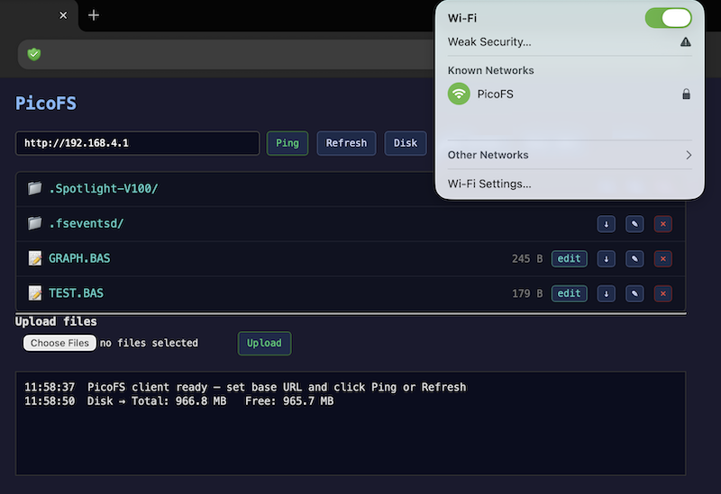

## A Standalone File Server in Micropython

Code for a
Raspberry Pi Pico 2W
connected to a SD-card.
A modest file server.
(The picture illustrates however a RPI PicoW, which should work equally well as no major capacity
related hardware is needed in this case.)

See more on these kinds of solutions at
[cc/ch04/sec4.4/storage/file](https://github.com/Feyerabend/cc/tree/main/ch04/sec4.4/storage/file).

A test client in JS/HTML, might show and respond to interactions (much depend on the browser/OS it is
running on, some allow and some disallow these kind of poor security networking).

