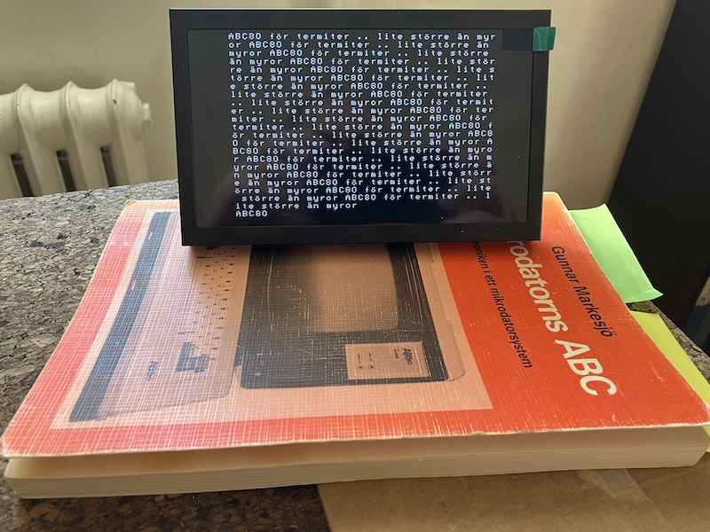
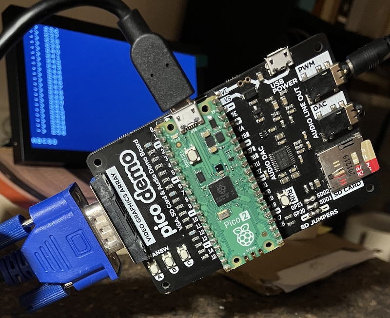

## ABC80 for Termites: VGA and Sound

An ABC80 emulator for the Raspberry Pi Pico 2 (RP2350), running on the
Pimoroni Pico VGA Demo Base.  The Z80 core executes the original ABC80 ROM.
The 40×24 character display (including Swedish characters and mosaic graphics)
is rendered to VGA at 320×240.  Keyboard input is over USB CDC serial--any
terminal at any baud rate works.


### Hardware

| Part      | Detail                                                  |
|-----------|---------------------------------------------------------|
| MCU board | Raspberry Pi Pico 2 (RP2350)                            |
| Carrier   | Pimoroni Pico VGA Demo Base                             |
| Display   | VGA-320×240 @ 60 Hz, resistor DAC, PIO-driven           |
| Audio     | PWM on GPIO 28 (VGA Demo Base audio jack, left channel) |
| Storage   | SD card (MicroSD slot on VGA Demo Base)                 |
| Input     | USB CDC serial (keyboard)                               |
| SDK       | Pico SDK 2.2.0 + pico-extras (pico_scanvideo_dpi)       |

#### Memory Used

|       | Used   | Free     | Total    |
|-------|--------|----------|----------|
| Flash | 174 KB | 3,822 KB | 4,096 KB |
| RAM   | 483 KB | 37 KB    | 520 KB   |

#### VGA GPIO mapping (fixed by the board)

| GPIO   | Signal              |
|--------|---------------------|
| 0–4    | Blue [4:0]          |
| 5–10   | Green [5:0]         |
| 11–15  | Red [4:0]           |
| 16     | H-Sync (active low) |
| 17     | V-Sync (active low) |

#### Buttons

| Button | GPIO | Action |
|--------|------|--------|
| A      | 0    | __Broken__--GPIO 0 is pulled low through the 75 Ω VGA termination resistor on Blue[0]; always reads as pressed.  Use `G 0` in the monitor to reset instead. |
| B      | 6    | Toggle monitor mode |
| C      | 11   | Unused |

#### SD card wiring (VGA Demo Base MicroSD socket)

| Signal | GPIO | Note |
|--------|------|------|
| CLK | 5 | Shared with VGA Green[0]--claimed only during SD access |
| MOSI | 18 | SD CMD |
| MISO | 19 | SD DAT0 |
| CS | 22 | SD DAT3, active-low |

SD access uses bit-bang SPI.  GPIO 5 (CLK) is normally owned by the VGA PIO;
it is briefly reclaimed for each SD operation and returned immediately after.


### Sound--SN76477

The ABC80 drives its SN76477 Complex Sound Generator via `OUT 6, val`.
This emulator reproduces the chip's VCO, SLF oscillator, noise generator,
one-shot envelope, and mixer in software, outputting PWM audio on GPIO 28.

There are many sources of inspiration for this combination of ideas,
including software emulations and even hardware implementations (in Verilog).
However, the implementation here is not entirely correct,
at least as far as I recall. That said, it is mostly accurate--or at
least good enough.[^sounds]

[^sounds]: Some of the inspiration comes from the following,
with many thanks to those involved:
https://github.com/sasq64/abc80sim/blob/master/src/sound.c,
https://github.com/mamedev/mame/blob/master/src/mame/luxor/abc80.cpp,
https://github.com/gyurco/ABC80-FPGA,
https://github.com/nocoolnicksleft/SN76477,
and many others.

#### Port 6 bit mapping

| Bits | Function |
|------|----------|
| 0 | 1 = chip on, 0 = silence |
| 1 | VCO pitch: 0 = ~6400 Hz, 1 = ~640 Hz |
| 2 | VCO source: 0 = external (fixed tone), 1 = SLF (wow-wow sweep) |
| 5:3 | Mixer: 000=VCO 001=Noise 010=SLF 011=VCO+Noise 100=SLF+Noise 101=SLF+VCO 110=SLF+VCO+Noise 111=Inhibit |
| 7:6 | Envelope: 00=VCO-gated 01=always-on 10=one-shot 11=alternating |

One-shot sounds (bell, bang, boom) fire on a 0→1 edge on bit 0, so the
ROM always writes `OUT 6, 0` immediately before writing the one-shot value.

#### Common sounds

| Sound | OUT 6 | Notes |
|-------|-------|-------|
| Silence | 0 | |
| Tone 640 Hz | 67 (0x43) | bit0+bit1+bit6 |
| Tone ~6400 Hz | 65 (0x41) | bit0+bit6 |
| Wow-wow | 69 (0x45) | bit0+bit2+bit6 |
| Noise | 73 (0x49) | bit0+bit3+bit6 |
| Pulsed noise | 97 (0x61) | bit0+bit5+bit6 |
| Tremolo 640 Hz | 195 (0xC3) | alternating envelope |
| __Bell__ (CHR$ 7) | 131 (0x83) | preceded by OUT 6,0; one-shot 640 Hz tone |
| Bang (noise) | 137 (0x89) | preceded by OUT 6,0 |
| Boom (VCO+noise) | 155 (0x9B) | preceded by OUT 6,0 |


### Storage--SD: device

`sd_device.c` injects a fake `SD:` device into the ABC80 *enhetslista*
at boot by patching a ROM entry point.  The underlying file system is
FatFS (the copy bundled with TinyUSB in the Pico SDK).

From the ABC80 BASIC prompt you can use SD: like any other device:

```
SAVE SD:PROGRAM
LOAD SD:PROGRAM
 RUN SD:PROGRAM
```

The driver uses a PC-trap mechanism: `abc80_step()` checks the Z80 program
counter after each instruction and, when it hits a trap address, calls a C
handler instead of executing the Z80 opcode.  Supported operations: OPEN,
PREPARE (create/truncate), CLOSE, INPUT (text line read), BL_IN / BL_UT
(binary block read/write).


### Display

- Resolution: 40 × 24 character cells × 8 × 10 px = 320 × 240 px total
- VGA timing: 640×480 @ 60 Hz, pixel-doubled to 320×240 effective
- Framerate: ~30 fps (Core 0 renders, Core 1 drives VGA scanlines)
- Double-buffered: Core 1 reads `active_fb`; Core 0 renders into `back_fb`;
  pointer swap happens between frames (atomic 32-bit write on RP2350)
- Character ROM: authentic ABC80 font (SIS 662241), including `ä ö å Ä Ö Å é ü Ü ¤`
- Cursor: bit-7 cells rendered as reverse video, blinking at ~330 ms

#### Known limitation--screen brightness sag

The VGA Demo Base uses a resistor DAC.  When many pixels are white (all 15
color GPIOs driven high simultaneously), the combined current through the DAC
resistors into the 75 Ω VGA termination causes a measurable voltage sag and
visible dimming.  This is a hardware limitation; there is no software fix
that does not reduce brightness unconditionally.

> [!WARNING]
> As the current is too low for the display to light up white pixels, this
> version of the emulator is __not__ recommended for displaying many dots
> at once, such as in games for example.

### Mosaic graphics

Each 8 × 10 character cell holds a 2 × 3 grid of addressable *dots*, giving
an effective dot resolution of 80 × 72 across the full screen.

```
  bit  dot
   0   TL  top-left
   1   TR  top-right
   2   ML  mid-left
   3   MR  mid-right
   4   BL  bot-left
   6   BR  bot-right
```

C API:

```c
setdot(int dot_x, int dot_y);    // dot_x 0–79, dot_y 0–71
clrdot(int dot_x, int dot_y);
```


### Monitor

Press __Button B__ to enter the monitor.  The display turns amber.
The Z80 is frozen while the monitor is active.  Press B again to return
to ABC80.  Type `H` for the full command list.

#### Inspection

| Command | Description |
|---------|-------------|
| `D [addr]` | Hex dump 64 bytes from *addr* |
| `U [addr]` | Disassemble 16 Z80 instructions |
| `R` | Z80 registers |
| `S` | BASIC memory status |
| `V` | BASIC variable list |
| `E` | ABC80 device list (*enhetslistan*) |
| `? N` | Look up ABC80 error code *N* |

#### Control

| Command | Description |
|---------|-------------|
| `G [addr]` | Set PC to *addr* and resume (also resets the ABC80 when addr=0) |
| `Q` | Quit monitor, return to ABC80 |

#### Assembler (A-family)

A line-numbered Z80 assembler editor.

| Command | Description |
|---------|-------------|
| `A n text` | Set line *n* to *text* |
| `A n` | Delete line *n* |
| `AL [n [m]]` | List lines |
| `AC` | Clear all lines |
| `AS [addr]` | Assemble to Z80 address *addr* (default `8000`) |
| `P` | Load the built-in Snake game source |

After `AS 8000`, switch back to ABC80 mode and call `CALL 32768`, or use
`G 8000` from the monitor.  Snake controls: W/A/S/D, Ctrl-C to quit.


### Building

Requires Pico SDK 2.2.0, pico-extras, and the ARM GCC toolchain.
The VS Code Pico extension installs these automatically.

```sh
mkdir build && cd build
cmake ..
make -j4
```

Flash `abc_pico.uf2` to the Pico in BOOTSEL mode.


### Source layout

```
02/
+-- src/
│   +-- main.c          display loop, 50 Hz strobe, button handling
│   +-- abc80.c         ABC80 machine init, keyboard poll, screen RAM
│   +-- z80.c           Z80 CPU core
│   +-- z80asm.c        embedded Z80 assembler
│   +-- disasm.c        Z80 disassembler
│   +-- display.c       VGA driver + framebuffer (pico_scanvideo_dpi)
│   +-- monitor.c       built-in debugger / assembler
│   +-- sn76477.c       SN76477 sound chip emulation (PWM output)
│   +-- sd_device.c     ABC80 SD: device driver (PC-trap based)
│   +-- sd_fat.c        FatFS glue
│   +-- diskio.c        bit-bang SPI SD card driver
+-- include/            header files
+-- CMakeLists.txt
```



