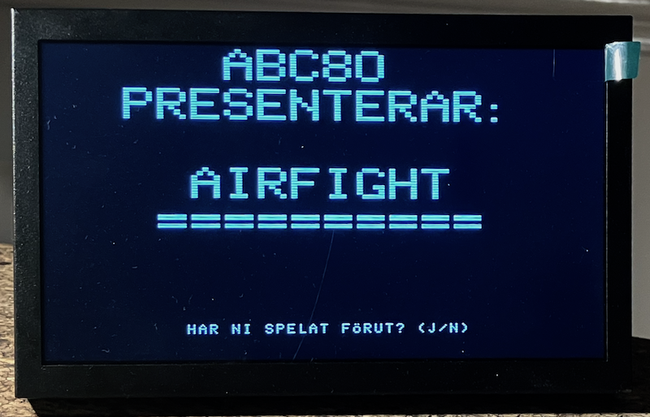

## ABC80 Emulator: AIRFIGHT returns ..

An ABC80 emulator for the Raspberry Pi Pico 2 (RP2350), running on the
Pimoroni Pico VGA Demo Base.  The Z80 core executes the original ABC80 ROM.
The 40x24 character display (including Swedish characters and mosaic graphics)
is rendered to VGA at 320x240.  Keyboard input is over USB CDC serial - any
terminal at any baud rate works.

> *Bundled game: AIRFIGHT* - see section below.


### Hardware

| Part | Detail |
|------|--------|
| MCU board | Raspberry Pi Pico 2 (RP2350) |
| Carrier | Pimoroni Pico VGA Demo Base |
| Display | VGA - 320x240 @ 60 Hz, resistor DAC, PIO-driven |
| Audio | PWM on GPIO 28 (VGA Demo Base audio jack, left channel) |
| Storage | SD card (MicroSD slot on VGA Demo Base) |
| Input | USB CDC serial (keyboard) |
| SDK | Pico SDK 2.2.0 + pico-extras (pico_scanvideo_dpi) |

#### VGA GPIO mapping (fixed by the board)

| GPIO | Signal |
|------|--------|
| 0-4 | Blue [4:0] |
| 5-10 | Green [5:0] |
| 11-15 | Red [4:0] |
| 16 | H-Sync (active low) |
| 17 | V-Sync (active low) |

#### Buttons

| Button | GPIO | Action |
|--------|------|--------|
| A | 0 | *Broken* - GPIO 0 is pulled low through the 75 Ω VGA termination resistor on Blue[0]; always reads as pressed.  Use `G 0` in the monitor to reset instead. |
| B | 6 | Toggle monitor mode |
| C | 11 | Unused |

#### SD card wiring (VGA Demo Base MicroSD socket)

| Signal | GPIO | Note |
|--------|------|------|
| CLK | 5 | Shared with VGA Green[0] - claimed only during SD access |
| MOSI | 18 | SD CMD |
| MISO | 19 | SD DAT0 |
| CS | 22 | SD DAT3, active-low |

SD access uses bit-bang SPI.  GPIO 5 (CLK) is normally owned by the VGA PIO;
it is briefly reclaimed for each SD operation and returned immediately after.


### Sound - SN76477

The ABC80 drives its SN76477 Complex Sound Generator via `OUT 6, val`.
This emulator reproduces the chip's VCO, SLF oscillator, noise generator,
one-shot envelope, and mixer in software, outputting PWM audio on GPIO 28.
An IIR low-pass filter smooths chip-enable on/off transitions to avoid
audible clicks on square-wave toggling sounds such as the victory tune.
However, minor clicks are still audible.

#### Port 6 bit mapping

| Bits | Function |
|------|----------|
| 0 | 1 = chip on, 0 = silence |
| 1 | VCO pitch: 0 = ~6400 Hz, 1 = ~640 Hz |
| 2 | VCO source: 0 = external (fixed tone), 1 = SLF (wow-wow sweep) |
| 5:3 | Mixer: 000=VCO 001=Noise 010=SLF 011=VCO+Noise 100=SLF+Noise 101=SLF+VCO 110=SLF+VCO+Noise 111=Inhibit |
| 7:6 | Envelope: 00=VCO-gated 01=always-on 10=one-shot 11=alternating |

One-shot sounds (bell, bang, boom) fire on a 0-->1 edge on bit 0, so the
ROM always writes `OUT 6, 0` immediately before writing the one-shot value.

#### Common sounds

| Sound | OUT 6 | Notes |
|-------|-------|-------|
| Silence | 0 | |
| Tone 640 Hz | 67 (0x43) | bit0+bit1+bit6 |
| Tone ~6400 Hz | 65 (0x41) | bit0+bit6 |
| Wow-wow | 69 (0x45) | bit0+bit2+bit6 |
| Noise | 73 (0x49) | bit0+bit3+bit6 |
| Pulsed noise | 97 (0x61) | bit0+bit5+bit6 |
| Tremolo 640 Hz | 195 (0xC3) | alternating envelope |
| __Bell__ (CHR$ 7) | 131 (0x83) | preceded by OUT 6,0; one-shot 640 Hz tone |
| Bang (noise) | 137 (0x89) | preceded by OUT 6,0 |
| Boom (VCO+noise) | 155 (0x9B) | preceded by OUT 6,0 |


### Storage - SD: device

`sd_device.c` injects a fake `SD:` device into the ABC80 *enhetslista*
at boot by patching a ROM entry point.  The underlying file system is
FatFS (the copy bundled with TinyUSB in the Pico SDK).

From the ABC80 BASIC prompt you can use SD: like any other device:

```
SAVE SD:PROGRAM
LOAD SD:PROGRAM
 RUN SD:PROGRAM
```

The driver uses a PC-trap mechanism: `abc80_step()` checks the Z80 program
counter after each instruction and, when it hits a trap address, calls a C
handler instead of executing the Z80 opcode.  Supported operations: OPEN,
PREPARE (create/truncate), CLOSE, INPUT (text line read), BL_IN / BL_UT
(binary block read/write).


### Display

- Resolution: 40 x 24 character cells x 8 x 10 px = 320 x 240 px total
- VGA timing: 640x480 @ 60 Hz, pixel-doubled to 320x240 effective
- Framerate: ~30 fps (Core 0 renders, Core 1 drives VGA scanlines)
- Double-buffered: Core 1 reads `active_fb`; Core 0 renders into `back_fb`;
  pointer swap happens between frames (atomic 32-bit write on RP2350)
- Character ROM: authentic ABC80 font (SIS 662241), including `ä ö å Ä Ö Å é ü Ü ¤`
- Cursor: bit-7 cells rendered as reverse video, blinking at ~330 ms

#### Known limitation - screen brightness sag

The VGA Demo Base uses a resistor DAC.  When many pixels are white (all 15
color GPIOs driven high simultaneously), the combined current through the DAC
resistors into the 75 Ω VGA termination causes a measurable voltage sag and
visible dimming.  This is a hardware limitation; there is no software fix
that does not reduce brightness unconditionally.


### Mosaic graphics

Each 8 x 10 character cell holds a 2 x 3 grid of addressable *dots*, giving
an effective dot resolution of 80 x 72 across the full screen.

```
  bit  dot
   0   TL  top-left
   1   TR  top-right
   2   ML  mid-left
   3   MR  mid-right
   4   BL  bot-left
   6   BR  bot-right
```

C API:

```c
setdot(int dot_x, int dot_y);    // dot_x 0-79, dot_y 0-71
clrdot(int dot_x, int dot_y);
```


### Monitor

Press **Button B** to enter the monitor.  The display turns amber.
The Z80 is frozen while the monitor is active.  Press B again to return
to ABC80.  Type `H` for the full command list.

#### Inspection

| Command | Description |
|---------|-------------|
| `D [addr]` | Hex dump 64 bytes from *addr* |
| `U [addr]` | Disassemble 16 Z80 instructions |
| `R` | Z80 registers |
| `S` | BASIC memory status |
| `V` | BASIC variable list |
| `E` | ABC80 device list (*enhetslistan*) |
| `? N` | Look up ABC80 error code *N* |

#### Control

| Command | Description |
|---------|-------------|
| `G [addr]` | Set PC to *addr* and resume (also resets the ABC80 when addr=0) |
| `Q` | Quit monitor, return to ABC80 |

#### Assembler (A-family)

A line-numbered Z80 assembler editor.

| Command | Description |
|---------|-------------|
| `A n text` | Set line *n* to *text* |
| `A n` | Delete line *n* |
| `AL [n [m]]` | List lines |
| `AC` | Clear all lines |
| `AS [addr]` | Assemble to Z80 address *addr* (default `8000`) |
| `P` | Load the built-in AIRFIGHT binary into Z80 RAM at `8000H` |

After `P`, type `G` (or `G 8000`) to start AIRFIGHT.


---

## AIRFIGHT

A two-player dogfight game for the ABC80, originally written in BASIC by
Kristian Lidberg and Set Lonnert in 1981.  This version is an interpretation
of the original game to a Z80 assembly port, pre-assembled on the host at
build time and embedded directly in the Pico firmware.

### Running

1. Press __Button B__ to enter the monitor (screen turns amber).
2. Type `P` - loads the AIRFIGHT binary into Z80 RAM at address `8000H`.
3. Type `G` (or `G 8000`) - jumps to the game entry point.

The intro sequence asks for player names, optionally shows instructions, and
lets players choose score or time mode.  A pre-game screen then shows each
player their controls and name, with both planes visible at their starting
positions; press any key to begin.

When the game ends - either by time running out or one player reaching the
score limit - a full-screen announcement plays with sound effects, followed
by a mosaic trophy for the winner (or `OAVGJORT` for a draw).  Then
`SPELA IGEN? (J/N)` is shown: __J__ restarts immediately with the same names
and mode; __N__ returns to the intro for new names and mode.

### Controls

| Key | Player 1 | Player 2 |
|-----|----------|----------|
| Turn left  | `A` | `J` |
| Turn right | `D` | `L` |
| Fire       | `X` | `M` |

Controls are read over USB CDC serial (the same terminal used for BASIC).

### Game modes

| Mode | Description |
|------|-------------|
| Score (P) | First to hit the opponent 10 times wins |
| Time (T) | Most hits when the countdown reaches 0:00 wins; 2 minutes |

### Intro and pre-game screen

The title screen uses ABC80 mosaic (teletext) graphics to draw the original
1981 logo.  After the logo, the game asks whether the players have played
before - if yes, the instruction screen is skipped.

Once mode is chosen, `GAME_INIT` places both planes at their starting
positions and the pre-game screen (`SHOW_READY`) overlays each player's
control keys and name in a text window inside the graphics area, centred
around a `REDO! TRYCK VALFRI TANGENT` prompt.  Both planes are visible so
players can identify which sprite is theirs before the round begins.

### Screen layout during play

```
Row  0        graphics border (col 0 = 0x97, enables mosaic mode for row)
Rows 1-19     play area (20 rows x 38 cols, planes and bullets move here)
Row 20        HUD: P1 score | P2 score | timer (time mode only)
Row 22        SPELA IGEN? prompt (end of game only)
```

### Aircraft sprites

Each plane is a 2-cell mosaic sprite.  There are 8 directions (N, NE, E, SE,
S, SW, W, NW); player 1 and player 2 use different mosaic patterns so they
are distinguishable at a glance.  Turning is rate-limited (`TURN_DELAY`
frames between turns) to prevent diagonal directions being skipped by fast
key repeats.

### Bullets

One bullet per player can be in flight at a time.  Each frame the bullet
advances `BUL_STEPS` cells in the firing direction.  If it leaves the play
area or hits the opponent's sprite it is removed.

A hit triggers a two-frame explosion animation at the opponent's position:
a brief solid-block flash (~300 ms) followed by scattered debris chars
(~300 ms), accompanied by an explosion sound.  The shooter's score is then
incremented, the HUD updated, and both planes reset to their start positions
with a ~1.5 s pause before play resumes.

### End-of-game sequence

1. *Announcement* - screen clears, `SOUND_WIN` plays over a `* SPELET SLUT *`
   box for ~1 s, then `SOUND_INTRO` plays as the screen fades (~2.5 s).
2. *Winner* - `VINNARE BLEV...` appears at the top of a fresh screen;
   rows 10-18 switch to graphics mode and a mosaic trophy cup is drawn.
   After ~1.8 s the winner's name is shown and the victory tune plays.
3. *Draw* - `OAVGJORT` is shown instead; no trophy, no tune.
4. *Play again* - `SPELA IGEN? (J/N)` at row 22.

### Sounds

| Event | Sound |
|-------|-------|
| Startup / inter-round whoosh | `SOUND_INTRO` (135) - noise dominant |
| Player 1 fires | `SOUND_SH1` (boom, VCO+noise) |
| Player 2 fires | `SOUND_SH2` (boom, slightly different) |
| Hit / explosion | `SOUND_HIT` (9) - one-shot burst |
| End-of-game fanfare | `SOUND_WIN` (199) |
| Victory tune | Original 1981 melody: 6 notes, rising pitch and duration |

The victory tune is reproduced from the original BASIC source using a
software-driven square wave (direct `OUT 6` toggling, same as the original).
`INT_SCALE` controls the inner-loop delay that sets pitch; `TUNE_SCALE`
controls the inter-note gap.  Adjust `INT_SCALE` first if the pitch sounds
wrong.

### Build pipeline

`airfight.asm` is *not* assembled on the Pico at run time.  CMake builds a
native `z80asm_host` binary from the same `z80asm.c` source and uses it to
produce `airfight.bin`, which `xxd -i` then converts to the C array
`airfight_bin.h`.  That header is compiled into the firmware and the monitor's
`P` command loads the array directly into Z80 RAM.

```
src/airfight.asm  -->  z80asm_host  -->  airfight.bin  -->  xxd  -->  airfight_bin.h
                                                                  v
                                                         linked into firmware
```

### Key constants (airfight.asm)

| Constant | Default | Meaning |
|----------|---------|---------|
| `SCORE_LIM` | 10 | Hits needed to win in score mode |
| `TIME_MIN` | 2 | Starting minutes in time mode |
| `BUL_STEPS` | 3 | Cells a bullet travels per 100 ms frame |
| `TURN_DELAY` | 3 | Frames between allowed turns |
| `INT_SCALE` | 62 | Victory tune pitch delay (integer loop, ~0.33 ms/step) |
| `TUNE_SCALE` | 200 | Victory tune inter-note gap (float loop speed) |
| `VAR_BASE` | `8F00H` | Start of 256-byte RAM variable block |

### Known issues / TODO

- *Victory tune pitch*: `INT_SCALE` (62) and `TUNE_SCALE` (200) approximate
  the original ABC80 BASIC interpreter timing.  Pitch and tempo may still
  drift slightly from the original; adjust `INT_SCALE` to tune pitch.
- *Button A reset*: GPIO 0 is shared with VGA Blue[0] and is permanently
  pulled low through the 75 Ω termination - use `G 0` in the monitor instead.
- *Logo rows 6-8*: blank gap between upper and lower logo halves.


### Building
                                                                                                                       
Requires Pico SDK 2.2.0, pico-extras, and the ARM GCC toolchain.
The VS Code Pico extension for VS Code (Mac/Windows) installs these
automatically under `~/.pico-sdk`. On Linux, install `cmake`,
`ninja-build`, `gcc-arm-none-eabi`, and set `PICO_SDK_PATH`.

```sh       
mkdir build && cd build
cmake ..
cmake --build . -j4
```
Flash abc_pico.uf2 to the Pico in BOOTSEL mode.
build_and_flash.sh automates the above on macOS with the VS Code Pico extension;
edit the path variables at the top if your SDK lives elsewhere.

The Z80 assembler (z80asm_host) is built automatically during the CMake build--
no separate step required.


### Source layout

```
02/
+-- src/
│     +-- main.c          display loop, 50 Hz strobe, button handling
│     +-- abc80.c         ABC80 machine init, keyboard poll, screen RAM
│     +-- z80.c           Z80 CPU core
│     +-- z80asm.c        Z80 assembler (embedded lib + standalone host build)
│     +-- disasm.c        Z80 disassembler
│     +-- display.c       VGA driver + framebuffer (pico_scanvideo_dpi)
│     +-- monitor.c       built-in debugger / assembler; P cmd loads AIRFIGHT
│     +-- sn76477.c       SN76477 sound chip emulation (PWM output, IIR smoothed)
│     +-- sd_device.c     ABC80 SD: device driver (PC-trap based)
│     +-- sd_fat.c        FatFS glue
│     +-- diskio.c        bit-bang SPI SD card driver
│     +-- airfight.asm    AIRFIGHT Z80 game source (pre-assembled at build time)
+-- include/            header files
+-- build/
│     +-- z80asm_host     native assembler (built from z80asm.c, no SDK)
│     +-- airfight.bin    assembled game binary (8000H-8xxxH)
│     +-- airfight_bin.h  C array generated by xxd; linked into firmware
+-- CMakeLists.txt
```
