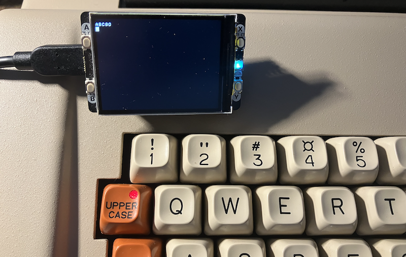

## ABC80 for Ants

A reconstruction of the ABC80 highlighting core elements such as files, screen, and keyboard.

##### License

The greedy licens here derives from the Z80 processor emulator inclusion. You might change this
and swap it for something else, with another license. The rest of the code (mine) does not depend
on this greedy license, and can be freely used under other packages. But as the code stands here,
it is thus included, and must so be.

