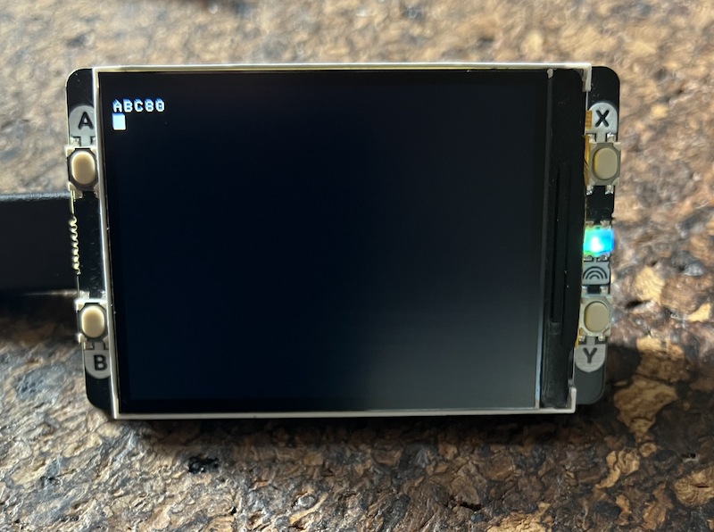
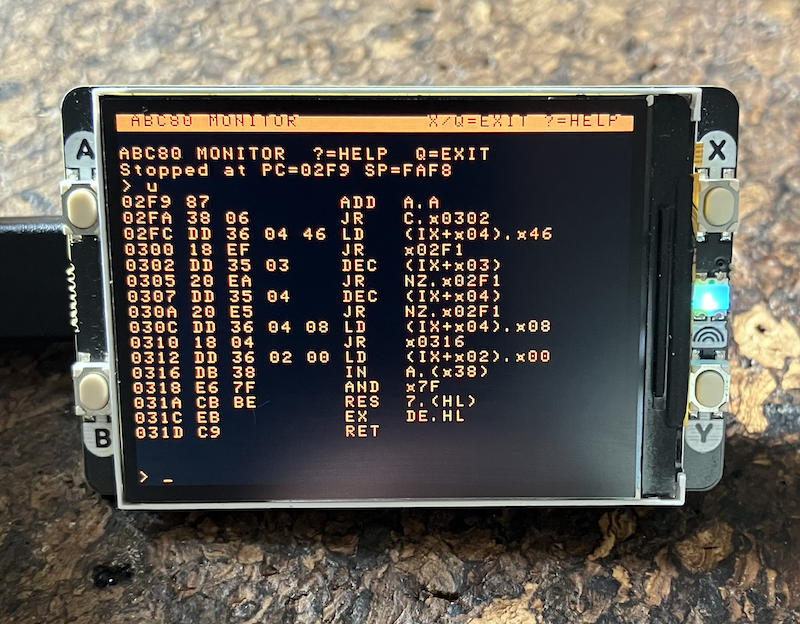

## abc_pico - ABC80 Emulator for Raspberry Pi Pico 2W

An ABC80 home computer emulator running on a Raspberry Pi Pico 2W with a
Pimoroni Display Pack 2.0.  The ABC80 was a Swedish 8-bit computer sold
1978–1983 by Luxor, built around a Z80 CPU and a interpreter by DIAB AB
(Johan Finnved/KTH).


### Hardware

| Component | Details |
|-----------|---------|
| MCU | Raspberry Pi Pico 2W (RP2350, dual Cortex-M33, 520 KB SRAM, 4 MB flash) |
| Display | Pimoroni Display Pack 2.0 - 320x240 IPS LCD, RGB565, SPI+DMA |
| Buttons | A / B / X / Y on the Display Pack |
| Keyboard | USB CDC serial - connect any terminal (minicom, screen, ...) |


### Source files

| File | Role |
|------|------|
| `main.c` | Main loop: strobe timer, display refresh, button handling |
| `abc80.c` | ABC80 machine core: ROM load, Z80 step, keyboard, screen RAM |
| `abc80.h` | Public API for `abc80.c` |
| `z80.c/z80.h` | Z80 CPU emulator (executes instructions, exposes registers/memory) |
| `abcprom.h` | ABC80 ROM image as a C byte array |
| `abcfont.h` | Authentic ABC80 character ROM (SIS 662241, 8x10 px glyphs) |
| `abc80errors.h` | Swedish BASIC error code strings |
| `display.c/display.h` | SPI/DMA LCD driver + framebuffer drawing API |
| `monitor.c/monitor.h` | Built-in machine monitor (hex dump, disassembler, BASIC inspector) |
| `disasm.c/disasm.h` | Z80 disassembler (adapted from sarnau/Z80DisAssembler) |
| `CMakeLists.txt` | Pico SDK build configuration |


### How it works

#### Execution loop (`main.c`)

The main loop runs single-stepped:
1. *50 Hz strobe* - a hardware repeating timer fires every 20 ms and sets a
   flag.  The main loop converts this flag into a `abc80_strobe()` call which
   delivers a Z80 interrupt, driving the ABC80's keyboard scan and time-keeping.
2. *Keyboard poll* - every ~500 steps `abc80_keyboard_poll()` checks the USB
   CDC FIFO non-blockingly.  A keypress is injected into the ABC80 keyboard
   buffer and the ISR latch at `0xFDF5`.
3. *CPU step* - `abc80_step()` executes one Z80 instruction via `z80.c`.
4. *Display refresh* - at ~30 fps (`FRAME_US = 33333 µs`) the screen RAM is
   rendered into a CPU-side framebuffer (`uint16_t[320x240]`) and blitted to
   the LCD via DMA.

#### Display (`display.c`, `main.c:screen_refresh`)

- The ABC80 uses 24 rows x 40 columns; each cell is rendered at 8x10 px,
  fitting exactly into 320x240.
- Screen RAM rows are stored non-linearly in Z80 address space: interleaved in
  banks of 8, each row 0x28 bytes from the next within a bank (base `0x7C00`).
- Character bit 7 = cursor/blink attribute → shown as reverse video, toggling
  at 500 ms.
- Graphics mode (`CHR$(151)` enter / `CHR$(135)` exit) maps byte values to
  64 mosaic block patterns stored in `abcfont.h` at index `0xA0+pattern`.

#### Character set (`abc80.c`)

The ABC80 uses SIS 662241, a Swedish 7-bit ASCII variant with
`Ä Ö Å ä ö å é ü Ü ¤` replacing some punctuation.  USB CDC input arrives as
UTF-8; `utf8_to_abc80()` maps the 2-byte sequences for Nordic letters and ¤
to their ABC80 codes.  Arrow keys are decoded from ANSI escape sequences.

#### Keyboard interrupt (`abc80.c`)

`abc80_strobe()` is called at 50 Hz.  It mimics the original hardware by
decrementing the ROM's DJNZ counter at `0xFDF0` (wrapping naturally) and the
16-bit outer counter at `0xFDF1–2`, then fires a Z80 interrupt on vector
`0x34`.  Without this strobe, BASIC's input loop stalls.


### Built-in monitor

Press *Button X* to enter/exit the monitor.  The Z80 is frozen while the
monitor is active.  The display switches to an amber-on-black colour scheme.
Commands can also be sent via the serial terminal.

#### Commands

| Command | Description |
|---------|-------------|
| `D [addr]` | Hex dump - 8 rows of 8 bytes with ASCII, from `addr` (or continue) |
| `U [addr]` | Unassemble - 16 Z80 instructions from `addr` (or continue) |
| `R` | Show Z80 registers: A F BC DE HL PC SP IX IY IM IFF flags |
| `S` | BASIC status: BOFA EOFA HEAP SPINI VARS, program/free bytes, cursor |
| `V` | Variable list - walk the BASIC symbol table |
| `? N` | Look up ABC80 BASIC error code N (Swedish message) |
| `Q` or `X` | Exit monitor |

Each command that accesses memory advances an internal address pointer so
repeat commands continue where the last one left off.

#### Variable list (`V` command)

The ABC80 BASIC interpreter maintains a linked list of variable records.
The root pointer lives at `0xFE29` (VARIABELROTEN).

*Record layout* (each node in the list):

```
offset  size  field
  0      1    type byte
              upper nibble: digit suffix (0–9) or 0xF = none
              lower nibble: 0=REAL  1=INT  2=STRING
                            4=REAL() 5=INT() 6=STRING()
                            8=REAL(,) 9=INT(,) A=STRING(,)
  1      1    name byte (ABC80 char: 0x41='A'..0x5A='Z', 0x5B=Ä, 0x5C=Ö, 0x5D=Å)
  2      2    next pointer (LE, 0 = end of list)
  4      ?    value (type-dependent, see below)
```

*Value encodings:*

- *REAL (float)* - 5 bytes SSSIE:
  - Sx3: three BCD bytes (six mantissa digits, value = 0.dddddd)
  - I: sign byte (0 = positive, non-zero = negative)
  - E: decimal exponent + 128
  - Example: `0x45 0x00 0x00 0x00 0x82` → `4.5`

- *INT* - 2 bytes, little-endian signed 16-bit integer.

- *STRING* - 6 bytes at offset+4:
  - `DD` (2): dimensioned (maximum) length
  - `RR` (2): pointer to string content in heap
  - `LL` (2): actual current length

- *Arrays / matrices* - 4 bytes at offset+4:
  - `AA` (2): pointer to element data
  - `MM` (2): total number of elements
  - Float arrays store 5 bytes per element; int arrays store 2 bytes per element.


### Z80 disassembler (`disasm.c`)

Adapted from [sarnau/Z80DisAssembler](https://github.com/sarnau/Z80DisAssembler)
(TurboDis Z80 by Markus Fritze, freeware).

All memory reads go through `abc80_read_mem()` so the disassembler always
operates on the live Z80 address space.

*API:*

```c
int z80_oplen(uint16_t addr);                       // byte length of instruction at addr
int z80_disasm(uint16_t addr, char *out, int outlen); // disassemble; returns length
```

Handles all Z80 instruction groups: plain, `CB`, `DD` (IX), `ED`, `FD` (IY),
`DD CB` (IX bit), `FD CB` (IY bit).


### BASIC memory map (key addresses)

| Address | Symbol | Description |
|---------|--------|-------------|
| `0x0000` | - | Z80 reset vector / ROM start |
| `0x6000` | - | ABC80 ROM end (approximate) |
| `0x7C00` | - | Screen RAM start (row 0, col 0) |
| `0xFDF0` | - | 50 Hz DJNZ counter (ROM timer) |
| `0xFDF3` | - | Cursor row |
| `0xFDF4` | - | Cursor column |
| `0xFDF5` | - | Keyboard ISR latch |
| `0xFE1C` | BOFA | Beginning of BASIC program area |
| `0xFE1E` | EOFA | End of BASIC program area (+1 = variable area start) |
| `0xFE20` | HEAP | Heap pointer (string storage grows upward) |
| `0xFE27` | SPINI | Initial stack pointer (= top of free memory) |
| `0xFE29` | VARIABELROTEN | Root of variable linked list |


### Build

Requires the Raspberry Pi Pico SDK (2.2.0) and the ARM toolchain configured
via the Pico VS Code extension or manually.

```bash
cd build
cmake ..
make -j4
```

Flash by holding BOOTSEL, connecting USB, then copying the `.uf2`:

```bash
cp abc_pico.uf2 /Volumes/RP2350/
```

#### Flash and RAM usage

| Region | Used | Available |
|--------|------|-----------|
| Flash (text) | ~114 KB | 4 MB |
| RAM (BSS) | ~224 KB | 520 KB |

The BSS figure is dominated by the framebuffer (~150 KB) and the emulated
Z80 address space (64 KB).  About 296 KB of RAM remains free as of this.


### Button summary

| Button | Function |
|--------|----------|
| X | Toggle monitor mode |
| Y | Reset ABC80 (only in normal mode) |


### References

- *Avancerad programmering för ABC80*
- *Mikrodatorns ABC*
- J. Finnved, [Examensarbete](https://dflund.se/~triad/diab/archive/ABC%2080/1979%20Johan%20Finnved%20Examensarbete.pdf)
- [sarnau/Z80DisAssembler](https://github.com/sarnau/Z80DisAssembler) - basis for `disasm.c`
- [Raspberry Pi Pico SDK](https://github.com/raspberrypi/pico-sdk)
- [Pimoroni Display Pack 2.0](https://shop.pimoroni.com/products/pico-display-pack-2-0)



