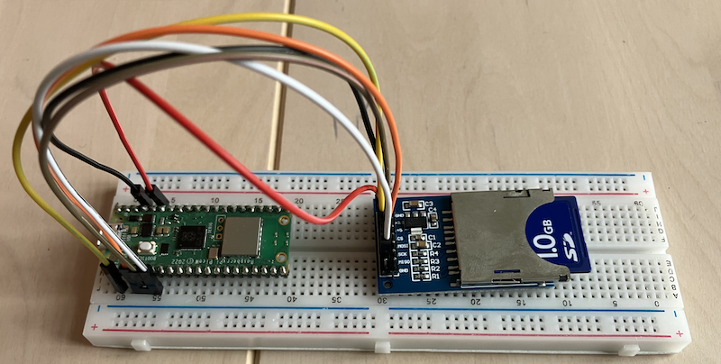

Code for 
Raspberry Pi Pico 2W
connected to a SD-card.
A modest file server. (The picture illustrates however a RPI PicoW.)

See more on these kinds of solutions at [cc/ch04/sec4.4/storage/file](./../../../../../cc/ch04/sec4.4/storage/file/).
