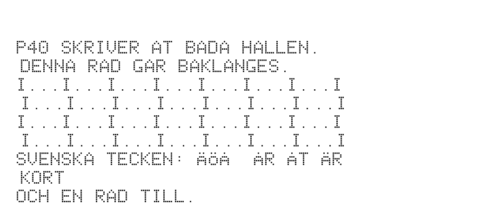
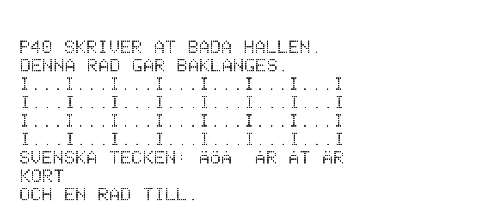

# Nålskrivaren P40

P40 (Metric P40, Scandia Metric) är skrivaren i band 2, kapitlet
Skrivarna, som ABC80 själv styr: drivrutinen på $7800 kör vagnens motor
och slår an de sju nålarna, en kolumn i taget, och skrivaren har ingen
processor. Emulatorn har skrivaren som kort 60 (`karna/p40.c`, flaggan
`-CP papper.png`), och papperet blir en bild.

| Fil              | Vad                                                        |
|------------------|------------------------------------------------------------|
| `PROV.BAS`       | skriver nio rader till `PR:`, åt båda hållen               |
| `gor.sh`         | kör `PROV.BAS` och skriver `papper.png` och `papper_orc.png` |
| `papper.png`     | papperet med drivrutinen som den är (`roms/p40.rom`)        |
| `papper_orc.png` | papperet med en ändrad kopia av drivrutinen (nedan)        |

Från emulatorns mapp:

    ./abc80 -r roms/abc80new.rom -l roms/p40.rom@7800 -CP papper.png \
            -f exempel/p40/PROV.BAS -k 'RUN\r' -t 9000

## Vad som är antaget

Drivrutinen är bevarad och disassemblerad (`dis/build/p40.asm`), men
inte skrivarens mekanik. Emulatorn antar (se `karna/p40.h`):

- att vagnen går med fast fart, utan start- och stoppsträcka, en kolumn
  på den tid drivrutinen ger en kolumn: 5 708 T-cykler (1,9 ms), lika åt
  båda hållen;
- att banan är 262 kolumner: raden om 240 och 11 tomma på var sida, som
  de 11 tomma kolumner som drivrutinen skriver bakåt före raden;
- att ändlägena slår till exakt i ändarna;
- att papperet matas fram en rad varje gång vagnen når en ände.

Var på papperet en kolumn hamnar avgörs alltså bara av tiden, som på
skrivaren. Bilden visar vad drivrutinen gör under de antagandena, inte
hur en verklig utskrift såg ut.

## Vad det visar

Boken säger att drivrutinen mäter hur länge vagnen går tillbaka till
vänstra änden och väntar lika länge på nästa rad framåt, "så att
kolumnerna hamnar under varandra åt båda hållen (?)". I emulatorn går
det att pröva.

Mätslingan bakåt (`BAKTRV`, TRAVEL) och väntslingan framåt (`FWDWT`)
kostar båda 43 T-cykler per varv. TRAVEL ökar med 794 när banan blir 6
kolumner längre (34 248 T / 43 = 796). Mätningen tar alltså med banans
längd, och var raderna hamnar mot varandra beror inte på den: med 256,
262, 280 och 300 kolumner är skillnaden densamma.

Men raderna hamnar inte exakt under varandra. De som skrivs framåt
börjar 2,25 kolumner till vänster om dem som skrivs bakåt, ungefär en
tredjedels tecken. Det syns i `papper.png`. Orsaken är väntslingan:

    FWDWT:  DEC  BC
            LD   A,B
            OR   B          ; prövar bara B
            JP   L7921
    L7921:  LD   A,$00
            JR   NZ,FWDWT

`LD A,B; OR B` prövar bara den höga byten, så slingan slutar när BC
når $00FF i stället för 0, alltid 255 varv för tidigt: 255 × 43 T ≈
1,9 kolumner. Med `OR C` (byte $B1 i stället för $B0 på $791D), som
`gor.sh` prövar i en kopia, hamnar raderna inom 0,25 kolumner från
varandra, vilket är bildens upplösning (`papper_orc.png`). Ett vanligt
mönster för en slinga med BC är `LD A,B; OR C`, och felet ser ut att
vara ett skrivfel.

`gor.sh` skriver var varje rad börjar, i kolumner från vänstra änden
(den första punkten på raden, så tecknens form spelar in; jämför raderna
parvis):

    papper.png:    7.00 9.25 8.00 10.25 8.00 10.25 7.00 9.25 7.00
    papper_orc.png:9.00 9.25 10.00 10.25 10.00 10.25 9.00 9.25 9.00

Drivrutinen som den är, med `OR B`. Varannan rad står förskjuten, och
I:na i de fyra mittraderna hamnar inte under varandra:

Samma program med `OR C`. Raderna börjar under varandra, och I:na
bildar raka kolumner:

På en verklig P40 kan vagnens start, stopp och ändlägen ha gett andra
fasta förskjutningar, som den fasta väntan FWDDLY ($0082, ungefär en
halv kolumn) kan ha varit till för att jämna ut. Felet med `OR B` är
alltså säkert i koden, men hur mycket det syntes på papperet går inte
att säga härifrån (?).
